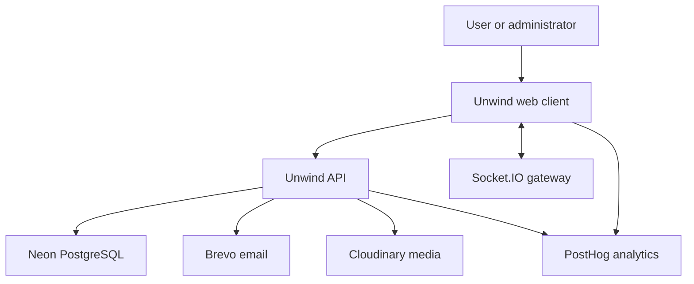
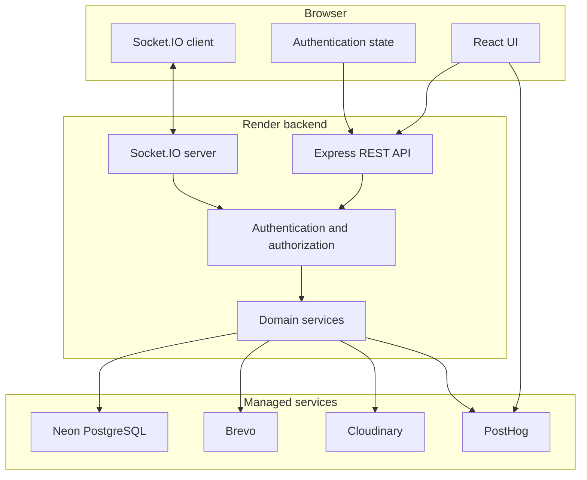
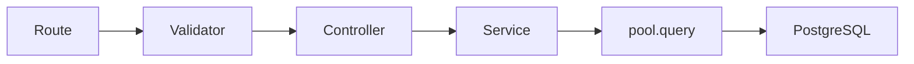
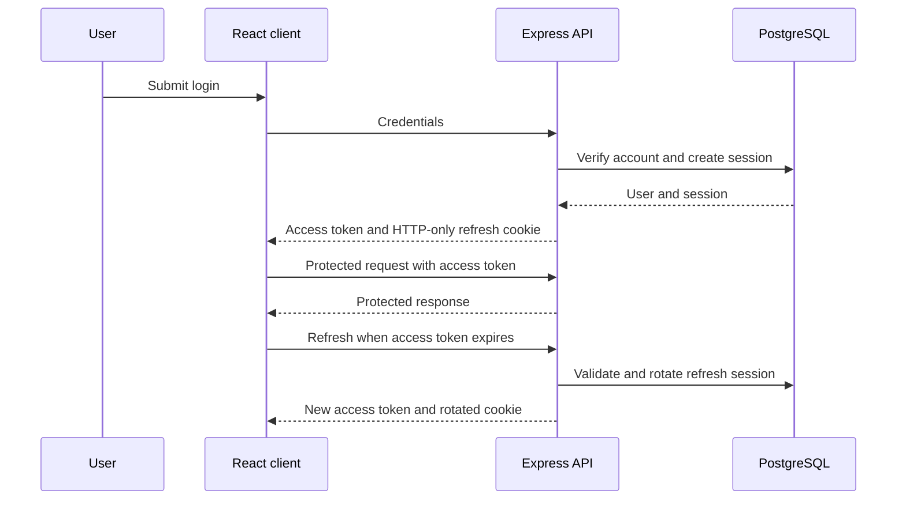
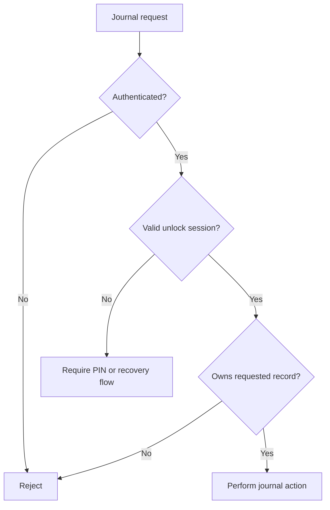
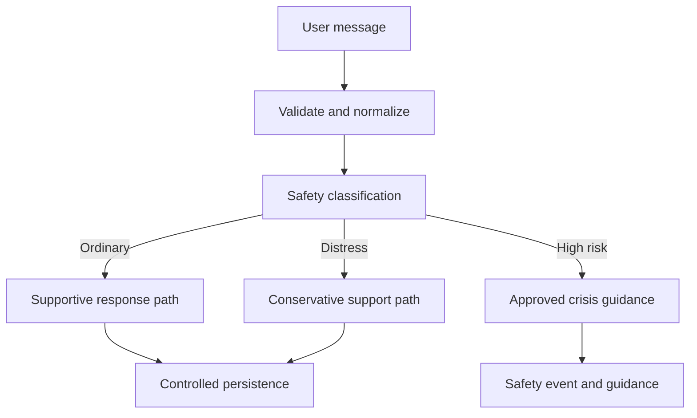
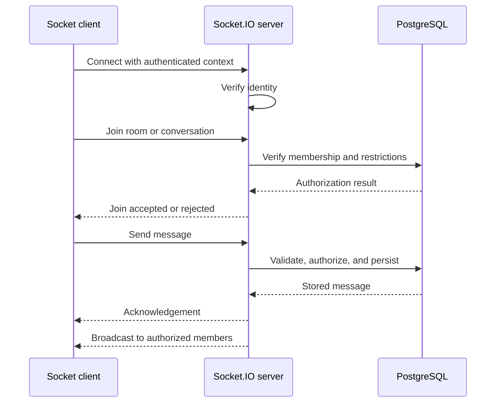
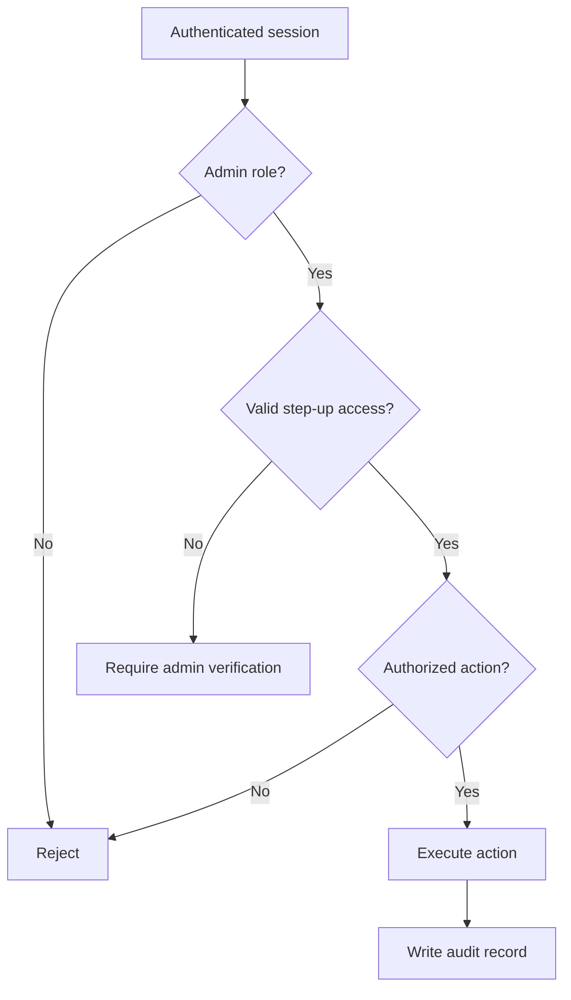
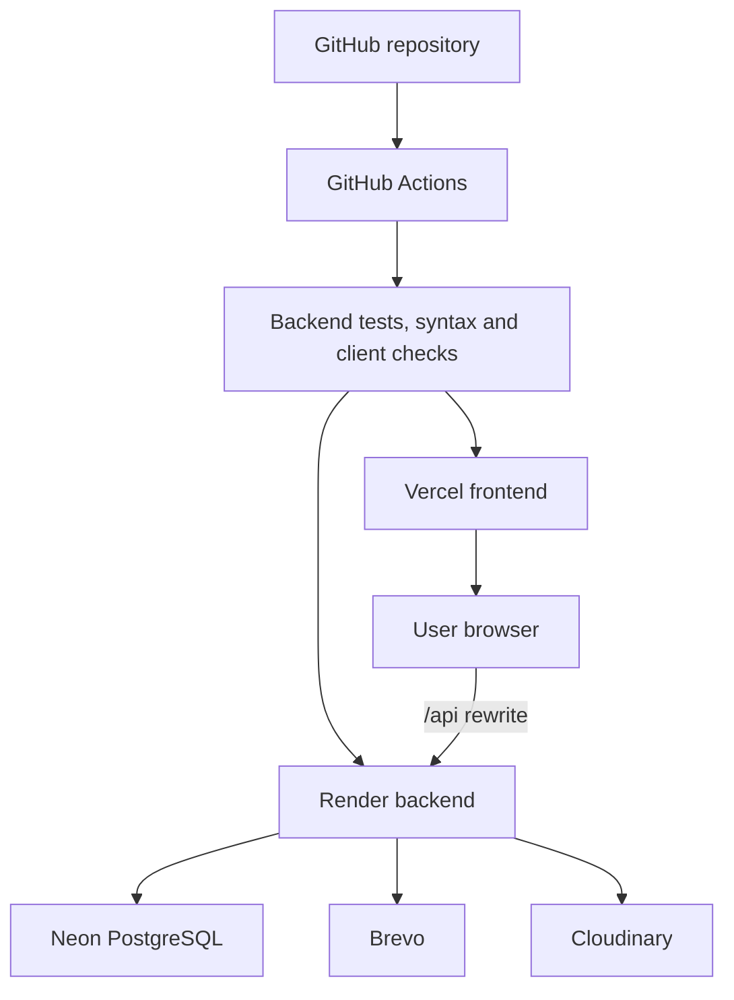

# Unwind System Architecture

## Document control

| Field                            | Value                                                          |
| -------------------------------- | -------------------------------------------------------------- |
| Project                          | Unwind                                                         |
| Document                         | System Architecture                                            |
| Architecture style               | Layered web application with REST APIs and real-time messaging |
| Architecture owner               | Atharva Padwal                                                 |
| Backend and infrastructure owner | Atharva Padwal                                                 |
| Frontend integration owner       | Parth Nikam                                                    |
| Created                          | 12 September 2026                                              |
| Last updated                     | 12 September 2026                                              |
| Status                           | Active                                                         |
| Classification                   | Internal technical documentation                               |

## 1. Purpose

This document describes the structure of Unwind, the responsibilities of its major components, the way information moves through the system, and the security boundaries between users, services, and data.

It is intended for developers, reviewers, academic evaluators, security reviewers, and future maintainers. It documents the deployed architecture and clearly separates confirmed implementation from unresolved architectural work.

Related documents:

* [`DECISIONS.md`](./DECISIONS.md) explains why major choices were made.
* [`DATABASE.md`](./DATABASE.md) documents PostgreSQL tables, columns, relationships, and indexes.
* [`SECURITY.md`](./SECURITY.md) defines vulnerability reporting and security expectations.
* [`PRIVACY.md`](./PRIVACY.md) defines user-data commitments.
* API documentation defines endpoint-level contracts.
* Testing documentation records verification evidence.

## 2. Product boundary

Unwind is a privacy-first mental-wellness and self-care platform. It combines structured self-assessment, private journaling, wellness tracking, supportive tools, AI-assisted support, community interaction, moderation, and progress insights.

Unwind supports well-being. It does not diagnose, treat, or replace professional care. This is both a product boundary and an architectural constraint: assessment, AI, report, notification, and community components must not silently cross into unsupported clinical decision-making.

## 3. Architecture principles

| Principle                  | Architectural effect                                                                                                  |
| -------------------------- | --------------------------------------------------------------------------------------------------------------------- |
| Privacy first              | Sensitive data passes through authenticated backend services and is not exposed directly to the browser or analytics. |
| Least privilege            | Users, moderators, administrators, services, and database roles receive only the access required for their function.  |
| Backend enforcement        | Authorization, ownership, validation, and sensitive business rules are enforced on the server.                        |
| Explicit safety boundaries | DASS-21 and AI-assisted features provide screening and support without diagnosis.                                     |
| Layered responsibilities   | Routes, validators, controllers, services, and database queries have distinct responsibilities.                       |
| Traceable administration   | Moderation and sensitive administrative actions produce auditable records.                                            |
| Resilient experience       | Loading, empty, success, and failure states are part of the user experience.                                          |
| Progressive verification   | Architectural claims require tests, configuration evidence, or production observations.                               |
| Controlled evolution       | Consequential changes update architecture, database, decision, and security documentation together.                   |

## 4. System context

### External actors

| Actor                      | Capabilities                                                     | Trust level                 |
| -------------------------- | ---------------------------------------------------------------- | --------------------------- |
| Visitor                    | View public pages, approved testimonials, and registration flows | Untrusted                   |
| Authenticated user         | Use private wellness features and permitted community functions  | Partially trusted           |
| Moderator or administrator | Review reports and perform authorized safety actions             | Privileged                  |
| Unwind developer           | Deploy and maintain application components                       | Privileged operational role |
| External provider          | Process only the data required for its contracted function       | External trust boundary     |

## 5. Technology stack

| Layer                       | Technology                                    | Primary owner  |
| --------------------------- | --------------------------------------------- | -------------- |
| Web client                  | React and Vite                                | Parth Nikam    |
| Client routing              | React Router                                  | Parth Nikam    |
| Client API access           | Axios                                         | Parth Nikam    |
| Client authentication state | React Context                                 | Parth Nikam    |
| API                         | Node.js 22 and Express using ES modules       | Atharva Padwal |
| Validation                  | Backend validation layer                      | Atharva Padwal |
| Database access             | PostgreSQL driver with raw `pool.query` calls | Atharva Padwal |
| Database                    | PostgreSQL hosted on Neon                     | Atharva Padwal |
| Real-time transport         | Socket.IO                                     | Atharva Padwal |
| Transactional email         | Brevo                                         | Atharva Padwal |
| Media storage and delivery  | Cloudinary                                    | Atharva Padwal |
| Product analytics           | PostHog with conservative capture settings    | Atharva Padwal |
| Frontend hosting            | Vercel                                        | Atharva Padwal |
| Backend hosting             | Render                                        | Atharva Padwal |
| CI                          | GitHub Actions                                | Atharva Padwal |

## 6. Container architecture

### Container responsibilities

| Container        | Responsibilities                                                                               | Must not do                                                                 |
| ---------------- | ---------------------------------------------------------------------------------------------- | --------------------------------------------------------------------------- |
| React client     | Presentation, navigation, local interaction state, accessible feedback, API and socket clients | Connect directly to Neon or enforce final authorization                     |
| Express API      | HTTP routing, validation, authentication, authorization, orchestration, error handling         | Trust client-supplied ownership or roles                                    |
| Socket.IO server | Authenticated real-time events, rooms, presence, acknowledgements                              | Accept membership or identity claims without server verification            |
| PostgreSQL       | Durable relational state, constraints, relationships, transactions                             | Replace application authorization or content-safety policy                  |
| Brevo            | Deliver transactional email                                                                    | Receive unrelated wellness or community content                             |
| Cloudinary       | Store and deliver approved media assets                                                        | Become the source of authorization truth                                    |
| PostHog          | Receive approved product events and masked recordings                                          | Receive journals, assessments, messages, secrets, or sensitive form content |

## 7. Frontend architecture

The frontend is a React single-page application built with Vite. React Router manages navigation, Axios performs HTTP requests, and React Context manages authentication state. Styling uses plain CSS with page or component stylesheets and shared reusable controls where appropriate.

### Frontend responsibilities

* render public, authenticated, community, and administrative experiences;
* manage navigation and protected-route presentation;
* submit access tokens and credentialed refresh requests correctly;
* maintain the Socket.IO client lifecycle;
* display validation, loading, empty, success, and error states;
* preserve light mode, dark mode, responsive layouts, and reduced-motion behaviour;
* avoid storing sensitive long-lived credentials in browser-accessible storage;
* avoid presenting client-side checks as security enforcement.

### Frontend feature areas

| Area              | Main responsibility                                                                  |
| ----------------- | ------------------------------------------------------------------------------------ |
| Public experience | Landing page, product explanation, testimonials, registration entry points           |
| Authentication    | Registration, verification, login, recovery, logout, Google OAuth, session handling  |
| Dashboard         | Unified access to wellness features and progress information                         |
| DASS-21           | Assessment questions, results, history, statistics, recommendations, reports         |
| Journal           | PIN-gated journal experience, entries, prompts, tags, media, export and settings     |
| Wellness tracking | Mood, energy, sleep, water, habits, tasks, reminders and statistics                  |
| AI support        | Conversation interface, settings, usage feedback and safety-aware responses          |
| Community         | Profiles, posts, comments, reactions, rooms, direct conversations and reporting      |
| Notifications     | Filters, read state and contextual actions                                           |
| Administration    | Dashboard, analytics, users, reports, decisions, testimonials, access and audit logs |

### Frontend trust rule

Route guards, hidden buttons, and disabled controls improve user experience but do not grant or deny authority. Every protected action must be rechecked by the backend.

## 8. Backend architecture

Unwind uses a layered Express architecture:

### Layer responsibilities

| Layer            | Responsibility                                       | Examples                                      |
| ---------------- | ---------------------------------------------------- | --------------------------------------------- |
| Route            | Map HTTP methods and paths; attach middleware        | authentication, rate limits, role checks      |
| Validator        | Validate and normalize request input                 | required fields, formats, ranges, enums       |
| Controller       | Translate HTTP requests and service results          | status codes, response shape, next-error flow |
| Service          | Apply business rules and orchestrate data operations | ownership, scoring, workflows, transactions   |
| Database query   | Execute parameterized SQL through the pool           | selects, inserts, updates, deletes            |
| Error middleware | Produce consistent safe error responses              | operational errors and unexpected failures    |

Unwind currently uses raw PostgreSQL access through `pool.query`. It does not rely on an ORM or a dedicated repository layer. SQL ownership therefore remains inside the service/data-access implementation and must be kept consistent, parameterized, and testable.

### Backend module boundaries

| Module             | Primary responsibilities                                                                  |
| ------------------ | ----------------------------------------------------------------------------------------- |
| Authentication     | Registration, verification, login, refresh, logout, password recovery, Google OAuth       |
| Users and profiles | Personal information, preferences, profile completion and account settings                |
| Sessions           | Refresh-token lifecycle, session revocation and logout-all-devices                        |
| DASS-21            | Questions, consent, scoring, results, history, statistics and reports                     |
| Journal            | PIN security, entries, prompts, tags, emotions, activities, attachments, voice and export |
| Wellness           | Mood, energy, sleep, water, habits, tasks, reminders and settings                         |
| AI support         | Conversations, messages, settings, usage limits and safety classification                 |
| Community          | Profiles, posts, comments, likes, media, rooms and direct messaging                       |
| Notifications      | Notification definitions, per-user delivery and read state                                |
| Moderation         | Reports, warnings, restrictions, actions, proposals and votes                             |
| Administration     | Step-up access, privileged APIs, audit logs and operational views                         |
| Public content     | Approved testimonials and public sample content                                           |

## 9. Data architecture

The application stores durable data in the Neon-hosted PostgreSQL `public` schema. The documented production schema contains:

| Metric                  | Count |
| ----------------------- | ----: |
| Tables                  |    79 |
| Columns                 |   914 |
| Primary-key constraints |    79 |
| Foreign-key constraints |   127 |
| Unique constraints      |    38 |
| Indexes                 |   366 |

The schema covers authentication, users, DASS-21, journaling, wellness tracking, AI conversations, community, direct messaging, notifications, moderation, administration, email records, and testimonials.

### Data-access rules

* The browser never receives database credentials.
* SQL uses parameters for user-controlled values.
* Sensitive rows are selected and changed using authenticated ownership or explicit administrative authority.
* Database constraints support integrity but do not replace service-level policy.
* Multi-step operations that must succeed together should use transactions.
* Schema changes require version-controlled migrations and compatibility review.
* Production data must not be copied into tests, screenshots, documentation, or public repositories.

Full table, column, relationship, and index details are maintained in [`DATABASE.md`](./DATABASE.md).

## 10. Authentication and session architecture

### Authentication model

Unwind uses short-lived JWT access tokens and longer-lived refresh tokens. Refresh tokens are delivered through HTTP-only cookies, rotated, and associated with revocable sessions. The recorded target lifetimes are approximately 15 minutes for access tokens and 30 days for refresh tokens.

### Authentication capabilities

* email registration and verification;
* OTP or link-based verification and recovery;
* login and logout;
* refresh-token rotation;
* logout from all devices;
* forgot and reset password;
* change password;
* Google OAuth;
* session storage and revocation;
* rate limiting on authentication and OTP endpoints.

### Authentication trust boundaries

* Access-token contents must be verified with the server secret before use.
* The server must derive identity from verified credentials, not request parameters.
* Refresh cookies require production-appropriate `HttpOnly`, `Secure`, and `SameSite` settings.
* OAuth identity must be validated server-side and safely mapped to an Unwind account.
* Password-based login must handle accounts without a password hash, such as OAuth-only accounts, without producing an uncontrolled server error.
* Tokens, password hashes, OTPs, and session-token hashes must never be logged or exposed in API responses.

## 11. Journal security architecture

The journal adds a second privacy barrier beyond account authentication. Users can create, unlock, change, disable, and recover a journal PIN. PINs are hashed, leading zeroes are preserved by treating PINs as strings, and journal access uses a time-bounded unlock session.

The journal PIN gate protects against casual access from an already signed-in device. It is not field-level encryption. Application-level encryption and key rotation remain open architectural decisions.

## 12. DASS-21 architecture

The DASS-21 module stores consent, assessment instances, questions, responses, calculated results, history, statistics, recommendations, and generated reports.

Architectural requirements:

* scoring must be deterministic and covered by tests;
* responses and results remain bound to the authenticated user;
* reports must preserve the non-diagnostic boundary;
* severity or risk language must not be represented as a clinical diagnosis;
* consent and disclaimer state must be available where required;
* high-risk guidance must use approved safety content and escalation pathways.

## 13. AI-support architecture

The database includes conversations, messages, safety events, settings, and daily usage records for the AI-support feature. Text is separated into ordinary, distress, and high-risk categories so the response path can change according to safety level.

The exact production AI provider and fallback chain are not proven by the current architecture evidence and must be documented only after configuration and code verification. Provider prompts and responses must not be treated as clinically authoritative.

## 14. Community and real-time architecture

Unwind supports community posts, comments, reactions, media, public rooms, invite-based private rooms, direct conversations, identity visibility controls, replies, edits, typing state, presence, unread counts, and read receipts.

### Real-time connection flow

### Real-time security rules

* authenticate the socket connection;
* authorize every room join and sensitive event;
* obtain membership and restriction state from server-controlled data;
* validate message size, type, references, and media metadata;
* prevent clients from selecting another user as sender;
* acknowledge stored messages and handle reconnection or duplication safely;
* maintain deterministic ordering and unread-state reconciliation;
* avoid describing private rooms or direct messages as end-to-end encrypted unless separately implemented and verified.

## 15. Moderation and administration architecture

The moderation system includes user reports, warnings, restrictions, moderation actions, proposals, votes, a decision workflow, and administrative audit logs.

Administrative access has two stages:

1. the user has an authenticated account with an authorized role;
2. the user completes step-up verification and receives a separate, revocable HTTP-only admin access token.

The recorded shared admin verification secret weakens individual attribution and revocation. Replacing it with per-administrator step-up authentication is an open security requirement.

## 16. Notifications architecture

The notification model separates notification definitions from user-specific notification records. This supports per-recipient read state, delivery state, filters, and actions without duplicating the meaning of the original event.

Notification creation and delivery must:

* authorize the source event;
* identify intended recipients server-side;
* avoid leaking private actor or resource data;
* deduplicate repeated events;
* enforce ownership on list, read, and action endpoints;
* apply a documented retention policy.

## 17. External integrations

| Integration  | Purpose                          | Data boundary                                        | Failure expectation                                      | Owner          |
| ------------ | -------------------------------- | ---------------------------------------------------- | -------------------------------------------------------- | -------------- |
| Neon         | Managed PostgreSQL               | Receives durable application data                    | API must handle connection and query failures safely     | Atharva Padwal |
| Brevo        | Verification and recovery email  | Receives delivery address and required template data | Email-dependent flows show retry-safe failure states     | Atharva Padwal |
| Cloudinary   | Media upload and delivery        | Receives approved media and associated metadata      | Database and provider state require reconciliation       | Atharva Padwal |
| PostHog      | Product analytics                | Receives approved events and masked recordings only  | Product remains usable if analytics fails                | Atharva Padwal |
| Google OAuth | Federated account authentication | Receives OAuth protocol data                         | Password and OAuth account states are handled distinctly | Atharva Padwal |

PostHog is configured conservatively with autocapture disabled, identified-only behaviour, and masked session recording. Approved event properties still require governance; configuration alone cannot prevent every accidental disclosure.

## 18. Deployment architecture

### Production topology

| Component | Production location | Public role                                     |
| --------- | ------------------- | ----------------------------------------------- |
| Frontend  | Vercel              | Serves the React application and SPA fallback   |
| API       | Render              | Serves HTTP endpoints and real-time connections |
| Database  | Neon                | Stores relational application state             |
| Email     | Brevo               | Sends transactional messages                    |
| Media     | Cloudinary          | Stores and delivers approved uploads            |
| Analytics | PostHog             | Processes approved product events               |

Vercel rewrites `/api` requests to the Render backend and uses an `index.html` fallback for client-side routes. Cookie, CORS, rewrite order, websocket routing, and environment configuration must be tested in production-like conditions.

## 19. CI/CD and quality gates

GitHub Actions runs automated checks for pushes and pull requests to the main branch and supports manual execution. The recorded workflow uses Node.js 22, `npm ci`, backend JavaScript syntax checks, backend tests, client checks, timeouts, and concurrency cancellation.

Current test evidence covers important boundaries including:

* access-token identity and role claims;
* rejection under an incorrect signing secret;
* refresh-token uniqueness;
* password hash comparison;
* anonymous and unauthorized role rejection;
* administrator middleware;
* journal PIN string handling and hashing;
* community message normalization;
* ownership-bound SQL behaviour;
* DASS scoring and AI safety classification.

Passing unit checks does not establish complete production safety. Disposable PostgreSQL integration tests, critical-flow end-to-end tests, websocket authorization tests, upload tests, and restore exercises remain important improvements.

## 20. Observability and operational behaviour

Confirmed visibility includes PostHog product analytics, platform logs, health checks, CI results, audit logs, and security scans. A complete observability standard is not yet documented.

The target operating model should define:

| Signal         | Required decision                                              |
| -------------- | -------------------------------------------------------------- |
| Availability   | Health-check and uptime objective                              |
| API latency    | p50 and p95 targets for critical flows                         |
| Error rate     | Alert thresholds by route and severity                         |
| Database       | Connection, slow-query, and saturation thresholds              |
| Realtime       | Connection, reconnect, acknowledgement, and delivery metrics   |
| Authentication | Failed-login, OTP, refresh, and abuse signals                  |
| Safety         | Restricted access to crisis and moderation operational metrics |
| Release        | Deployment success, rollback trigger, and incident linkage     |

Logs must exclude credentials, tokens, passwords, OTPs, journal content, assessment responses, private messages, and unnecessary personal information.

## 21. Security boundaries and threats

| Boundary or threat           | Required architectural control                                           | Current confidence                                             |
| ---------------------------- | ------------------------------------------------------------------------ | -------------------------------------------------------------- |
| Browser to API               | TLS, authentication, validation, authorization, controlled CORS          | Implemented; configuration requires continued verification     |
| Browser to realtime server   | Socket authentication and per-event membership checks                    | Implemented architecture; requires dedicated tests             |
| API to PostgreSQL            | Encrypted connection, parameterized SQL, least-privilege role            | Partial evidence; database-role review open                    |
| API to third parties         | Minimum required data, server-side secrets, timeouts, safe failures      | Implemented pattern; per-provider review required              |
| IDOR                         | Ownership predicates and authorization tests                             | Confirmed test evidence for selected paths, not every endpoint |
| XSS                          | React escaping, content handling, upload controls and headers            | Requires ongoing verification                                  |
| CSRF                         | Cookie design, origin policy and state-changing request protection       | Requires explicit end-to-end review                            |
| Token theft                  | Short access lifetime, HTTP-only refresh cookie, rotation and revocation | Confirmed architecture                                         |
| Shared admin secret          | Per-admin step-up credentials and revocation                             | Open risk                                                      |
| Sensitive data at rest       | Field-level encryption assessment and key management                     | Open decision                                                  |
| Supply-chain vulnerabilities | Dependency alerts, patching and CI                                       | Active process                                                 |
| Secret leakage               | Environment separation and Gitleaks                                      | Gitleaks scan reported no leaks; ongoing control required      |

## 22. Availability, resilience, and recovery

The architecture depends on several managed services. Frontend, backend, database, email, media, and analytics can fail independently.

### Expected failure behaviour

* Authentication and core private operations fail closed when authorization or database state cannot be verified.
* Analytics failure must not block the product.
* Email failure must be visible and retry-safe for verification and recovery flows.
* Media failure must not create an untracked database/provider mismatch.
* Realtime disconnects must reconnect safely without duplicating messages or bypassing membership checks.
* Backend cold starts and temporary database latency require clear loading and retry states.
* Releases require a documented rollback decision and a known last stable version.

The actual Neon restore window, recovery point objective, recovery time objective, and tested restoration procedure remain unverified. They are tracked in `DATABASE.md` and the open architecture work below.

## 23. Performance and scalability

Known performance concerns include authentication flows taking approximately two to three seconds, earlier chat send latency of approximately two to three seconds, delayed delivery to other clients, Render cold starts, and a Vite warning for bundles larger than 500 kB.

Architectural priorities:

* measure rather than describe performance only as “fast” or “slow”;
* set p50 and p95 targets for login, signup, dashboard load, API calls, and chat delivery;
* split large frontend routes and heavy components;
* avoid unnecessary sequential network requests;
* use safe cache policies and explicit invalidation;
* index verified query paths based on measured plans;
* use pagination for feeds, messages, journals, audit logs, and history;
* control upload size and memory use;
* prevent unbounded Socket.IO presence or room state;
* monitor database connection behaviour under concurrent requests.

## 24. Privacy architecture

Privacy controls span design, code, infrastructure, operations, and documentation.

| Data area       | Privacy requirement                                                              |
| --------------- | -------------------------------------------------------------------------------- |
| Accounts        | Collect only necessary identity and recovery information                         |
| Journals        | Strict owner access, discreet previews, controlled export and deletion           |
| Assessments     | Consent, non-diagnostic language, private results and controlled reports         |
| Trackers        | Owner-bound history and documented retention                                     |
| Community       | Accurate identity visibility boundaries and internal moderation traceability     |
| Direct messages | Membership authorization and truthful encryption claims                          |
| AI support      | Minimized provider data and separate safety-event handling                       |
| Analytics       | Approved events only; no sensitive content or secrets                            |
| Logs            | Redaction, access control, retention and incident usefulness                     |
| Deletion        | Coordinated removal across PostgreSQL, media, analytics, and external processors |

Retention periods, permanent-deletion behaviour, field-level encryption, and cross-provider deletion remain unresolved governance and architecture work.

## 25. Architecture ownership

| Area                                  | Accountable owner | Review responsibility                                                |
| ------------------------------------- | ----------------- | -------------------------------------------------------------------- |
| Product and system architecture       | Atharva Padwal    | Ensure changes remain consistent with Unwind’s purpose and decisions |
| Backend services and APIs             | Atharva Padwal    | Security, business rules, performance and maintainability            |
| Database and migrations               | Atharva Padwal    | Integrity, access, migration safety and recovery evidence            |
| Authentication and authorization      | Atharva Padwal    | Token, session, OAuth, role and ownership boundaries                 |
| Realtime community backend            | Atharva Padwal    | Socket authorization, delivery and moderation integration            |
| Frontend architecture and integration | Parth Nikam       | Routes, components, API integration, accessibility and UI states     |
| Deployment and CI/CD                  | Atharva Padwal    | Configuration, checks, releases and rollback readiness               |
| Architecture documentation            | Atharva Padwal    | Accuracy, evidence, changelog and cross-document consistency         |

## 26. Open architecture decisions

| ID      | Decision or evidence required                                                   | Owner                          | Target date       | Status |
| ------- | ------------------------------------------------------------------------------- | ------------------------------ | ----------------- | ------ |
| ARC-P01 | Approve fields requiring application-level encryption and key rotation          | Atharva Padwal                 | 18 September 2026 | Open   |
| ARC-P02 | Replace shared admin verification with per-administrator step-up authentication | Atharva Padwal                 | 20 September 2026 | Open   |
| ARC-P03 | Approve crisis content, escalation path, and human review responsibility        | Atharva Padwal                 | 21 September 2026 | Open   |
| ARC-P04 | Verify Neon recovery window and complete a restore exercise                     | Atharva Padwal                 | 28 September 2026 | Open   |
| ARC-P05 | Define retention and deletion behaviour across all providers                    | Atharva Padwal                 | 30 September 2026 | Open   |
| ARC-P06 | Set p50 and p95 performance targets for critical user flows                     | Atharva Padwal                 | 24 September 2026 | Open   |
| ARC-P07 | Set frontend bundle budget and route-splitting gate                             | Parth Nikam                    | 25 September 2026 | Open   |
| ARC-P08 | Approve WCAG target and accessibility release gate                              | Parth Nikam                    | 26 September 2026 | Open   |
| ARC-P09 | Define formal monitoring, alerting, incident, and rollback procedures           | Atharva Padwal                 | 27 September 2026 | Open   |
| ARC-P10 | Verify least-privilege PostgreSQL and CI credentials                            | Atharva Padwal                 | 27 September 2026 | Open   |
| ARC-P11 | Add integration, end-to-end, websocket, and upload test strategy                | Atharva Padwal and Parth Nikam | 30 September 2026 | Open   |
| ARC-P12 | Verify and document the production AI provider and fallback chain               | Atharva Padwal                 | 30 September 2026 | Open   |

## 27. Architecture change process

Update this document when a change:

* introduces or removes a major service, framework, data store, or provider;
* changes deployment topology or public request routing;
* changes authentication, authorization, session, or administrative access;
* introduces a new sensitive-data category;
* changes module boundaries or the backend layering model;
* changes realtime messaging or membership enforcement;
* changes safety, privacy, retention, recovery, or moderation behaviour;
* changes an externally visible API contract across multiple modules;
* accepts a known architectural risk for release.

Every consequential architecture change should include:

1. an update to this document;
2. a linked entry in `DECISIONS.md`;
3. database documentation and migration updates where relevant;
4. security and privacy review where relevant;
5. automated or manual verification evidence;
6. a changelog entry below.

## 28. Changelog

| Date              | Change type | Owner          | Section or component    | Description                                                                                                                           |
| ----------------- | ----------- | -------------- | ----------------------- | ------------------------------------------------------------------------------------------------------------------------------------- |
| 12 September 2026 | Added       | Atharva Padwal | Full document           | Created the initial Unwind system architecture document from confirmed project, deployment, database, testing, and decision evidence. |
| 12 September 2026 | Added       | Atharva Padwal | Backend                 | Documented the Routes → Validators → Controllers → Services → PostgreSQL structure and raw `pool.query` access model.                 |
| 12 September 2026 | Added       | Atharva Padwal | Security and operations | Recorded trust boundaries, known risks, owners, and target dates.                                                                     |
| 12 September 2026 | Added       | Parth Nikam    | Frontend                | Recorded frontend architecture and integration ownership.                                                                             |

Add a row whenever an architecture element is introduced, materially changed, reclassified, deprecated, or superseded. Keep historical rows. When a component or decision is superseded, identify both the old and replacement architecture or decision reference.

## Appendix A. Confirmed evidence and limitations

This architecture is based on the deployed Unwind stack, the reconstructed decision log, the production Neon schema documentation, automated-test evidence, deployment information, and prior implementation discussions available on 12 September 2026.

Confirmed evidence includes React/Vite, Node.js/Express, PostgreSQL on Neon, raw `pool.query` access, Socket.IO, Vercel, Render, Brevo, Cloudinary, PostHog, JWT access and refresh flows, HTTP-only cookies, Google OAuth, journal PIN sessions, DASS-21, community and moderation modules, GitHub Actions, and the production database inventory.

Not proven solely by this document: complete endpoint coverage, exact source-directory names, complete runtime configuration, data-retention periods, field-level encryption, database restore testing, least-privilege roles, every websocket authorization path, every third-party payload, production AI-provider selection, formal service-level objectives, full accessibility conformance, or complete integration and end-to-end coverage.

Unknown or unverified facts must remain labelled as such until supported by code, configuration, tests, provider settings, or production evidence.
