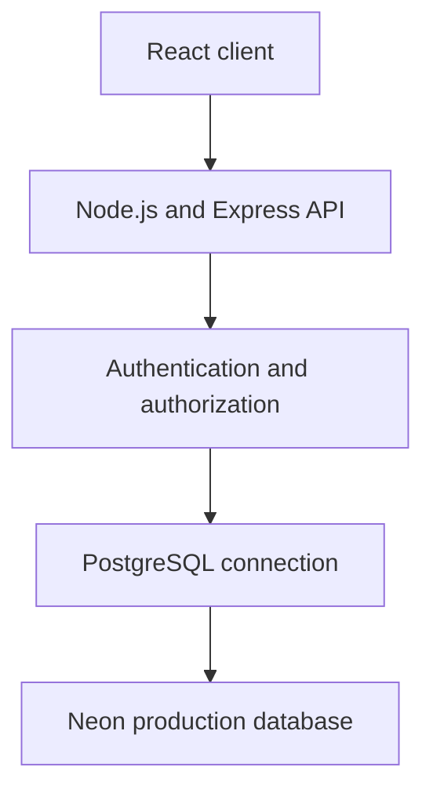

# Unwind Database Documentation

## Document control

| Field                      | Value                            |
| -------------------------- | -------------------------------- |
| Project                    | Unwind                           |
| Database engine            | PostgreSQL                       |
| Managed provider           | Neon                             |
| Schema documented          | `public`                         |
| Document owner             | Atharva Padwal                   |
| Database and backend owner | Atharva Padwal                   |
| Frontend integration owner | Parth Nikam                      |
| Created                    | 12 September 2026                |
| Last updated               | 12 September 2026                |
| Status                     | Active                           |
| Classification             | Internal technical documentation |

## 1. Purpose and scope

This document describes the production Unwind PostgreSQL schema hosted on Neon. It records tables, columns, keys, relationships, indexes, ownership, security expectations, unresolved database decisions, and documentation history.

The structural catalogue was generated from read-only PostgreSQL metadata exported on 12 September 2026. It does not contain production rows, credentials, connection strings, password hashes, journal content, assessment answers, messages, OTPs, tokens, or personal information.

## 2. Architecture

The client must not connect directly to Neon. The backend owns queries, authorization, validation, transactions, and error handling. Secrets belong in deployment environment variables and must never be committed to Git or copied into this file.

## 3. Schema inventory

| Metric                       | Observed value |
| ---------------------------- | -------------: |
| Tables                       |             79 |
| Columns                      |            914 |
| Non-nullable columns         |            630 |
| Nullable columns             |            284 |
| Primary-key constraints      |             79 |
| Foreign-key constraints      |            127 |
| Unique constraints           |             38 |
| Indexes                      |            366 |
| Tables without a primary key |              0 |
| Tables without an index      |              0 |

Constraint counts above are based on distinct constraint names. Composite keys can span multiple rows in the exported metadata.

### Tables by domain

| Domain                            | Tables |
| --------------------------------- | -----: |
| AI chatbot                        |      5 |
| Administration and moderation     |      9 |
| Assessments                       |      6 |
| Authentication and users          |      5 |
| Communications and public content |      2 |
| Community                         |     14 |
| Journal                           |     21 |
| Notifications                     |      2 |
| Wellness tracking                 |     15 |

## 4. Table catalogue

| Table                         | Domain                            | Purpose                                               | Sensitivity           | Owner                                 |
| ----------------------------- | --------------------------------- | ----------------------------------------------------- | --------------------- | ------------------------------------- |
| `admin_access_sessions`       | Administration and moderation     | Stores records for admin access sessions.             | Restricted            | Atharva Padwal (database and backend) |
| `admin_audit_logs`            | Administration and moderation     | Records admin audit events or history.                | Restricted            | Atharva Padwal (database and backend) |
| `admin_moderation_proposals`  | Administration and moderation     | Stores records for admin moderation proposals.        | Restricted            | Atharva Padwal (database and backend) |
| `admin_moderation_votes`      | Administration and moderation     | Stores records for admin moderation votes.            | Restricted            | Atharva Padwal (database and backend) |
| `assessment_consents`         | Assessments                       | Stores records for assessment consents.               | Highly restricted     | Atharva Padwal (database and backend) |
| `auth_tokens`                 | Authentication and users          | Stores hashed or controlled auth tokens.              | Restricted            | Atharva Padwal (database and backend) |
| `chat_history_preferences`    | Community                         | Stores chat history preferences.                      | Sensitive             | Parth Nikam (frontend integration)    |
| `chat_messages`               | Community                         | Stores messages for chat.                             | Highly restricted     | Atharva Padwal (database and backend) |
| `chat_room_members`           | Community                         | Associates users with chat room.                      | Sensitive             | Atharva Padwal (database and backend) |
| `chat_rooms`                  | Community                         | Stores records for chat rooms.                        | Sensitive             | Atharva Padwal (database and backend) |
| `chatbot_conversations`       | AI chatbot                        | Stores records for chatbot conversations.             | Sensitive             | Atharva Padwal (database and backend) |
| `chatbot_messages`            | AI chatbot                        | Stores messages for chatbot.                          | Sensitive             | Atharva Padwal (database and backend) |
| `chatbot_safety_events`       | AI chatbot                        | Stores records for chatbot safety events.             | Highly restricted     | Atharva Padwal (database and backend) |
| `chatbot_settings`            | AI chatbot                        | Stores chatbot configuration.                         | Sensitive             | Parth Nikam (frontend integration)    |
| `chatbot_usage_daily`         | AI chatbot                        | Stores records for chatbot usage daily.               | Sensitive             | Atharva Padwal (database and backend) |
| `comment_likes`               | Community                         | Records user likes for comment.                       | Sensitive             | Atharva Padwal (database and backend) |
| `community_posts`             | Community                         | Stores records for community posts.                   | Sensitive             | Atharva Padwal (database and backend) |
| `community_profiles`          | Community                         | Stores records for community profiles.                | Sensitive             | Parth Nikam (frontend integration)    |
| `community_reports`           | Administration and moderation     | Stores community reports and their workflow state.    | Restricted            | Atharva Padwal (database and backend) |
| `dass_assessments`            | Assessments                       | Stores records for dass assessments.                  | Highly restricted     | Atharva Padwal (database and backend) |
| `dass_questions`              | Assessments                       | Stores records for dass questions.                    | Highly restricted     | Atharva Padwal (database and backend) |
| `dass_reports`                | Assessments                       | Stores dass reports and their workflow state.         | Highly restricted     | Atharva Padwal (database and backend) |
| `dass_responses`              | Assessments                       | Stores individual dass responses.                     | Highly restricted     | Atharva Padwal (database and backend) |
| `dass_results`                | Assessments                       | Stores calculated dass results.                       | Highly restricted     | Atharva Padwal (database and backend) |
| `direct_conversation_members` | Community                         | Associates users with direct conversation.            | Sensitive             | Atharva Padwal (database and backend) |
| `direct_conversations`        | Community                         | Stores records for direct conversations.              | Sensitive             | Atharva Padwal (database and backend) |
| `direct_messages`             | Community                         | Stores messages for direct.                           | Highly restricted     | Atharva Padwal (database and backend) |
| `email_logs`                  | Communications and public content | Records email events or history.                      | Restricted            | Atharva Padwal (database and backend) |
| `energy_entries`              | Wellness tracking                 | Stores individual energy entries.                     | Sensitive             | Atharva Padwal (database and backend) |
| `habit_logs`                  | Wellness tracking                 | Records habit events or history.                      | Sensitive             | Atharva Padwal (database and backend) |
| `habits`                      | Wellness tracking                 | Stores records for habits.                            | Sensitive             | Atharva Padwal (database and backend) |
| `journal_activities`          | Journal                           | Stores records for journal activities.                | Highly restricted     | Atharva Padwal (database and backend) |
| `journal_attachments`         | Journal                           | Stores records for journal attachments.               | Highly restricted     | Atharva Padwal (database and backend) |
| `journal_emotions`            | Journal                           | Stores records for journal emotions.                  | Highly restricted     | Atharva Padwal (database and backend) |
| `journal_entries`             | Journal                           | Stores individual journal entries.                    | Highly restricted     | Atharva Padwal (database and backend) |
| `journal_entry_activities`    | Journal                           | Stores records for journal entry activities.          | Highly restricted     | Atharva Padwal (database and backend) |
| `journal_entry_emotions`      | Journal                           | Stores records for journal entry emotions.            | Highly restricted     | Atharva Padwal (database and backend) |
| `journal_entry_tags`          | Journal                           | Stores records for journal entry tags.                | Highly restricted     | Atharva Padwal (database and backend) |
| `journal_export_entries`      | Journal                           | Stores individual journal export entries.             | Highly restricted     | Atharva Padwal (database and backend) |
| `journal_exports`             | Journal                           | Stores records for journal exports.                   | Highly restricted     | Atharva Padwal (database and backend) |
| `journal_pin_attempts`        | Journal                           | Stores records for journal pin attempts.              | Highly restricted     | Atharva Padwal (database and backend) |
| `journal_pin_reset_tokens`    | Journal                           | Stores hashed or controlled journal pin reset tokens. | Highly restricted     | Atharva Padwal (database and backend) |
| `journal_prompt_history`      | Journal                           | Stores records for journal prompt history.            | Highly restricted     | Atharva Padwal (database and backend) |
| `journal_prompts`             | Journal                           | Stores records for journal prompts.                   | Highly restricted     | Atharva Padwal (database and backend) |
| `journal_reminders`           | Journal                           | Stores records for journal reminders.                 | Highly restricted     | Atharva Padwal (database and backend) |
| `journal_safety_events`       | Journal                           | Stores records for journal safety events.             | Highly restricted     | Atharva Padwal (database and backend) |
| `journal_security_settings`   | Journal                           | Stores journal security configuration.                | Highly restricted     | Atharva Padwal (database and backend) |
| `journal_settings`            | Journal                           | Stores journal configuration.                         | Highly restricted     | Atharva Padwal (database and backend) |
| `journal_tags`                | Journal                           | Stores records for journal tags.                      | Highly restricted     | Atharva Padwal (database and backend) |
| `journal_unlock_sessions`     | Journal                           | Stores records for journal unlock sessions.           | Highly restricted     | Atharva Padwal (database and backend) |
| `journal_voice_notes`         | Journal                           | Stores records for journal voice notes.               | Highly restricted     | Atharva Padwal (database and backend) |
| `journal_voice_transcripts`   | Journal                           | Stores records for journal voice transcripts.         | Highly restricted     | Atharva Padwal (database and backend) |
| `moderation_actions`          | Administration and moderation     | Stores records for moderation actions.                | Restricted            | Atharva Padwal (database and backend) |
| `mood_entries`                | Wellness tracking                 | Stores individual mood entries.                       | Sensitive             | Atharva Padwal (database and backend) |
| `mood_entry_activities`       | Wellness tracking                 | Stores records for mood entry activities.             | Sensitive             | Atharva Padwal (database and backend) |
| `mood_entry_emotions`         | Wellness tracking                 | Stores records for mood entry emotions.               | Sensitive             | Atharva Padwal (database and backend) |
| `notifications`               | Notifications                     | Stores records for notifications.                     | Sensitive             | Atharva Padwal (database and backend) |
| `post_comments`               | Community                         | Stores records for post comments.                     | Sensitive             | Atharva Padwal (database and backend) |
| `post_likes`                  | Community                         | Records user likes for post.                          | Sensitive             | Atharva Padwal (database and backend) |
| `post_media`                  | Community                         | Stores records for post media.                        | Sensitive             | Atharva Padwal (database and backend) |
| `reports`                     | Administration and moderation     | Stores reports and their workflow state.              | Restricted            | Atharva Padwal (database and backend) |
| `sleep_entries`               | Wellness tracking                 | Stores individual sleep entries.                      | Sensitive             | Atharva Padwal (database and backend) |
| `sleep_entry_factors`         | Wellness tracking                 | Stores records for sleep entry factors.               | Sensitive             | Atharva Padwal (database and backend) |
| `sleep_factors`               | Wellness tracking                 | Stores records for sleep factors.                     | Sensitive             | Atharva Padwal (database and backend) |
| `testimonials`                | Communications and public content | Stores records for testimonials.                      | Public after approval | Atharva Padwal (database and backend) |
| `tracker_activities`          | Wellness tracking                 | Stores records for tracker activities.                | Sensitive             | Atharva Padwal (database and backend) |
| `tracker_emotions`            | Wellness tracking                 | Stores records for tracker emotions.                  | Sensitive             | Atharva Padwal (database and backend) |
| `tracker_reminders`           | Wellness tracking                 | Stores records for tracker reminders.                 | Sensitive             | Atharva Padwal (database and backend) |
| `tracker_settings`            | Wellness tracking                 | Stores tracker configuration.                         | Sensitive             | Atharva Padwal (database and backend) |
| `user_blocks`                 | Community                         | Stores records for user blocks.                       | Restricted            | Atharva Padwal (database and backend) |
| `user_notifications`          | Notifications                     | Stores records for user notifications.                | Restricted            | Atharva Padwal (database and backend) |
| `user_profiles`               | Authentication and users          | Stores records for user profiles.                     | Restricted            | Atharva Padwal (database and backend) |
| `user_restrictions`           | Administration and moderation     | Stores records for user restrictions.                 | Restricted            | Atharva Padwal (database and backend) |
| `user_sessions`               | Authentication and users          | Stores records for user sessions.                     | Restricted            | Atharva Padwal (database and backend) |
| `user_settings`               | Authentication and users          | Stores user configuration.                            | Restricted            | Parth Nikam (frontend integration)    |
| `user_warnings`               | Administration and moderation     | Stores records for user warnings.                     | Restricted            | Atharva Padwal (database and backend) |
| `users`                       | Authentication and users          | Stores records for users.                             | Restricted            | Atharva Padwal (database and backend) |
| `water_containers`            | Wellness tracking                 | Stores records for water containers.                  | Sensitive             | Atharva Padwal (database and backend) |
| `water_logs`                  | Wellness tracking                 | Records water events or history.                      | Sensitive             | Atharva Padwal (database and backend) |

Purposes and classifications are documentation labels inferred from table names and schema context. Confirm them against backend services and privacy policy before treating them as governance approval.

## 5. Relationships

| Source table                  | Source column                | Referenced table             | Referenced column    | Constraint                                    |
| ----------------------------- | ---------------------------- | ---------------------------- | -------------------- | --------------------------------------------- |
| `admin_access_sessions`       | `admin_id`                   | `users`                      | `user_id`            | `fk_admin_access_session_admin`               |
| `admin_audit_logs`            | `admin_id`                   | `users`                      | `user_id`            | `fk_admin_audit_admin`                        |
| `admin_moderation_proposals`  | `requested_by`               | `users`                      | `user_id`            | `fk_admin_moderation_proposal_requester`      |
| `admin_moderation_proposals`  | `target_user_id`             | `users`                      | `user_id`            | `fk_admin_moderation_proposal_target_user`    |
| `admin_moderation_votes`      | `admin_id`                   | `users`                      | `user_id`            | `fk_admin_moderation_vote_admin`              |
| `admin_moderation_votes`      | `proposal_id`                | `admin_moderation_proposals` | `proposal_id`        | `fk_admin_moderation_vote_proposal`           |
| `assessment_consents`         | `user_id`                    | `users`                      | `user_id`            | `fk_assessment_consents_user`                 |
| `auth_tokens`                 | `user_id`                    | `users`                      | `user_id`            | `fk_auth_tokens`                              |
| `chat_history_preferences`    | `conversation_id`            | `direct_conversations`       | `conversation_id`    | `fk_chat_history_conversation`                |
| `chat_history_preferences`    | `room_id`                    | `chat_rooms`                 | `room_id`            | `fk_chat_history_room`                        |
| `chat_history_preferences`    | `user_id`                    | `users`                      | `user_id`            | `fk_chat_history_user`                        |
| `chat_messages`               | `reply_to_message_id`        | `chat_messages`              | `chat_message_id`    | `fk_chat_messages_reply`                      |
| `chat_messages`               | `room_id`                    | `chat_rooms`                 | `room_id`            | `fk_chat_messages_room`                       |
| `chat_messages`               | `sender_user_id`             | `users`                      | `user_id`            | `fk_chat_messages_sender`                     |
| `chat_room_members`           | `room_id`                    | `chat_rooms`                 | `room_id`            | `fk_chat_room_members_room`                   |
| `chat_room_members`           | `user_id`                    | `users`                      | `user_id`            | `fk_chat_room_members_user`                   |
| `chat_rooms`                  | `owner_user_id`              | `users`                      | `user_id`            | `fk_chat_rooms_owner`                         |
| `chatbot_conversations`       | `user_id`                    | `users`                      | `user_id`            | `fk_chatbot_conversations_user`               |
| `chatbot_messages`            | `conversation_id`            | `chatbot_conversations`      | `conversation_id`    | `fk_chatbot_messages_conversation`            |
| `chatbot_messages`            | `user_id`                    | `users`                      | `user_id`            | `fk_chatbot_messages_user`                    |
| `chatbot_safety_events`       | `conversation_id`            | `chatbot_conversations`      | `conversation_id`    | `fk_chatbot_safety_conversation`              |
| `chatbot_safety_events`       | `message_id`                 | `chatbot_messages`           | `message_id`         | `fk_chatbot_safety_message`                   |
| `chatbot_safety_events`       | `user_id`                    | `users`                      | `user_id`            | `fk_chatbot_safety_user`                      |
| `chatbot_settings`            | `user_id`                    | `users`                      | `user_id`            | `fk_chatbot_settings_user`                    |
| `chatbot_usage_daily`         | `user_id`                    | `users`                      | `user_id`            | `fk_chatbot_usage_daily_user`                 |
| `comment_likes`               | `comment_id`                 | `post_comments`              | `comment_id`         | `fk_comment_likes_comment`                    |
| `comment_likes`               | `user_id`                    | `users`                      | `user_id`            | `fk_comment_likes_user`                       |
| `community_posts`             | `author_user_id`             | `users`                      | `user_id`            | `fk_community_posts_author`                   |
| `community_profiles`          | `user_id`                    | `users`                      | `user_id`            | `fk_community_profiles_user`                  |
| `community_reports`           | `reported_chat_message_id`   | `chat_messages`              | `chat_message_id`    | `fk_community_reports_chat_message`           |
| `community_reports`           | `reported_comment_id`        | `post_comments`              | `comment_id`         | `fk_community_reports_comment`                |
| `community_reports`           | `reported_direct_message_id` | `direct_messages`            | `direct_message_id`  | `fk_community_reports_direct_message`         |
| `community_reports`           | `reported_post_id`           | `community_posts`            | `post_id`            | `fk_community_reports_post`                   |
| `community_reports`           | `reported_user_id`           | `users`                      | `user_id`            | `fk_community_reports_reported_user`          |
| `community_reports`           | `reporter_user_id`           | `users`                      | `user_id`            | `fk_community_reports_reporter`               |
| `community_reports`           | `reviewed_by_user_id`        | `users`                      | `user_id`            | `fk_community_reports_reviewer`               |
| `community_reports`           | `reported_room_id`           | `chat_rooms`                 | `room_id`            | `fk_community_reports_room`                   |
| `dass_assessments`            | `user_id`                    | `users`                      | `user_id`            | `fk_dass_assessments_user`                    |
| `dass_reports`                | `assessment_id`              | `dass_assessments`           | `assessment_id`      | `fk_dass_reports_assessment`                  |
| `dass_reports`                | `result_id`                  | `dass_results`               | `result_id`          | `fk_dass_reports_result`                      |
| `dass_responses`              | `assessment_id`              | `dass_assessments`           | `assessment_id`      | `fk_dass_responses_assessment`                |
| `dass_responses`              | `question_id`                | `dass_questions`             | `question_id`        | `fk_dass_responses_question`                  |
| `dass_results`                | `assessment_id`              | `dass_assessments`           | `assessment_id`      | `fk_dass_results_assessment`                  |
| `direct_conversation_members` | `conversation_id`            | `direct_conversations`       | `conversation_id`    | `fk_direct_conversation_members_conversation` |
| `direct_conversation_members` | `user_id`                    | `users`                      | `user_id`            | `fk_direct_conversation_members_user`         |
| `direct_conversations`        | `initiated_by_user_id`       | `users`                      | `user_id`            | `fk_direct_conversations_initiator`           |
| `direct_messages`             | `conversation_id`            | `direct_conversations`       | `conversation_id`    | `fk_direct_messages_conversation`             |
| `direct_messages`             | `reply_to_message_id`        | `direct_messages`            | `direct_message_id`  | `fk_direct_messages_reply`                    |
| `direct_messages`             | `sender_user_id`             | `users`                      | `user_id`            | `fk_direct_messages_sender`                   |
| `email_logs`                  | `user_id`                    | `users`                      | `user_id`            | `fk_email_logs_user`                          |
| `energy_entries`              | `user_id`                    | `users`                      | `user_id`            | `energy_entries_user_id_fkey`                 |
| `habit_logs`                  | `habit_id`                   | `habits`                     | `habit_id`           | `habit_logs_habit_id_fkey`                    |
| `habit_logs`                  | `user_id`                    | `users`                      | `user_id`            | `habit_logs_user_id_fkey`                     |
| `habits`                      | `user_id`                    | `users`                      | `user_id`            | `habits_user_id_fkey`                         |
| `journal_activities`          | `user_id`                    | `users`                      | `user_id`            | `journal_activities_user_fk`                  |
| `journal_attachments`         | `entry_id`                   | `journal_entries`            | `entry_id`           | `journal_attachments_entry_fk`                |
| `journal_attachments`         | `user_id`                    | `users`                      | `user_id`            | `journal_attachments_user_fk`                 |
| `journal_entries`             | `prompt_id`                  | `journal_prompts`            | `prompt_id`          | `journal_entries_prompt_fk`                   |
| `journal_entries`             | `user_id`                    | `users`                      | `user_id`            | `journal_entries_user_fk`                     |
| `journal_entry_activities`    | `activity_id`                | `journal_activities`         | `activity_id`        | `journal_entry_activities_activity_fk`        |
| `journal_entry_activities`    | `entry_id`                   | `journal_entries`            | `entry_id`           | `journal_entry_activities_entry_fk`           |
| `journal_entry_emotions`      | `emotion_id`                 | `journal_emotions`           | `emotion_id`         | `journal_entry_emotions_emotion_fk`           |
| `journal_entry_emotions`      | `entry_id`                   | `journal_entries`            | `entry_id`           | `journal_entry_emotions_entry_fk`             |
| `journal_entry_tags`          | `entry_id`                   | `journal_entries`            | `entry_id`           | `journal_entry_tags_entry_fk`                 |
| `journal_entry_tags`          | `tag_id`                     | `journal_tags`               | `tag_id`             | `journal_entry_tags_tag_fk`                   |
| `journal_export_entries`      | `entry_id`                   | `journal_entries`            | `entry_id`           | `journal_export_entries_entry_fk`             |
| `journal_export_entries`      | `export_id`                  | `journal_exports`            | `export_id`          | `journal_export_entries_export_fk`            |
| `journal_exports`             | `user_id`                    | `users`                      | `user_id`            | `journal_exports_user_fk`                     |
| `journal_pin_attempts`        | `user_id`                    | `users`                      | `user_id`            | `journal_pin_attempts_user_fk`                |
| `journal_pin_reset_tokens`    | `user_id`                    | `users`                      | `user_id`            | `journal_pin_reset_tokens_user_fk`            |
| `journal_prompt_history`      | `entry_id`                   | `journal_entries`            | `entry_id`           | `journal_prompt_history_entry_fk`             |
| `journal_prompt_history`      | `prompt_id`                  | `journal_prompts`            | `prompt_id`          | `journal_prompt_history_prompt_fk`            |
| `journal_prompt_history`      | `user_id`                    | `users`                      | `user_id`            | `journal_prompt_history_user_fk`              |
| `journal_prompts`             | `user_id`                    | `users`                      | `user_id`            | `journal_prompts_user_fk`                     |
| `journal_reminders`           | `user_id`                    | `users`                      | `user_id`            | `journal_reminders_user_fk`                   |
| `journal_safety_events`       | `entry_id`                   | `journal_entries`            | `entry_id`           | `journal_safety_events_entry_fk`              |
| `journal_safety_events`       | `user_id`                    | `users`                      | `user_id`            | `journal_safety_events_user_fk`               |
| `journal_security_settings`   | `user_id`                    | `users`                      | `user_id`            | `journal_security_user_fk`                    |
| `journal_settings`            | `user_id`                    | `users`                      | `user_id`            | `journal_settings_user_fk`                    |
| `journal_tags`                | `user_id`                    | `users`                      | `user_id`            | `journal_tags_user_fk`                        |
| `journal_unlock_sessions`     | `user_id`                    | `users`                      | `user_id`            | `journal_unlock_sessions_user_fk`             |
| `journal_voice_notes`         | `entry_id`                   | `journal_entries`            | `entry_id`           | `journal_voice_notes_entry_fk`                |
| `journal_voice_notes`         | `user_id`                    | `users`                      | `user_id`            | `journal_voice_notes_user_fk`                 |
| `journal_voice_transcripts`   | `attachment_id`              | `journal_attachments`        | `attachment_id`      | `journal_voice_transcripts_attachment_fk`     |
| `journal_voice_transcripts`   | `entry_id`                   | `journal_entries`            | `entry_id`           | `journal_voice_transcripts_entry_fk`          |
| `journal_voice_transcripts`   | `user_id`                    | `users`                      | `user_id`            | `journal_voice_transcripts_user_fk`           |
| `moderation_actions`          | `admin_id`                   | `users`                      | `user_id`            | `fk_moderation_admin`                         |
| `moderation_actions`          | `target_user_id`             | `users`                      | `user_id`            | `fk_moderation_target_user`                   |
| `mood_entries`                | `user_id`                    | `users`                      | `user_id`            | `mood_entries_user_id_fkey`                   |
| `mood_entry_activities`       | `activity_id`                | `tracker_activities`         | `activity_id`        | `mood_entry_activities_activity_id_fkey`      |
| `mood_entry_activities`       | `mood_entry_id`              | `mood_entries`               | `mood_entry_id`      | `mood_entry_activities_mood_entry_id_fkey`    |
| `mood_entry_emotions`         | `emotion_id`                 | `tracker_emotions`           | `emotion_id`         | `mood_entry_emotions_emotion_id_fkey`         |
| `mood_entry_emotions`         | `mood_entry_id`              | `mood_entries`               | `mood_entry_id`      | `mood_entry_emotions_mood_entry_id_fkey`      |
| `notifications`               | `created_by_user_id`         | `users`                      | `user_id`            | `fk_notifications_created_by_user`            |
| `post_comments`               | `author_user_id`             | `users`                      | `user_id`            | `fk_post_comments_author`                     |
| `post_comments`               | `parent_comment_id`          | `post_comments`              | `comment_id`         | `fk_post_comments_parent`                     |
| `post_comments`               | `post_id`                    | `community_posts`            | `post_id`            | `fk_post_comments_post`                       |
| `post_likes`                  | `post_id`                    | `community_posts`            | `post_id`            | `fk_post_likes_post`                          |
| `post_likes`                  | `user_id`                    | `users`                      | `user_id`            | `fk_post_likes_user`                          |
| `post_media`                  | `post_id`                    | `community_posts`            | `post_id`            | `fk_post_media_post`                          |
| `reports`                     | `reported_user_id`           | `users`                      | `user_id`            | `reports_reported_user_id_fkey`               |
| `reports`                     | `reporter_user_id`           | `users`                      | `user_id`            | `reports_reporter_user_id_fkey`               |
| `reports`                     | `reviewed_by`                | `users`                      | `user_id`            | `reports_reviewed_by_fkey`                    |
| `sleep_entries`               | `user_id`                    | `users`                      | `user_id`            | `sleep_entries_user_id_fkey`                  |
| `sleep_entry_factors`         | `sleep_entry_id`             | `sleep_entries`              | `sleep_entry_id`     | `sleep_entry_factors_sleep_entry_id_fkey`     |
| `sleep_entry_factors`         | `sleep_factor_id`            | `sleep_factors`              | `sleep_factor_id`    | `sleep_entry_factors_sleep_factor_id_fkey`    |
| `testimonials`                | `reviewed_by`                | `users`                      | `user_id`            | `fk_testimonials_reviewed_by`                 |
| `tracker_activities`          | `user_id`                    | `users`                      | `user_id`            | `tracker_activities_user_id_fkey`             |
| `tracker_emotions`            | `user_id`                    | `users`                      | `user_id`            | `tracker_emotions_user_id_fkey`               |
| `tracker_reminders`           | `user_id`                    | `users`                      | `user_id`            | `tracker_reminders_user_id_fkey`              |
| `tracker_settings`            | `user_id`                    | `users`                      | `user_id`            | `tracker_settings_user_id_fkey`               |
| `user_blocks`                 | `blocked_user_id`            | `users`                      | `user_id`            | `fk_user_blocks_blocked`                      |
| `user_blocks`                 | `blocker_user_id`            | `users`                      | `user_id`            | `fk_user_blocks_blocker`                      |
| `user_notifications`          | `notification_id`            | `notifications`              | `notification_id`    | `fk_user_notifications_notification`          |
| `user_notifications`          | `user_id`                    | `users`                      | `user_id`            | `fk_user_notifications_user`                  |
| `user_profiles`               | `user_id`                    | `users`                      | `user_id`            | `fk_user_profile`                             |
| `user_restrictions`           | `created_by`                 | `users`                      | `user_id`            | `fk_restriction_admin`                        |
| `user_restrictions`           | `user_id`                    | `users`                      | `user_id`            | `fk_restriction_user`                         |
| `user_sessions`               | `user_id`                    | `users`                      | `user_id`            | `fk_user_sessions`                            |
| `user_settings`               | `user_id`                    | `users`                      | `user_id`            | `fk_user_settings`                            |
| `user_warnings`               | `admin_id`                   | `users`                      | `user_id`            | `fk_warning_admin`                            |
| `user_warnings`               | `user_id`                    | `users`                      | `user_id`            | `fk_warning_user`                             |
| `users`                       | `ban_proposal_id`            | `admin_moderation_proposals` | `proposal_id`        | `fk_users_ban_proposal`                       |
| `users`                       | `suspension_proposal_id`     | `admin_moderation_proposals` | `proposal_id`        | `fk_users_suspension_proposal`                |
| `water_containers`            | `user_id`                    | `users`                      | `user_id`            | `water_containers_user_id_fkey`               |
| `water_logs`                  | `user_id`                    | `users`                      | `user_id`            | `water_logs_user_id_fkey`                     |
| `water_logs`                  | `water_container_id`         | `water_containers`           | `water_container_id` | `water_logs_water_container_id_fkey`          |

Delete and update actions were not included in the supplied export. They remain unverified and must be extracted from `pg_constraint` or the versioned migration or migration SQL before documentation claims cascade, restrict, or nullification behaviour.

## 6. Detailed table definitions

### `admin_access_sessions`

* **Domain:** Administration and moderation
* **Purpose:** Stores records for admin access sessions.
* **Sensitivity:** Restricted
* **Owner:** Atharva Padwal (database and backend)
* **Columns:** 9
* **Indexes:** 5

| Position | Column                    | PostgreSQL type            | Nullable | Default             | Key or constraint    |
| -------: | ------------------------- | -------------------------- | -------- | ------------------- | -------------------- |
|        1 | `admin_access_session_id` | `uuid`                     | NO       | `gen_random_uuid()` | PK                   |
|        2 | `admin_id`                | `uuid`                     | NO       | `—`                 | FK → `users.user_id` |
|        3 | `session_token_hash`      | `text`                     | NO       | `—`                 | Unique               |
|        4 | `expires_at`              | `timestamp with time zone` | NO       | `—`                 | —                    |
|        5 | `revoked_at`              | `timestamp with time zone` | YES      | `—`                 | —                    |
|        6 | `created_at`              | `timestamp with time zone` | NO       | `now()`             | —                    |
|        7 | `last_used_at`            | `timestamp with time zone` | YES      | `—`                 | —                    |
|        8 | `ip_address`              | `character varying(45)`    | YES      | `—`                 | —                    |
|        9 | `user_agent`              | `text`                     | YES      | `—`                 | —                    |

**Indexes**

| Index                                          | Definition                                                                                                                          |
| ---------------------------------------------- | ----------------------------------------------------------------------------------------------------------------------------------- |
| `admin_access_sessions_pkey`                   | `CREATE UNIQUE INDEX admin_access_sessions_pkey ON public.admin_access_sessions USING btree (admin_access_session_id)`              |
| `admin_access_sessions_session_token_hash_key` | `CREATE UNIQUE INDEX admin_access_sessions_session_token_hash_key ON public.admin_access_sessions USING btree (session_token_hash)` |
| `idx_admin_access_sessions_admin`              | `CREATE INDEX idx_admin_access_sessions_admin ON public.admin_access_sessions USING btree (admin_id)`                               |
| `idx_admin_access_sessions_expires`            | `CREATE INDEX idx_admin_access_sessions_expires ON public.admin_access_sessions USING btree (expires_at)`                           |
| `idx_admin_access_sessions_revoked`            | `CREATE INDEX idx_admin_access_sessions_revoked ON public.admin_access_sessions USING btree (revoked_at)`                           |

### `admin_audit_logs`

* **Domain:** Administration and moderation
* **Purpose:** Records admin audit events or history.
* **Sensitivity:** Restricted
* **Owner:** Atharva Padwal (database and backend)
* **Columns:** 11
* **Indexes:** 5

| Position | Column        | PostgreSQL type            | Nullable | Default             | Key or constraint    |
| -------: | ------------- | -------------------------- | -------- | ------------------- | -------------------- |
|        1 | `audit_id`    | `uuid`                     | NO       | `gen_random_uuid()` | PK                   |
|        2 | `admin_id`    | `uuid`                     | YES      | `—`                 | FK → `users.user_id` |
|        3 | `action`      | `character varying(100)`   | NO       | `—`                 | —                    |
|        4 | `target_type` | `character varying(50)`    | YES      | `—`                 | —                    |
|        5 | `target_id`   | `uuid`                     | YES      | `—`                 | —                    |
|        6 | `reason`      | `text`                     | YES      | `—`                 | —                    |
|        7 | `old_value`   | `jsonb`                    | YES      | `—`                 | —                    |
|        8 | `new_value`   | `jsonb`                    | YES      | `—`                 | —                    |
|        9 | `metadata`    | `jsonb`                    | YES      | `'{}'::jsonb`       | —                    |
|       10 | `ip_address`  | `character varying(45)`    | YES      | `—`                 | —                    |
|       11 | `created_at`  | `timestamp with time zone` | NO       | `now()`             | —                    |

**Indexes**

| Index                        | Definition                                                                                            |
| ---------------------------- | ----------------------------------------------------------------------------------------------------- |
| `admin_audit_logs_pkey`      | `CREATE UNIQUE INDEX admin_audit_logs_pkey ON public.admin_audit_logs USING btree (audit_id)`         |
| `idx_admin_audit_action`     | `CREATE INDEX idx_admin_audit_action ON public.admin_audit_logs USING btree (action)`                 |
| `idx_admin_audit_admin`      | `CREATE INDEX idx_admin_audit_admin ON public.admin_audit_logs USING btree (admin_id)`                |
| `idx_admin_audit_created_at` | `CREATE INDEX idx_admin_audit_created_at ON public.admin_audit_logs USING btree (created_at DESC)`    |
| `idx_admin_audit_target`     | `CREATE INDEX idx_admin_audit_target ON public.admin_audit_logs USING btree (target_type, target_id)` |

### `admin_moderation_proposals`

* **Domain:** Administration and moderation
* **Purpose:** Stores records for admin moderation proposals.
* **Sensitivity:** Restricted
* **Owner:** Atharva Padwal (database and backend)
* **Columns:** 17
* **Indexes:** 8

| Position | Column                       | PostgreSQL type            | Nullable | Default                        | Key or constraint    |
| -------: | ---------------------------- | -------------------------- | -------- | ------------------------------ | -------------------- |
|        1 | `proposal_id`                | `uuid`                     | NO       | `gen_random_uuid()`            | PK                   |
|        2 | `requested_by`               | `uuid`                     | YES      | `—`                            | FK → `users.user_id` |
|        3 | `target_user_id`             | `uuid`                     | YES      | `—`                            | FK → `users.user_id` |
|        4 | `action_type`                | `character varying(40)`    | NO       | `—`                            | —                    |
|        5 | `reason`                     | `text`                     | NO       | `—`                            | —                    |
|        6 | `requested_duration_minutes` | `integer`                  | YES      | `—`                            | —                    |
|        7 | `requested_expires_at`       | `timestamp with time zone` | YES      | `—`                            | —                    |
|        8 | `admin_count_snapshot`       | `integer`                  | NO       | `—`                            | —                    |
|        9 | `required_approvals`         | `integer`                  | NO       | `—`                            | —                    |
|       10 | `proposal_hash`              | `character varying(64)`    | NO       | `—`                            | —                    |
|       11 | `status`                     | `character varying(30)`    | NO       | `'pending'::character varying` | —                    |
|       12 | `approved_at`                | `timestamp with time zone` | YES      | `—`                            | —                    |
|       13 | `rejected_at`                | `timestamp with time zone` | YES      | `—`                            | —                    |
|       14 | `executed_at`                | `timestamp with time zone` | YES      | `—`                            | —                    |
|       15 | `cancelled_at`               | `timestamp with time zone` | YES      | `—`                            | —                    |
|       16 | `created_at`                 | `timestamp with time zone` | NO       | `now()`                        | —                    |
|       17 | `updated_at`                 | `timestamp with time zone` | NO       | `now()`                        | —                    |

**Indexes**

| Index                                          | Definition                                                                                                                                              |
| ---------------------------------------------- | ------------------------------------------------------------------------------------------------------------------------------------------------------- |
| `admin_moderation_proposals_pkey`              | `CREATE UNIQUE INDEX admin_moderation_proposals_pkey ON public.admin_moderation_proposals USING btree (proposal_id)`                                    |
| `idx_admin_moderation_pending`                 | `CREATE INDEX idx_admin_moderation_pending ON public.admin_moderation_proposals USING btree (created_at DESC) WHERE ((status)::text = 'pending'::text)` |
| `idx_admin_moderation_proposals_action`        | `CREATE INDEX idx_admin_moderation_proposals_action ON public.admin_moderation_proposals USING btree (action_type)`                                     |
| `idx_admin_moderation_proposals_created_at`    | `CREATE INDEX idx_admin_moderation_proposals_created_at ON public.admin_moderation_proposals USING btree (created_at DESC)`                             |
| `idx_admin_moderation_proposals_requester`     | `CREATE INDEX idx_admin_moderation_proposals_requester ON public.admin_moderation_proposals USING btree (requested_by)`                                 |
| `idx_admin_moderation_proposals_status`        | `CREATE INDEX idx_admin_moderation_proposals_status ON public.admin_moderation_proposals USING btree (status)`                                          |
| `idx_admin_moderation_proposals_target_status` | `CREATE INDEX idx_admin_moderation_proposals_target_status ON public.admin_moderation_proposals USING btree (target_user_id, status)`                   |
| `idx_admin_moderation_proposals_target_user`   | `CREATE INDEX idx_admin_moderation_proposals_target_user ON public.admin_moderation_proposals USING btree (target_user_id)`                             |

### `admin_moderation_votes`

* **Domain:** Administration and moderation
* **Purpose:** Stores records for admin moderation votes.
* **Sensitivity:** Restricted
* **Owner:** Atharva Padwal (database and backend)
* **Columns:** 9
* **Indexes:** 6

| Position | Column             | PostgreSQL type            | Nullable | Default             | Key or constraint                                             |
| -------: | ------------------ | -------------------------- | -------- | ------------------- | ------------------------------------------------------------- |
|        1 | `vote_id`          | `uuid`                     | NO       | `gen_random_uuid()` | PK                                                            |
|        2 | `proposal_id`      | `uuid`                     | NO       | `—`                 | FK → `admin_moderation_proposals.proposal_id`, Unique, Unique |
|        3 | `admin_id`         | `uuid`                     | YES      | `—`                 | FK → `users.user_id`, Unique, Unique                          |
|        4 | `decision`         | `character varying(20)`    | NO       | `—`                 | —                                                             |
|        5 | `proposal_hash`    | `character varying(64)`    | NO       | `—`                 | —                                                             |
|        6 | `admin_session_id` | `uuid`                     | YES      | `—`                 | —                                                             |
|        7 | `ip_address`       | `inet`                     | YES      | `—`                 | —                                                             |
|        8 | `user_agent`       | `text`                     | YES      | `—`                 | —                                                             |
|        9 | `signed_at`        | `timestamp with time zone` | NO       | `now()`             | —                                                             |

**Indexes**

| Index                                          | Definition                                                                                                                       |
| ---------------------------------------------- | -------------------------------------------------------------------------------------------------------------------------------- |
| `admin_moderation_votes_pkey`                  | `CREATE UNIQUE INDEX admin_moderation_votes_pkey ON public.admin_moderation_votes USING btree (vote_id)`                         |
| `idx_admin_moderation_votes_admin`             | `CREATE INDEX idx_admin_moderation_votes_admin ON public.admin_moderation_votes USING btree (admin_id)`                          |
| `idx_admin_moderation_votes_proposal`          | `CREATE INDEX idx_admin_moderation_votes_proposal ON public.admin_moderation_votes USING btree (proposal_id)`                    |
| `idx_admin_moderation_votes_proposal_decision` | `CREATE INDEX idx_admin_moderation_votes_proposal_decision ON public.admin_moderation_votes USING btree (proposal_id, decision)` |
| `idx_admin_moderation_votes_signed_at`         | `CREATE INDEX idx_admin_moderation_votes_signed_at ON public.admin_moderation_votes USING btree (signed_at DESC)`                |
| `uq_admin_moderation_vote`                     | `CREATE UNIQUE INDEX uq_admin_moderation_vote ON public.admin_moderation_votes USING btree (proposal_id, admin_id)`              |

### `assessment_consents`

* **Domain:** Assessments
* **Purpose:** Stores records for assessment consents.
* **Sensitivity:** Highly restricted
* **Owner:** Atharva Padwal (database and backend)
* **Columns:** 9
* **Indexes:** 4

| Position | Column            | PostgreSQL type            | Nullable | Default                       | Key or constraint                    |
| -------: | ----------------- | -------------------------- | -------- | ----------------------------- | ------------------------------------ |
|        1 | `consent_id`      | `uuid`                     | NO       | `gen_random_uuid()`           | PK                                   |
|        2 | `user_id`         | `uuid`                     | NO       | `—`                           | FK → `users.user_id`, Unique, Unique |
|        3 | `assessment_type` | `character varying(30)`    | NO       | `'dass21'::character varying` | Unique, Unique                       |
|        4 | `consent_given`   | `boolean`                  | NO       | `false`                       | —                                    |
|        5 | `consent_version` | `character varying(20)`    | NO       | `'1.0'::character varying`    | —                                    |
|        6 | `consented_at`    | `timestamp with time zone` | YES      | `—`                           | —                                    |
|        7 | `revoked_at`      | `timestamp with time zone` | YES      | `—`                           | —                                    |
|        8 | `created_at`      | `timestamp with time zone` | NO       | `now()`                       | —                                    |
|        9 | `updated_at`      | `timestamp with time zone` | NO       | `now()`                       | —                                    |

**Indexes**

| Index                                 | Definition                                                                                                                             |
| ------------------------------------- | -------------------------------------------------------------------------------------------------------------------------------------- |
| `assessment_consents_pkey`            | `CREATE UNIQUE INDEX assessment_consents_pkey ON public.assessment_consents USING btree (consent_id)`                                  |
| `idx_assessment_consents_user_active` | `CREATE INDEX idx_assessment_consents_user_active ON public.assessment_consents USING btree (user_id, assessment_type, consent_given)` |
| `idx_assessment_consents_version`     | `CREATE INDEX idx_assessment_consents_version ON public.assessment_consents USING btree (assessment_type, consent_version)`            |
| `uq_assessment_consent_user_type`     | `CREATE UNIQUE INDEX uq_assessment_consent_user_type ON public.assessment_consents USING btree (user_id, assessment_type)`             |

### `auth_tokens`

* **Domain:** Authentication and users
* **Purpose:** Stores hashed or controlled auth tokens.
* **Sensitivity:** Restricted
* **Owner:** Atharva Padwal (database and backend)
* **Columns:** 9
* **Indexes:** 2

| Position | Column            | PostgreSQL type            | Nullable | Default             | Key or constraint    |
| -------: | ----------------- | -------------------------- | -------- | ------------------- | -------------------- |
|        1 | `token_id`        | `uuid`                     | NO       | `gen_random_uuid()` | PK                   |
|        2 | `user_id`         | `uuid`                     | NO       | `—`                 | FK → `users.user_id` |
|        3 | `token_hash`      | `text`                     | NO       | `—`                 | Unique               |
|        4 | `token_type`      | `character varying(30)`    | NO       | `—`                 | —                    |
|        5 | `delivery_method` | `character varying(20)`    | NO       | `—`                 | —                    |
|        6 | `attempt_count`   | `smallint`                 | NO       | `0`                 | —                    |
|        7 | `expires_at`      | `timestamp with time zone` | NO       | `—`                 | —                    |
|        8 | `used_at`         | `timestamp with time zone` | YES      | `—`                 | —                    |
|        9 | `created_at`      | `timestamp with time zone` | NO       | `now()`             | —                    |

**Indexes**

| Index                        | Definition                                                                                      |
| ---------------------------- | ----------------------------------------------------------------------------------------------- |
| `auth_tokens_pkey`           | `CREATE UNIQUE INDEX auth_tokens_pkey ON public.auth_tokens USING btree (token_id)`             |
| `auth_tokens_token_hash_key` | `CREATE UNIQUE INDEX auth_tokens_token_hash_key ON public.auth_tokens USING btree (token_hash)` |

### `chat_history_preferences`

* **Domain:** Community
* **Purpose:** Stores chat history preferences.
* **Sensitivity:** Sensitive
* **Owner:** Atharva Padwal (database and backend)
* **Columns:** 11
* **Indexes:** 5

| Position | Column                  | PostgreSQL type            | Nullable | Default             | Key or constraint                           |
| -------: | ----------------------- | -------------------------- | -------- | ------------------- | ------------------------------------------- |
|        1 | `history_preference_id` | `uuid`                     | NO       | `gen_random_uuid()` | PK                                          |
|        2 | `user_id`               | `uuid`                     | NO       | `—`                 | FK → `users.user_id`                        |
|        3 | `room_id`               | `uuid`                     | YES      | `—`                 | FK → `chat_rooms.room_id`                   |
|        4 | `conversation_id`       | `uuid`                     | YES      | `—`                 | FK → `direct_conversations.conversation_id` |
|        5 | `is_archived`           | `boolean`                  | NO       | `false`             | —                                           |
|        6 | `is_pinned`             | `boolean`                  | NO       | `false`             | —                                           |
|        7 | `is_hidden`             | `boolean`                  | NO       | `false`             | —                                           |
|        8 | `cleared_at`            | `timestamp with time zone` | YES      | `—`                 | —                                           |
|        9 | `last_opened_at`        | `timestamp with time zone` | YES      | `—`                 | —                                           |
|       10 | `created_at`            | `timestamp with time zone` | NO       | `now()`             | —                                           |
|       11 | `updated_at`            | `timestamp with time zone` | NO       | `now()`             | —                                           |

**Indexes**

| Index                               | Definition                                                                                                                                                            |
| ----------------------------------- | --------------------------------------------------------------------------------------------------------------------------------------------------------------------- |
| `chat_history_preferences_pkey`     | `CREATE UNIQUE INDEX chat_history_preferences_pkey ON public.chat_history_preferences USING btree (history_preference_id)`                                            |
| `idx_chat_history_user_pinned`      | `CREATE INDEX idx_chat_history_user_pinned ON public.chat_history_preferences USING btree (user_id, is_pinned) WHERE (is_pinned = true)`                              |
| `idx_chat_history_user_recent`      | `CREATE INDEX idx_chat_history_user_recent ON public.chat_history_preferences USING btree (user_id, last_opened_at DESC)`                                             |
| `uq_chat_history_user_conversation` | `CREATE UNIQUE INDEX uq_chat_history_user_conversation ON public.chat_history_preferences USING btree (user_id, conversation_id) WHERE (conversation_id IS NOT NULL)` |
| `uq_chat_history_user_room`         | `CREATE UNIQUE INDEX uq_chat_history_user_room ON public.chat_history_preferences USING btree (user_id, room_id) WHERE (room_id IS NOT NULL)`                         |

### `chat_messages`

* **Domain:** Community
* **Purpose:** Stores messages for chat.
* **Sensitivity:** Highly restricted
* **Owner:** Atharva Padwal (database and backend)
* **Columns:** 15
* **Indexes:** 5

| Position | Column                 | PostgreSQL type            | Nullable | Default                     | Key or constraint                    |
| -------: | ---------------------- | -------------------------- | -------- | --------------------------- | ------------------------------------ |
|        1 | `chat_message_id`      | `uuid`                     | NO       | `gen_random_uuid()`         | PK                                   |
|        2 | `room_id`              | `uuid`                     | NO       | `—`                         | FK → `chat_rooms.room_id`            |
|        3 | `sender_user_id`       | `uuid`                     | YES      | `—`                         | FK → `users.user_id`                 |
|        4 | `sender_visible_name`  | `character varying(50)`    | NO       | `—`                         | —                                    |
|        5 | `sender_identity_mode` | `character varying(20)`    | NO       | `—`                         | —                                    |
|        6 | `message_text`         | `text`                     | YES      | `—`                         | —                                    |
|        7 | `reply_to_message_id`  | `uuid`                     | YES      | `—`                         | FK → `chat_messages.chat_message_id` |
|        8 | `message_type`         | `character varying(20)`    | NO       | `'text'::character varying` | —                                    |
|        9 | `is_edited`            | `boolean`                  | NO       | `false`                     | —                                    |
|       10 | `edited_at`            | `timestamp with time zone` | YES      | `—`                         | —                                    |
|       11 | `is_deleted`           | `boolean`                  | NO       | `false`                     | —                                    |
|       12 | `deleted_at`           | `timestamp with time zone` | YES      | `—`                         | —                                    |
|       13 | `deleted_by`           | `character varying(20)`    | YES      | `—`                         | —                                    |
|       14 | `created_at`           | `timestamp with time zone` | NO       | `now()`                     | —                                    |
|       15 | `updated_at`           | `timestamp with time zone` | NO       | `now()`                     | —                                    |

**Indexes**

| Index                            | Definition                                                                                                                             |
| -------------------------------- | -------------------------------------------------------------------------------------------------------------------------------------- |
| `chat_messages_pkey`             | `CREATE UNIQUE INDEX chat_messages_pkey ON public.chat_messages USING btree (chat_message_id)`                                         |
| `idx_chat_messages_not_deleted`  | `CREATE INDEX idx_chat_messages_not_deleted ON public.chat_messages USING btree (room_id, created_at DESC) WHERE (is_deleted = false)` |
| `idx_chat_messages_reply`        | `CREATE INDEX idx_chat_messages_reply ON public.chat_messages USING btree (reply_to_message_id)`                                       |
| `idx_chat_messages_room_created` | `CREATE INDEX idx_chat_messages_room_created ON public.chat_messages USING btree (room_id, created_at DESC)`                           |
| `idx_chat_messages_sender`       | `CREATE INDEX idx_chat_messages_sender ON public.chat_messages USING btree (sender_user_id)`                                           |

### `chat_room_members`

* **Domain:** Community
* **Purpose:** Associates users with chat room.
* **Sensitivity:** Sensitive
* **Owner:** Atharva Padwal (database and backend)
* **Columns:** 11
* **Indexes:** 5

| Position | Column           | PostgreSQL type            | Nullable | Default                       | Key or constraint                         |
| -------: | ---------------- | -------------------------- | -------- | ----------------------------- | ----------------------------------------- |
|        1 | `room_member_id` | `uuid`                     | NO       | `gen_random_uuid()`           | PK                                        |
|        2 | `room_id`        | `uuid`                     | NO       | `—`                           | FK → `chat_rooms.room_id`, Unique, Unique |
|        3 | `user_id`        | `uuid`                     | NO       | `—`                           | FK → `users.user_id`, Unique, Unique      |
|        4 | `visible_name`   | `character varying(50)`    | NO       | `—`                           | —                                         |
|        5 | `identity_mode`  | `character varying(20)`    | NO       | `—`                           | —                                         |
|        6 | `member_role`    | `character varying(20)`    | NO       | `'member'::character varying` | —                                         |
|        7 | `is_muted`       | `boolean`                  | NO       | `false`                       | —                                         |
|        8 | `is_removed`     | `boolean`                  | NO       | `false`                       | —                                         |
|        9 | `joined_at`      | `timestamp with time zone` | NO       | `now()`                       | —                                         |
|       10 | `left_at`        | `timestamp with time zone` | YES      | `—`                           | —                                         |
|       11 | `last_read_at`   | `timestamp with time zone` | YES      | `—`                           | —                                         |

**Indexes**

| Index                          | Definition                                                                                                         |
| ------------------------------ | ------------------------------------------------------------------------------------------------------------------ |
| `chat_room_members_pkey`       | `CREATE UNIQUE INDEX chat_room_members_pkey ON public.chat_room_members USING btree (room_member_id)`              |
| `idx_chat_room_members_active` | `CREATE INDEX idx_chat_room_members_active ON public.chat_room_members USING btree (room_id, is_removed, left_at)` |
| `idx_chat_room_members_room`   | `CREATE INDEX idx_chat_room_members_room ON public.chat_room_members USING btree (room_id)`                        |
| `idx_chat_room_members_user`   | `CREATE INDEX idx_chat_room_members_user ON public.chat_room_members USING btree (user_id)`                        |
| `uq_chat_room_membership`      | `CREATE UNIQUE INDEX uq_chat_room_membership ON public.chat_room_members USING btree (room_id, user_id)`           |

### `chat_rooms`

* **Domain:** Community
* **Purpose:** Stores records for chat rooms.
* **Sensitivity:** Sensitive
* **Owner:** Atharva Padwal (database and backend)
* **Columns:** 14
* **Indexes:** 6

| Position | Column             | PostgreSQL type            | Nullable | Default             | Key or constraint    |
| -------: | ------------------ | -------------------------- | -------- | ------------------- | -------------------- |
|        1 | `room_id`          | `uuid`                     | NO       | `gen_random_uuid()` | PK                   |
|        2 | `owner_user_id`    | `uuid`                     | YES      | `—`                 | FK → `users.user_id` |
|        3 | `room_name`        | `character varying(100)`   | NO       | `—`                 | —                    |
|        4 | `room_description` | `character varying(500)`   | YES      | `—`                 | —                    |
|        5 | `room_type`        | `character varying(20)`    | NO       | `—`                 | —                    |
|        6 | `room_code`        | `character varying(8)`     | YES      | `—`                 | —                    |
|        7 | `invite_token`     | `character varying(500)`   | YES      | `gen_random_uuid()` | Unique               |
|        8 | `maximum_members`  | `integer`                  | NO       | `20`                | —                    |
|        9 | `is_locked`        | `boolean`                  | NO       | `false`             | —                    |
|       10 | `is_active`        | `boolean`                  | NO       | `true`              | —                    |
|       11 | `expires_at`       | `timestamp with time zone` | YES      | `—`                 | —                    |
|       12 | `last_activity_at` | `timestamp with time zone` | NO       | `now()`             | —                    |
|       13 | `created_at`       | `timestamp with time zone` | NO       | `now()`             | —                    |
|       14 | `updated_at`       | `timestamp with time zone` | NO       | `now()`             | —                    |

**Indexes**

| Index                          | Definition                                                                                                               |
| ------------------------------ | ------------------------------------------------------------------------------------------------------------------------ |
| `chat_rooms_invite_token_key`  | `CREATE UNIQUE INDEX chat_rooms_invite_token_key ON public.chat_rooms USING btree (invite_token)`                        |
| `chat_rooms_pkey`              | `CREATE UNIQUE INDEX chat_rooms_pkey ON public.chat_rooms USING btree (room_id)`                                         |
| `idx_chat_rooms_last_activity` | `CREATE INDEX idx_chat_rooms_last_activity ON public.chat_rooms USING btree (last_activity_at DESC)`                     |
| `idx_chat_rooms_owner`         | `CREATE INDEX idx_chat_rooms_owner ON public.chat_rooms USING btree (owner_user_id)`                                     |
| `idx_chat_rooms_type_active`   | `CREATE INDEX idx_chat_rooms_type_active ON public.chat_rooms USING btree (room_type, is_active)`                        |
| `uq_chat_rooms_room_code`      | `CREATE UNIQUE INDEX uq_chat_rooms_room_code ON public.chat_rooms USING btree (room_code) WHERE (room_code IS NOT NULL)` |

### `chatbot_conversations`

* **Domain:** AI chatbot
* **Purpose:** Stores records for chatbot conversations.
* **Sensitivity:** Sensitive
* **Owner:** Atharva Padwal (database and backend)
* **Columns:** 11
* **Indexes:** 6

| Position | Column                | PostgreSQL type            | Nullable | Default                         | Key or constraint    |
| -------: | --------------------- | -------------------------- | -------- | ------------------------------- | -------------------- |
|        1 | `conversation_id`     | `uuid`                     | NO       | `gen_random_uuid()`             | PK                   |
|        2 | `user_id`             | `uuid`                     | NO       | `—`                             | FK → `users.user_id` |
|        3 | `title`               | `character varying(255)`   | NO       | `'New Chat'::character varying` | —                    |
|        4 | `is_title_generated`  | `boolean`                  | NO       | `false`                         | —                    |
|        5 | `conversation_status` | `character varying(20)`    | NO       | `'active'::character varying`   | —                    |
|        6 | `total_messages`      | `integer`                  | NO       | `0`                             | —                    |
|        7 | `first_message_at`    | `timestamp with time zone` | YES      | `—`                             | —                    |
|        8 | `last_message_at`     | `timestamp with time zone` | YES      | `—`                             | —                    |
|        9 | `created_at`          | `timestamp with time zone` | NO       | `now()`                         | —                    |
|       10 | `updated_at`          | `timestamp with time zone` | NO       | `now()`                         | —                    |
|       11 | `is_pinned`           | `boolean`                  | NO       | `false`                         | —                    |

**Indexes**

| Index                                    | Definition                                                                                                                             |
| ---------------------------------------- | -------------------------------------------------------------------------------------------------------------------------------------- |
| `chatbot_conversations_pkey`             | `CREATE UNIQUE INDEX chatbot_conversations_pkey ON public.chatbot_conversations USING btree (conversation_id)`                         |
| `idx_chatbot_conversations_created`      | `CREATE INDEX idx_chatbot_conversations_created ON public.chatbot_conversations USING btree (created_at DESC)`                         |
| `idx_chatbot_conversations_last_message` | `CREATE INDEX idx_chatbot_conversations_last_message ON public.chatbot_conversations USING btree (last_message_at DESC)`               |
| `idx_chatbot_conversations_pinned`       | `CREATE INDEX idx_chatbot_conversations_pinned ON public.chatbot_conversations USING btree (user_id, is_pinned, last_message_at DESC)` |
| `idx_chatbot_conversations_status`       | `CREATE INDEX idx_chatbot_conversations_status ON public.chatbot_conversations USING btree (conversation_status)`                      |
| `idx_chatbot_conversations_user`         | `CREATE INDEX idx_chatbot_conversations_user ON public.chatbot_conversations USING btree (user_id)`                                    |

### `chatbot_messages`

* **Domain:** AI chatbot
* **Purpose:** Stores messages for chatbot.
* **Sensitivity:** Sensitive
* **Owner:** Atharva Padwal (database and backend)
* **Columns:** 19
* **Indexes:** 10

| Position | Column              | PostgreSQL type            | Nullable | Default                          | Key or constraint                            |
| -------: | ------------------- | -------------------------- | -------- | -------------------------------- | -------------------------------------------- |
|        1 | `message_id`        | `uuid`                     | NO       | `gen_random_uuid()`              | PK                                           |
|        2 | `conversation_id`   | `uuid`                     | NO       | `—`                              | FK → `chatbot_conversations.conversation_id` |
|        3 | `user_id`           | `uuid`                     | NO       | `—`                              | FK → `users.user_id`                         |
|        4 | `message_role`      | `character varying(20)`    | NO       | `—`                              | —                                            |
|        5 | `message_content`   | `text`                     | NO       | `—`                              | —                                            |
|        6 | `message_status`    | `character varying(20)`    | NO       | `'completed'::character varying` | —                                            |
|        7 | `response_source`   | `character varying(20)`    | YES      | `—`                              | —                                            |
|        8 | `provider_name`     | `character varying(30)`    | YES      | `—`                              | —                                            |
|        9 | `model_name`        | `character varying(100)`   | YES      | `—`                              | —                                            |
|       10 | `finish_reason`     | `character varying(30)`    | YES      | `—`                              | —                                            |
|       11 | `prompt_tokens`     | `integer`                  | NO       | `0`                              | —                                            |
|       12 | `completion_tokens` | `integer`                  | NO       | `0`                              | —                                            |
|       13 | `total_tokens`      | `integer`                  | NO       | `0`                              | —                                            |
|       14 | `response_time_ms`  | `integer`                  | YES      | `—`                              | —                                            |
|       15 | `is_edited`         | `boolean`                  | NO       | `false`                          | —                                            |
|       16 | `is_deleted`        | `boolean`                  | NO       | `false`                          | —                                            |
|       17 | `metadata`          | `jsonb`                    | NO       | `'{}'::jsonb`                    | —                                            |
|       18 | `created_at`        | `timestamp with time zone` | NO       | `now()`                          | —                                            |
|       19 | `updated_at`        | `timestamp with time zone` | NO       | `now()`                          | —                                            |

**Indexes**

| Index                                       | Definition                                                                                                                    |
| ------------------------------------------- | ----------------------------------------------------------------------------------------------------------------------------- |
| `chatbot_messages_pkey`                     | `CREATE UNIQUE INDEX chatbot_messages_pkey ON public.chatbot_messages USING btree (message_id)`                               |
| `idx_chatbot_messages_conversation`         | `CREATE INDEX idx_chatbot_messages_conversation ON public.chatbot_messages USING btree (conversation_id)`                     |
| `idx_chatbot_messages_conversation_created` | `CREATE INDEX idx_chatbot_messages_conversation_created ON public.chatbot_messages USING btree (conversation_id, created_at)` |
| `idx_chatbot_messages_created`              | `CREATE INDEX idx_chatbot_messages_created ON public.chatbot_messages USING btree (created_at DESC)`                          |
| `idx_chatbot_messages_deleted`              | `CREATE INDEX idx_chatbot_messages_deleted ON public.chatbot_messages USING btree (is_deleted)`                               |
| `idx_chatbot_messages_provider`             | `CREATE INDEX idx_chatbot_messages_provider ON public.chatbot_messages USING btree (provider_name)`                           |
| `idx_chatbot_messages_role`                 | `CREATE INDEX idx_chatbot_messages_role ON public.chatbot_messages USING btree (message_role)`                                |
| `idx_chatbot_messages_source`               | `CREATE INDEX idx_chatbot_messages_source ON public.chatbot_messages USING btree (response_source)`                           |
| `idx_chatbot_messages_status`               | `CREATE INDEX idx_chatbot_messages_status ON public.chatbot_messages USING btree (message_status)`                            |
| `idx_chatbot_messages_user`                 | `CREATE INDEX idx_chatbot_messages_user ON public.chatbot_messages USING btree (user_id)`                                     |

### `chatbot_safety_events`

* **Domain:** AI chatbot
* **Purpose:** Stores records for chatbot safety events.
* **Sensitivity:** Highly restricted
* **Owner:** Atharva Padwal (database and backend)
* **Columns:** 14
* **Indexes:** 7

| Position | Column               | PostgreSQL type            | Nullable | Default                        | Key or constraint                            |
| -------: | -------------------- | -------------------------- | -------- | ------------------------------ | -------------------------------------------- |
|        1 | `safety_event_id`    | `uuid`                     | NO       | `gen_random_uuid()`            | PK                                           |
|        2 | `user_id`            | `uuid`                     | NO       | `—`                            | FK → `users.user_id`                         |
|        3 | `conversation_id`    | `uuid`                     | YES      | `—`                            | FK → `chatbot_conversations.conversation_id` |
|        4 | `message_id`         | `uuid`                     | YES      | `—`                            | FK → `chatbot_messages.message_id`           |
|        5 | `risk_level`         | `character varying(20)`    | NO       | `—`                            | —                                            |
|        6 | `detection_source`   | `character varying(20)`    | NO       | `'keyword'::character varying` | —                                            |
|        7 | `matched_keyword`    | `character varying(255)`   | YES      | `—`                            | —                                            |
|        8 | `message_preview`    | `character varying(500)`   | YES      | `—`                            | —                                            |
|        9 | `provider_used`      | `character varying(30)`    | YES      | `—`                            | —                                            |
|       10 | `ai_blocked`         | `boolean`                  | NO       | `true`                         | —                                            |
|       11 | `response_generated` | `boolean`                  | NO       | `true`                         | —                                            |
|       12 | `helpline_country`   | `character(2)`             | NO       | `'IN'::bpchar`                 | —                                            |
|       13 | `metadata`           | `jsonb`                    | NO       | `'{}'::jsonb`                  | —                                            |
|       14 | `created_at`         | `timestamp with time zone` | NO       | `now()`                        | —                                            |

**Indexes**

| Index                             | Definition                                                                                                     |
| --------------------------------- | -------------------------------------------------------------------------------------------------------------- |
| `chatbot_safety_events_pkey`      | `CREATE UNIQUE INDEX chatbot_safety_events_pkey ON public.chatbot_safety_events USING btree (safety_event_id)` |
| `idx_chatbot_safety_conversation` | `CREATE INDEX idx_chatbot_safety_conversation ON public.chatbot_safety_events USING btree (conversation_id)`   |
| `idx_chatbot_safety_created`      | `CREATE INDEX idx_chatbot_safety_created ON public.chatbot_safety_events USING btree (created_at DESC)`        |
| `idx_chatbot_safety_detection`    | `CREATE INDEX idx_chatbot_safety_detection ON public.chatbot_safety_events USING btree (detection_source)`     |
| `idx_chatbot_safety_message`      | `CREATE INDEX idx_chatbot_safety_message ON public.chatbot_safety_events USING btree (message_id)`             |
| `idx_chatbot_safety_risk`         | `CREATE INDEX idx_chatbot_safety_risk ON public.chatbot_safety_events USING btree (risk_level)`                |
| `idx_chatbot_safety_user`         | `CREATE INDEX idx_chatbot_safety_user ON public.chatbot_safety_events USING btree (user_id)`                   |

### `chatbot_settings`

* **Domain:** AI chatbot
* **Purpose:** Stores chatbot configuration.
* **Sensitivity:** Sensitive
* **Owner:** Atharva Padwal (database and backend)
* **Columns:** 13
* **Indexes:** 4

| Position | Column                       | PostgreSQL type            | Nullable | Default                         | Key or constraint            |
| -------: | ---------------------------- | -------------------------- | -------- | ------------------------------- | ---------------------------- |
|        1 | `chatbot_setting_id`         | `uuid`                     | NO       | `gen_random_uuid()`             | PK                           |
|        2 | `user_id`                    | `uuid`                     | NO       | `—`                             | FK → `users.user_id`, Unique |
|        3 | `preferred_provider`         | `character varying(30)`    | NO       | `'groq'::character varying`     | —                            |
|        4 | `preferred_language`         | `character varying(10)`    | NO       | `'en'::character varying`       | —                            |
|        5 | `preferred_response_style`   | `character varying(20)`    | NO       | `'balanced'::character varying` | —                            |
|        6 | `allow_conversation_history` | `boolean`                  | NO       | `true`                          | —                            |
|        7 | `allow_personalized_context` | `boolean`                  | NO       | `true`                          | —                            |
|        8 | `allow_predefined_responses` | `boolean`                  | NO       | `true`                          | —                            |
|        9 | `allow_ai_responses`         | `boolean`                  | NO       | `true`                          | —                            |
|       10 | `enable_streaming`           | `boolean`                  | NO       | `true`                          | —                            |
|       11 | `daily_ai_message_limit`     | `integer`                  | NO       | `200`                           | —                            |
|       12 | `created_at`                 | `timestamp with time zone` | NO       | `now()`                         | —                            |
|       13 | `updated_at`                 | `timestamp with time zone` | NO       | `now()`                         | —                            |

**Indexes**

| Index                           | Definition                                                                                               |
| ------------------------------- | -------------------------------------------------------------------------------------------------------- |
| `chatbot_settings_pkey`         | `CREATE UNIQUE INDEX chatbot_settings_pkey ON public.chatbot_settings USING btree (chatbot_setting_id)`  |
| `chatbot_settings_user_id_key`  | `CREATE UNIQUE INDEX chatbot_settings_user_id_key ON public.chatbot_settings USING btree (user_id)`      |
| `idx_chatbot_settings_language` | `CREATE INDEX idx_chatbot_settings_language ON public.chatbot_settings USING btree (preferred_language)` |
| `idx_chatbot_settings_provider` | `CREATE INDEX idx_chatbot_settings_provider ON public.chatbot_settings USING btree (preferred_provider)` |

### `chatbot_usage_daily`

* **Domain:** AI chatbot
* **Purpose:** Stores records for chatbot usage daily.
* **Sensitivity:** Sensitive
* **Owner:** Atharva Padwal (database and backend)
* **Columns:** 11
* **Indexes:** 5

| Position | Column                | PostgreSQL type            | Nullable | Default             | Key or constraint                    |
| -------: | --------------------- | -------------------------- | -------- | ------------------- | ------------------------------------ |
|        1 | `usage_id`            | `uuid`                     | NO       | `gen_random_uuid()` | PK                                   |
|        2 | `user_id`             | `uuid`                     | NO       | `—`                 | FK → `users.user_id`, Unique, Unique |
|        3 | `usage_date`          | `date`                     | NO       | `—`                 | Unique, Unique                       |
|        4 | `total_messages`      | `integer`                  | NO       | `0`                 | —                                    |
|        5 | `ai_messages`         | `integer`                  | NO       | `0`                 | —                                    |
|        6 | `predefined_messages` | `integer`                  | NO       | `0`                 | —                                    |
|        7 | `prompt_tokens`       | `integer`                  | NO       | `0`                 | —                                    |
|        8 | `completion_tokens`   | `integer`                  | NO       | `0`                 | —                                    |
|        9 | `total_tokens`        | `integer`                  | NO       | `0`                 | —                                    |
|       10 | `created_at`          | `timestamp with time zone` | NO       | `now()`             | —                                    |
|       11 | `updated_at`          | `timestamp with time zone` | NO       | `now()`             | —                                    |

**Indexes**

| Index                               | Definition                                                                                                            |
| ----------------------------------- | --------------------------------------------------------------------------------------------------------------------- |
| `chatbot_usage_daily_pkey`          | `CREATE UNIQUE INDEX chatbot_usage_daily_pkey ON public.chatbot_usage_daily USING btree (usage_id)`                   |
| `idx_chatbot_usage_daily_date`      | `CREATE INDEX idx_chatbot_usage_daily_date ON public.chatbot_usage_daily USING btree (usage_date DESC)`               |
| `idx_chatbot_usage_daily_user`      | `CREATE INDEX idx_chatbot_usage_daily_user ON public.chatbot_usage_daily USING btree (user_id)`                       |
| `idx_chatbot_usage_daily_user_date` | `CREATE INDEX idx_chatbot_usage_daily_user_date ON public.chatbot_usage_daily USING btree (user_id, usage_date DESC)` |
| `uq_chatbot_usage_daily`            | `CREATE UNIQUE INDEX uq_chatbot_usage_daily ON public.chatbot_usage_daily USING btree (user_id, usage_date)`          |

### `comment_likes`

* **Domain:** Community
* **Purpose:** Records user likes for comment.
* **Sensitivity:** Sensitive
* **Owner:** Atharva Padwal (database and backend)
* **Columns:** 4
* **Indexes:** 4

| Position | Column            | PostgreSQL type            | Nullable | Default             | Key or constraint                               |
| -------: | ----------------- | -------------------------- | -------- | ------------------- | ----------------------------------------------- |
|        1 | `comment_like_id` | `uuid`                     | NO       | `gen_random_uuid()` | PK                                              |
|        2 | `comment_id`      | `uuid`                     | NO       | `—`                 | FK → `post_comments.comment_id`, Unique, Unique |
|        3 | `user_id`         | `uuid`                     | NO       | `—`                 | FK → `users.user_id`, Unique, Unique            |
|        4 | `created_at`      | `timestamp with time zone` | NO       | `now()`             | —                                               |

**Indexes**

| Index                               | Definition                                                                                                         |
| ----------------------------------- | ------------------------------------------------------------------------------------------------------------------ |
| `comment_likes_pkey`                | `CREATE UNIQUE INDEX comment_likes_pkey ON public.comment_likes USING btree (comment_like_id)`                     |
| `idx_comment_likes_comment_created` | `CREATE INDEX idx_comment_likes_comment_created ON public.comment_likes USING btree (comment_id, created_at DESC)` |
| `idx_comment_likes_user`            | `CREATE INDEX idx_comment_likes_user ON public.comment_likes USING btree (user_id)`                                |
| `uq_comment_likes_user_comment`     | `CREATE UNIQUE INDEX uq_comment_likes_user_comment ON public.comment_likes USING btree (comment_id, user_id)`      |

### `community_posts`

* **Domain:** Community
* **Purpose:** Stores records for community posts.
* **Sensitivity:** Sensitive
* **Owner:** Atharva Padwal (database and backend)
* **Columns:** 18
* **Indexes:** 4

| Position | Column                 | PostgreSQL type            | Nullable | Default                          | Key or constraint    |
| -------: | ---------------------- | -------------------------- | -------- | -------------------------------- | -------------------- |
|        1 | `post_id`              | `uuid`                     | NO       | `gen_random_uuid()`              | PK                   |
|        2 | `author_user_id`       | `uuid`                     | YES      | `—`                              | FK → `users.user_id` |
|        3 | `author_visible_name`  | `character varying(50)`    | NO       | `—`                              | —                    |
|        4 | `author_identity_mode` | `character varying(20)`    | NO       | `—`                              | —                    |
|        5 | `caption`              | `text`                     | YES      | `—`                              | —                    |
|        6 | `post_type`            | `character varying(20)`    | NO       | `'text'::character varying`      | —                    |
|        7 | `visibility`           | `character varying(20)`    | NO       | `'community'::character varying` | —                    |
|        8 | `comments_enabled`     | `boolean`                  | NO       | `true`                           | —                    |
|        9 | `is_edited`            | `boolean`                  | NO       | `false`                          | —                    |
|       10 | `edited_at`            | `timestamp with time zone` | YES      | `—`                              | —                    |
|       11 | `is_deleted`           | `boolean`                  | NO       | `false`                          | —                    |
|       12 | `deleted_at`           | `timestamp with time zone` | YES      | `—`                              | —                    |
|       13 | `deleted_by`           | `character varying(20)`    | YES      | `—`                              | —                    |
|       14 | `created_at`           | `timestamp with time zone` | NO       | `now()`                          | —                    |
|       15 | `updated_at`           | `timestamp with time zone` | NO       | `now()`                          | —                    |
|       16 | `like_count`           | `integer`                  | NO       | `0`                              | —                    |
|       17 | `comment_count`        | `integer`                  | NO       | `0`                              | —                    |
|       18 | `share_count`          | `integer`                  | NO       | `0`                              | —                    |

**Indexes**

| Index                        | Definition                                                                                                                                                                |
| ---------------------------- | ------------------------------------------------------------------------------------------------------------------------------------------------------------------------- |
| `community_posts_pkey`       | `CREATE UNIQUE INDEX community_posts_pkey ON public.community_posts USING btree (post_id)`                                                                                |
| `idx_community_posts_author` | `CREATE INDEX idx_community_posts_author ON public.community_posts USING btree (author_user_id)`                                                                          |
| `idx_community_posts_feed`   | `CREATE INDEX idx_community_posts_feed ON public.community_posts USING btree (created_at DESC) WHERE ((is_deleted = false) AND ((visibility)::text = 'community'::text))` |
| `idx_community_posts_type`   | `CREATE INDEX idx_community_posts_type ON public.community_posts USING btree (post_type)`                                                                                 |

### `community_profiles`

* **Domain:** Community
* **Purpose:** Stores records for community profiles.
* **Sensitivity:** Sensitive
* **Owner:** Atharva Padwal (database and backend)
* **Columns:** 12
* **Indexes:** 4

| Position | Column                    | PostgreSQL type            | Nullable | Default                          | Key or constraint            |
| -------: | ------------------------- | -------------------------- | -------- | -------------------------------- | ---------------------------- |
|        1 | `community_profile_id`    | `uuid`                     | NO       | `gen_random_uuid()`              | PK                           |
|        2 | `user_id`                 | `uuid`                     | NO       | `—`                              | FK → `users.user_id`, Unique |
|        3 | `display_name`            | `character varying(50)`    | YES      | `—`                              | —                            |
|        4 | `anonymous_alias`         | `character varying(50)`    | NO       | `—`                              | Unique                       |
|        5 | `identity_mode`           | `character varying(20)`    | NO       | `'anonymous'::character varying` | —                            |
|        6 | `profile_image_url`       | `text`                     | YES      | `—`                              | —                            |
|        7 | `profile_image_public_id` | `text`                     | YES      | `—`                              | —                            |
|        8 | `bio`                     | `character varying(300)`   | YES      | `—`                              | —                            |
|        9 | `is_active`               | `boolean`                  | NO       | `true`                           | —                            |
|       10 | `is_suspended`            | `boolean`                  | NO       | `false`                          | —                            |
|       11 | `created_at`              | `timestamp with time zone` | NO       | `now()`                          | —                            |
|       12 | `updated_at`              | `timestamp with time zone` | NO       | `now()`                          | —                            |

**Indexes**

| Index                                    | Definition                                                                                                              |
| ---------------------------------------- | ----------------------------------------------------------------------------------------------------------------------- |
| `community_profiles_anonymous_alias_key` | `CREATE UNIQUE INDEX community_profiles_anonymous_alias_key ON public.community_profiles USING btree (anonymous_alias)` |
| `community_profiles_pkey`                | `CREATE UNIQUE INDEX community_profiles_pkey ON public.community_profiles USING btree (community_profile_id)`           |
| `community_profiles_user_id_key`         | `CREATE UNIQUE INDEX community_profiles_user_id_key ON public.community_profiles USING btree (user_id)`                 |
| `idx_community_profiles_active`          | `CREATE INDEX idx_community_profiles_active ON public.community_profiles USING btree (is_active, is_suspended)`         |

### `community_reports`

* **Domain:** Administration and moderation
* **Purpose:** Stores community reports and their workflow state.
* **Sensitivity:** Restricted
* **Owner:** Atharva Padwal (database and backend)
* **Columns:** 16
* **Indexes:** 8

| Position | Column                       | PostgreSQL type            | Nullable | Default                        | Key or constraint                        |
| -------: | ---------------------------- | -------------------------- | -------- | ------------------------------ | ---------------------------------------- |
|        1 | `report_id`                  | `uuid`                     | NO       | `gen_random_uuid()`            | PK                                       |
|        2 | `reporter_user_id`           | `uuid`                     | NO       | `—`                            | FK → `users.user_id`                     |
|        3 | `reported_user_id`           | `uuid`                     | YES      | `—`                            | FK → `users.user_id`                     |
|        4 | `reported_room_id`           | `uuid`                     | YES      | `—`                            | FK → `chat_rooms.room_id`                |
|        5 | `reported_chat_message_id`   | `uuid`                     | YES      | `—`                            | FK → `chat_messages.chat_message_id`     |
|        6 | `reported_direct_message_id` | `uuid`                     | YES      | `—`                            | FK → `direct_messages.direct_message_id` |
|        7 | `reported_post_id`           | `uuid`                     | YES      | `—`                            | FK → `community_posts.post_id`           |
|        8 | `reported_comment_id`        | `uuid`                     | YES      | `—`                            | FK → `post_comments.comment_id`          |
|        9 | `report_reason`              | `character varying(50)`    | NO       | `—`                            | —                                        |
|       10 | `report_description`         | `character varying(1000)`  | YES      | `—`                            | —                                        |
|       11 | `report_status`              | `character varying(20)`    | NO       | `'pending'::character varying` | —                                        |
|       12 | `reviewed_by_user_id`        | `uuid`                     | YES      | `—`                            | FK → `users.user_id`                     |
|       13 | `moderator_notes`            | `character varying(1000)`  | YES      | `—`                            | —                                        |
|       14 | `reviewed_at`                | `timestamp with time zone` | YES      | `—`                            | —                                        |
|       15 | `created_at`                 | `timestamp with time zone` | NO       | `now()`                        | —                                        |
|       16 | `updated_at`                 | `timestamp with time zone` | NO       | `now()`                        | —                                        |

**Indexes**

| Index                                  | Definition                                                                                                               |
| -------------------------------------- | ------------------------------------------------------------------------------------------------------------------------ |
| `community_reports_pkey`               | `CREATE UNIQUE INDEX community_reports_pkey ON public.community_reports USING btree (report_id)`                         |
| `idx_community_reports_chat_message`   | `CREATE INDEX idx_community_reports_chat_message ON public.community_reports USING btree (reported_chat_message_id)`     |
| `idx_community_reports_comment`        | `CREATE INDEX idx_community_reports_comment ON public.community_reports USING btree (reported_comment_id)`               |
| `idx_community_reports_direct_message` | `CREATE INDEX idx_community_reports_direct_message ON public.community_reports USING btree (reported_direct_message_id)` |
| `idx_community_reports_post`           | `CREATE INDEX idx_community_reports_post ON public.community_reports USING btree (reported_post_id)`                     |
| `idx_community_reports_reported_user`  | `CREATE INDEX idx_community_reports_reported_user ON public.community_reports USING btree (reported_user_id)`            |
| `idx_community_reports_reporter`       | `CREATE INDEX idx_community_reports_reporter ON public.community_reports USING btree (reporter_user_id)`                 |
| `idx_community_reports_status`         | `CREATE INDEX idx_community_reports_status ON public.community_reports USING btree (report_status, created_at)`          |

### `dass_assessments`

* **Domain:** Assessments
* **Purpose:** Stores records for dass assessments.
* **Sensitivity:** Highly restricted
* **Owner:** Atharva Padwal (database and backend)
* **Columns:** 10
* **Indexes:** 5

| Position | Column             | PostgreSQL type            | Nullable | Default                            | Key or constraint    |
| -------: | ------------------ | -------------------------- | -------- | ---------------------------------- | -------------------- |
|        1 | `assessment_id`    | `uuid`                     | NO       | `gen_random_uuid()`                | PK                   |
|        2 | `user_id`          | `uuid`                     | NO       | `—`                                | FK → `users.user_id` |
|        3 | `status`           | `character varying(20)`    | NO       | `'in_progress'::character varying` | —                    |
|        4 | `current_question` | `smallint`                 | NO       | `1`                                | —                    |
|        5 | `started_at`       | `timestamp with time zone` | NO       | `now()`                            | —                    |
|        6 | `last_activity_at` | `timestamp with time zone` | NO       | `now()`                            | —                    |
|        7 | `completed_at`     | `timestamp with time zone` | YES      | `—`                                | —                    |
|        8 | `abandoned_at`     | `timestamp with time zone` | YES      | `—`                                | —                    |
|        9 | `created_at`       | `timestamp with time zone` | NO       | `now()`                            | —                    |
|       10 | `updated_at`       | `timestamp with time zone` | NO       | `now()`                            | —                    |

**Indexes**

| Index                                       | Definition                                                                                                                                                        |
| ------------------------------------------- | ----------------------------------------------------------------------------------------------------------------------------------------------------------------- |
| `dass_assessments_pkey`                     | `CREATE UNIQUE INDEX dass_assessments_pkey ON public.dass_assessments USING btree (assessment_id)`                                                                |
| `idx_dass_assessments_in_progress_activity` | `CREATE INDEX idx_dass_assessments_in_progress_activity ON public.dass_assessments USING btree (last_activity_at) WHERE ((status)::text = 'in_progress'::text)`   |
| `idx_dass_assessments_user_completed`       | `CREATE INDEX idx_dass_assessments_user_completed ON public.dass_assessments USING btree (user_id, completed_at DESC) WHERE ((status)::text = 'completed'::text)` |
| `idx_dass_assessments_user_started`         | `CREATE INDEX idx_dass_assessments_user_started ON public.dass_assessments USING btree (user_id, started_at DESC)`                                                |
| `idx_dass_assessments_user_status`          | `CREATE INDEX idx_dass_assessments_user_status ON public.dass_assessments USING btree (user_id, status)`                                                          |

### `dass_questions`

* **Domain:** Assessments
* **Purpose:** Stores records for dass questions.
* **Sensitivity:** Highly restricted
* **Owner:** Atharva Padwal (database and backend)
* **Columns:** 7
* **Indexes:** 4

| Position | Column            | PostgreSQL type            | Nullable | Default                                               | Key or constraint |
| -------: | ----------------- | -------------------------- | -------- | ----------------------------------------------------- | ----------------- |
|        1 | `question_id`     | `smallint`                 | NO       | `nextval('dass_questions_question_id_seq'::regclass)` | PK                |
|        2 | `question_number` | `smallint`                 | NO       | `—`                                                   | Unique            |
|        3 | `question_text`   | `text`                     | NO       | `—`                                                   | —                 |
|        4 | `category`        | `character varying(15)`    | NO       | `—`                                                   | —                 |
|        5 | `is_active`       | `boolean`                  | NO       | `true`                                                | —                 |
|        6 | `created_at`      | `timestamp with time zone` | NO       | `now()`                                               | —                 |
|        7 | `updated_at`      | `timestamp with time zone` | NO       | `now()`                                               | —                 |

**Indexes**

| Index                              | Definition                                                                                                        |
| ---------------------------------- | ----------------------------------------------------------------------------------------------------------------- |
| `dass_questions_pkey`              | `CREATE UNIQUE INDEX dass_questions_pkey ON public.dass_questions USING btree (question_id)`                      |
| `idx_dass_questions_active_number` | `CREATE INDEX idx_dass_questions_active_number ON public.dass_questions USING btree (is_active, question_number)` |
| `idx_dass_questions_category`      | `CREATE INDEX idx_dass_questions_category ON public.dass_questions USING btree (category)`                        |
| `uq_dass_question_number`          | `CREATE UNIQUE INDEX uq_dass_question_number ON public.dass_questions USING btree (question_number)`              |

### `dass_reports`

* **Domain:** Assessments
* **Purpose:** Stores dass reports and their workflow state.
* **Sensitivity:** Highly restricted
* **Owner:** Atharva Padwal (database and backend)
* **Columns:** 11
* **Indexes:** 4

| Position | Column                   | PostgreSQL type            | Nullable | Default                                       | Key or constraint                     |
| -------: | ------------------------ | -------------------------- | -------- | --------------------------------------------- | ------------------------------------- |
|        1 | `report_id`              | `uuid`                     | NO       | `gen_random_uuid()`                           | PK                                    |
|        2 | `assessment_id`          | `uuid`                     | NO       | `—`                                           | FK → `dass_assessments.assessment_id` |
|        3 | `result_id`              | `uuid`                     | NO       | `—`                                           | FK → `dass_results.result_id`, Unique |
|        4 | `report_status`          | `character varying(20)`    | NO       | `'generated'::character varying`              | —                                     |
|        5 | `interpretation_text`    | `text`                     | NO       | `—`                                           | —                                     |
|        6 | `interpretation_source`  | `character varying(30)`    | NO       | `'rule_based'::character varying`             | —                                     |
|        7 | `interpretation_version` | `character varying(30)`    | NO       | `'dass_interpretation_v1'::character varying` | —                                     |
|        8 | `pdf_url`                | `text`                     | YES      | `—`                                           | —                                     |
|        9 | `pdf_public_id`          | `text`                     | YES      | `—`                                           | —                                     |
|       10 | `generated_at`           | `timestamp with time zone` | NO       | `now()`                                       | —                                     |
|       11 | `updated_at`             | `timestamp with time zone` | NO       | `now()`                                       | —                                     |

**Indexes**

| Index                           | Definition                                                                                          |
| ------------------------------- | --------------------------------------------------------------------------------------------------- |
| `dass_reports_pkey`             | `CREATE UNIQUE INDEX dass_reports_pkey ON public.dass_reports USING btree (report_id)`              |
| `idx_dass_reports_assessment`   | `CREATE INDEX idx_dass_reports_assessment ON public.dass_reports USING btree (assessment_id)`       |
| `idx_dass_reports_generated_at` | `CREATE INDEX idx_dass_reports_generated_at ON public.dass_reports USING btree (generated_at DESC)` |
| `uq_dass_report_result`         | `CREATE UNIQUE INDEX uq_dass_report_result ON public.dass_reports USING btree (result_id)`          |

### `dass_responses`

* **Domain:** Assessments
* **Purpose:** Stores individual dass responses.
* **Sensitivity:** Highly restricted
* **Owner:** Atharva Padwal (database and backend)
* **Columns:** 6
* **Indexes:** 4

| Position | Column          | PostgreSQL type            | Nullable | Default             | Key or constraint                                     |
| -------: | --------------- | -------------------------- | -------- | ------------------- | ----------------------------------------------------- |
|        1 | `response_id`   | `uuid`                     | NO       | `gen_random_uuid()` | PK                                                    |
|        2 | `assessment_id` | `uuid`                     | NO       | `—`                 | FK → `dass_assessments.assessment_id`, Unique, Unique |
|        3 | `question_id`   | `smallint`                 | NO       | `—`                 | FK → `dass_questions.question_id`, Unique, Unique     |
|        4 | `answer_value`  | `smallint`                 | NO       | `—`                 | —                                                     |
|        5 | `answered_at`   | `timestamp with time zone` | NO       | `now()`             | —                                                     |
|        6 | `updated_at`    | `timestamp with time zone` | NO       | `now()`             | —                                                     |

**Indexes**

| Index                                  | Definition                                                                                                                   |
| -------------------------------------- | ---------------------------------------------------------------------------------------------------------------------------- |
| `dass_responses_pkey`                  | `CREATE UNIQUE INDEX dass_responses_pkey ON public.dass_responses USING btree (response_id)`                                 |
| `idx_dass_responses_assessment`        | `CREATE INDEX idx_dass_responses_assessment ON public.dass_responses USING btree (assessment_id)`                            |
| `idx_dass_responses_question`          | `CREATE INDEX idx_dass_responses_question ON public.dass_responses USING btree (question_id)`                                |
| `uq_dass_response_assessment_question` | `CREATE UNIQUE INDEX uq_dass_response_assessment_question ON public.dass_responses USING btree (assessment_id, question_id)` |

### `dass_results`

* **Domain:** Assessments
* **Purpose:** Stores calculated dass results.
* **Sensitivity:** Highly restricted
* **Owner:** Atharva Padwal (database and backend)
* **Columns:** 14
* **Indexes:** 3

| Position | Column                 | PostgreSQL type            | Nullable | Default                                   | Key or constraint                             |
| -------: | ---------------------- | -------------------------- | -------- | ----------------------------------------- | --------------------------------------------- |
|        1 | `result_id`            | `uuid`                     | NO       | `gen_random_uuid()`                       | PK                                            |
|        2 | `assessment_id`        | `uuid`                     | NO       | `—`                                       | FK → `dass_assessments.assessment_id`, Unique |
|        3 | `depression_raw_score` | `smallint`                 | NO       | `—`                                       | —                                             |
|        4 | `anxiety_raw_score`    | `smallint`                 | NO       | `—`                                       | —                                             |
|        5 | `stress_raw_score`     | `smallint`                 | NO       | `—`                                       | —                                             |
|        6 | `depression_score`     | `smallint`                 | NO       | `—`                                       | —                                             |
|        7 | `anxiety_score`        | `smallint`                 | NO       | `—`                                       | —                                             |
|        8 | `stress_score`         | `smallint`                 | NO       | `—`                                       | —                                             |
|        9 | `depression_level`     | `character varying(20)`    | NO       | `—`                                       | —                                             |
|       10 | `anxiety_level`        | `character varying(20)`    | NO       | `—`                                       | —                                             |
|       11 | `stress_level`         | `character varying(20)`    | NO       | `—`                                       | —                                             |
|       12 | `scoring_version`      | `character varying(30)`    | NO       | `'dass21_standard_v1'::character varying` | —                                             |
|       13 | `calculated_at`        | `timestamp with time zone` | NO       | `now()`                                   | —                                             |
|       14 | `updated_at`           | `timestamp with time zone` | NO       | `now()`                                   | —                                             |

**Indexes**

| Index                            | Definition                                                                                            |
| -------------------------------- | ----------------------------------------------------------------------------------------------------- |
| `dass_results_pkey`              | `CREATE UNIQUE INDEX dass_results_pkey ON public.dass_results USING btree (result_id)`                |
| `idx_dass_results_calculated_at` | `CREATE INDEX idx_dass_results_calculated_at ON public.dass_results USING btree (calculated_at DESC)` |
| `uq_dass_result_assessment`      | `CREATE UNIQUE INDEX uq_dass_result_assessment ON public.dass_results USING btree (assessment_id)`    |

### `direct_conversation_members`

* **Domain:** Community
* **Purpose:** Associates users with direct conversation.
* **Sensitivity:** Sensitive
* **Owner:** Atharva Padwal (database and backend)
* **Columns:** 15
* **Indexes:** 5

| Position | Column                   | PostgreSQL type            | Nullable | Default                        | Key or constraint                                           |
| -------: | ------------------------ | -------------------------- | -------- | ------------------------------ | ----------------------------------------------------------- |
|        1 | `conversation_member_id` | `uuid`                     | NO       | `gen_random_uuid()`            | PK                                                          |
|        2 | `conversation_id`        | `uuid`                     | NO       | `—`                            | FK → `direct_conversations.conversation_id`, Unique, Unique |
|        3 | `user_id`                | `uuid`                     | NO       | `—`                            | FK → `users.user_id`, Unique, Unique                        |
|        4 | `visible_name`           | `character varying(50)`    | NO       | `—`                            | —                                                           |
|        5 | `identity_mode`          | `character varying(20)`    | NO       | `—`                            | —                                                           |
|        6 | `member_role`            | `character varying(20)`    | NO       | `—`                            | —                                                           |
|        7 | `request_status`         | `character varying(20)`    | NO       | `'pending'::character varying` | —                                                           |
|        8 | `is_muted`               | `boolean`                  | NO       | `false`                        | —                                                           |
|        9 | `is_archived`            | `boolean`                  | NO       | `false`                        | —                                                           |
|       10 | `joined_at`              | `timestamp with time zone` | YES      | `—`                            | —                                                           |
|       11 | `left_at`                | `timestamp with time zone` | YES      | `—`                            | —                                                           |
|       12 | `last_read_at`           | `timestamp with time zone` | YES      | `—`                            | —                                                           |
|       13 | `cleared_at`             | `timestamp with time zone` | YES      | `—`                            | —                                                           |
|       14 | `created_at`             | `timestamp with time zone` | NO       | `now()`                        | —                                                           |
|       15 | `updated_at`             | `timestamp with time zone` | NO       | `now()`                        | —                                                           |

**Indexes**

| Index                                          | Definition                                                                                                                        |
| ---------------------------------------------- | --------------------------------------------------------------------------------------------------------------------------------- |
| `direct_conversation_members_pkey`             | `CREATE UNIQUE INDEX direct_conversation_members_pkey ON public.direct_conversation_members USING btree (conversation_member_id)` |
| `idx_direct_conversation_members_conversation` | `CREATE INDEX idx_direct_conversation_members_conversation ON public.direct_conversation_members USING btree (conversation_id)`   |
| `idx_direct_conversation_members_user`         | `CREATE INDEX idx_direct_conversation_members_user ON public.direct_conversation_members USING btree (user_id)`                   |
| `idx_direct_members_user_status`               | `CREATE INDEX idx_direct_members_user_status ON public.direct_conversation_members USING btree (user_id, request_status)`         |
| `uq_direct_conversation_member`                | `CREATE UNIQUE INDEX uq_direct_conversation_member ON public.direct_conversation_members USING btree (conversation_id, user_id)`  |

### `direct_conversations`

* **Domain:** Community
* **Purpose:** Stores records for direct conversations.
* **Sensitivity:** Sensitive
* **Owner:** Atharva Padwal (database and backend)
* **Columns:** 7
* **Indexes:** 4

| Position | Column                 | PostgreSQL type            | Nullable | Default                        | Key or constraint    |
| -------: | ---------------------- | -------------------------- | -------- | ------------------------------ | -------------------- |
|        1 | `conversation_id`      | `uuid`                     | NO       | `gen_random_uuid()`            | PK                   |
|        2 | `initiated_by_user_id` | `uuid`                     | YES      | `—`                            | FK → `users.user_id` |
|        3 | `conversation_status`  | `character varying(20)`    | NO       | `'pending'::character varying` | —                    |
|        4 | `is_active`            | `boolean`                  | NO       | `true`                         | —                    |
|        5 | `last_message_at`      | `timestamp with time zone` | YES      | `—`                            | —                    |
|        6 | `created_at`           | `timestamp with time zone` | NO       | `now()`                        | —                    |
|        7 | `updated_at`           | `timestamp with time zone` | NO       | `now()`                        | —                    |

**Indexes**

| Index                                   | Definition                                                                                                             |
| --------------------------------------- | ---------------------------------------------------------------------------------------------------------------------- |
| `direct_conversations_pkey`             | `CREATE UNIQUE INDEX direct_conversations_pkey ON public.direct_conversations USING btree (conversation_id)`           |
| `idx_direct_conversations_initiator`    | `CREATE INDEX idx_direct_conversations_initiator ON public.direct_conversations USING btree (initiated_by_user_id)`    |
| `idx_direct_conversations_last_message` | `CREATE INDEX idx_direct_conversations_last_message ON public.direct_conversations USING btree (last_message_at DESC)` |
| `idx_direct_conversations_status`       | `CREATE INDEX idx_direct_conversations_status ON public.direct_conversations USING btree (conversation_status)`        |

### `direct_messages`

* **Domain:** Community
* **Purpose:** Stores messages for direct.
* **Sensitivity:** Highly restricted
* **Owner:** Atharva Padwal (database and backend)
* **Columns:** 15
* **Indexes:** 5

| Position | Column                 | PostgreSQL type            | Nullable | Default                     | Key or constraint                           |
| -------: | ---------------------- | -------------------------- | -------- | --------------------------- | ------------------------------------------- |
|        1 | `direct_message_id`    | `uuid`                     | NO       | `gen_random_uuid()`         | PK                                          |
|        2 | `conversation_id`      | `uuid`                     | NO       | `—`                         | FK → `direct_conversations.conversation_id` |
|        3 | `sender_user_id`       | `uuid`                     | YES      | `—`                         | FK → `users.user_id`                        |
|        4 | `sender_visible_name`  | `character varying(50)`    | NO       | `—`                         | —                                           |
|        5 | `sender_identity_mode` | `character varying(20)`    | NO       | `—`                         | —                                           |
|        6 | `message_text`         | `text`                     | YES      | `—`                         | —                                           |
|        7 | `reply_to_message_id`  | `uuid`                     | YES      | `—`                         | FK → `direct_messages.direct_message_id`    |
|        8 | `message_type`         | `character varying(20)`    | NO       | `'text'::character varying` | —                                           |
|        9 | `is_edited`            | `boolean`                  | NO       | `false`                     | —                                           |
|       10 | `edited_at`            | `timestamp with time zone` | YES      | `—`                         | —                                           |
|       11 | `is_deleted`           | `boolean`                  | NO       | `false`                     | —                                           |
|       12 | `deleted_at`           | `timestamp with time zone` | YES      | `—`                         | —                                           |
|       13 | `deleted_by`           | `character varying(20)`    | YES      | `—`                         | —                                           |
|       14 | `created_at`           | `timestamp with time zone` | NO       | `now()`                     | —                                           |
|       15 | `updated_at`           | `timestamp with time zone` | NO       | `now()`                     | —                                           |

**Indexes**

| Index                                      | Definition                                                                                                                                         |
| ------------------------------------------ | -------------------------------------------------------------------------------------------------------------------------------------------------- |
| `direct_messages_pkey`                     | `CREATE UNIQUE INDEX direct_messages_pkey ON public.direct_messages USING btree (direct_message_id)`                                               |
| `idx_direct_messages_conversation_created` | `CREATE INDEX idx_direct_messages_conversation_created ON public.direct_messages USING btree (conversation_id, created_at DESC)`                   |
| `idx_direct_messages_not_deleted`          | `CREATE INDEX idx_direct_messages_not_deleted ON public.direct_messages USING btree (conversation_id, created_at DESC) WHERE (is_deleted = false)` |
| `idx_direct_messages_reply`                | `CREATE INDEX idx_direct_messages_reply ON public.direct_messages USING btree (reply_to_message_id)`                                               |
| `idx_direct_messages_sender`               | `CREATE INDEX idx_direct_messages_sender ON public.direct_messages USING btree (sender_user_id)`                                                   |

### `email_logs`

* **Domain:** Communications and public content
* **Purpose:** Records email events or history.
* **Sensitivity:** Restricted
* **Owner:** Atharva Padwal (database and backend)
* **Columns:** 10
* **Indexes:** 1

| Position | Column             | PostgreSQL type            | Nullable | Default                        | Key or constraint    |
| -------: | ------------------ | -------------------------- | -------- | ------------------------------ | -------------------- |
|        1 | `email_log_id`     | `uuid`                     | NO       | `gen_random_uuid()`            | PK                   |
|        2 | `user_id`          | `uuid`                     | YES      | `—`                            | FK → `users.user_id` |
|        3 | `recipient_email`  | `character varying(255)`   | NO       | `—`                            | —                    |
|        4 | `email_type`       | `character varying(40)`    | NO       | `—`                            | —                    |
|        5 | `brevo_message_id` | `text`                     | YES      | `—`                            | —                    |
|        6 | `delivery_status`  | `character varying(20)`    | NO       | `'pending'::character varying` | —                    |
|        7 | `failure_reason`   | `text`                     | YES      | `—`                            | —                    |
|        8 | `sent_at`          | `timestamp with time zone` | YES      | `—`                            | —                    |
|        9 | `delivered_at`     | `timestamp with time zone` | YES      | `—`                            | —                    |
|       10 | `created_at`       | `timestamp with time zone` | NO       | `now()`                        | —                    |

**Indexes**

| Index             | Definition                                                                            |
| ----------------- | ------------------------------------------------------------------------------------- |
| `email_logs_pkey` | `CREATE UNIQUE INDEX email_logs_pkey ON public.email_logs USING btree (email_log_id)` |

### `energy_entries`

* **Domain:** Wellness tracking
* **Purpose:** Stores individual energy entries.
* **Sensitivity:** Sensitive
* **Owner:** Atharva Padwal (database and backend)
* **Columns:** 14
* **Indexes:** 4

| Position | Column                  | PostgreSQL type            | Nullable | Default             | Key or constraint    |
| -------: | ----------------------- | -------------------------- | -------- | ------------------- | -------------------- |
|        1 | `energy_entry_id`       | `uuid`                     | NO       | `gen_random_uuid()` | PK                   |
|        2 | `user_id`               | `uuid`                     | NO       | `—`                 | FK → `users.user_id` |
|        3 | `energy_score`          | `smallint`                 | NO       | `—`                 | —                    |
|        4 | `fatigue_score`         | `smallint`                 | YES      | `—`                 | —                    |
|        5 | `focus_score`           | `smallint`                 | YES      | `—`                 | —                    |
|        6 | `motivation_score`      | `smallint`                 | YES      | `—`                 | —                    |
|        7 | `physical_energy_score` | `smallint`                 | YES      | `—`                 | —                    |
|        8 | `mental_energy_score`   | `smallint`                 | YES      | `—`                 | —                    |
|        9 | `context_category`      | `character varying(80)`    | YES      | `—`                 | —                    |
|       10 | `note`                  | `text`                     | YES      | `—`                 | —                    |
|       11 | `logged_at`             | `timestamp with time zone` | NO       | `now()`             | —                    |
|       12 | `created_at`            | `timestamp with time zone` | NO       | `now()`             | —                    |
|       13 | `updated_at`            | `timestamp with time zone` | NO       | `now()`             | —                    |
|       14 | `deleted_at`            | `timestamp with time zone` | YES      | `—`                 | —                    |

**Indexes**

| Index                               | Definition                                                                                                                                 |
| ----------------------------------- | ------------------------------------------------------------------------------------------------------------------------------------------ |
| `energy_entries_pkey`               | `CREATE UNIQUE INDEX energy_entries_pkey ON public.energy_entries USING btree (energy_entry_id)`                                           |
| `energy_entries_user_context_idx`   | `CREATE INDEX energy_entries_user_context_idx ON public.energy_entries USING btree (user_id, context_category) WHERE (deleted_at IS NULL)` |
| `energy_entries_user_logged_at_idx` | `CREATE INDEX energy_entries_user_logged_at_idx ON public.energy_entries USING btree (user_id, logged_at DESC) WHERE (deleted_at IS NULL)` |
| `energy_entries_user_score_idx`     | `CREATE INDEX energy_entries_user_score_idx ON public.energy_entries USING btree (user_id, energy_score) WHERE (deleted_at IS NULL)`       |

### `habit_logs`

* **Domain:** Wellness tracking
* **Purpose:** Records habit events or history.
* **Sensitivity:** Sensitive
* **Owner:** Atharva Padwal (database and backend)
* **Columns:** 11
* **Indexes:** 4

| Position | Column         | PostgreSQL type            | Nullable | Default                          | Key or constraint      |
| -------: | -------------- | -------------------------- | -------- | -------------------------------- | ---------------------- |
|        1 | `habit_log_id` | `uuid`                     | NO       | `gen_random_uuid()`              | PK                     |
|        2 | `habit_id`     | `uuid`                     | NO       | `—`                              | FK → `habits.habit_id` |
|        3 | `user_id`      | `uuid`                     | NO       | `—`                              | FK → `users.user_id`   |
|        4 | `log_date`     | `date`                     | NO       | `CURRENT_DATE`                   | —                      |
|        5 | `status`       | `character varying(20)`    | NO       | `'completed'::character varying` | —                      |
|        6 | `value`        | `integer`                  | NO       | `1`                              | —                      |
|        7 | `note`         | `text`                     | YES      | `—`                              | —                      |
|        8 | `completed_at` | `timestamp with time zone` | YES      | `—`                              | —                      |
|        9 | `created_at`   | `timestamp with time zone` | NO       | `now()`                          | —                      |
|       10 | `updated_at`   | `timestamp with time zone` | NO       | `now()`                          | —                      |
|       11 | `deleted_at`   | `timestamp with time zone` | YES      | `—`                              | —                      |

**Indexes**

| Index                          | Definition                                                                                                                          |
| ------------------------------ | ----------------------------------------------------------------------------------------------------------------------------------- |
| `habit_logs_habit_date_unique` | `CREATE UNIQUE INDEX habit_logs_habit_date_unique ON public.habit_logs USING btree (habit_id, log_date) WHERE (deleted_at IS NULL)` |
| `habit_logs_habit_status_idx`  | `CREATE INDEX habit_logs_habit_status_idx ON public.habit_logs USING btree (habit_id, status) WHERE (deleted_at IS NULL)`           |
| `habit_logs_pkey`              | `CREATE UNIQUE INDEX habit_logs_pkey ON public.habit_logs USING btree (habit_log_id)`                                               |
| `habit_logs_user_date_idx`     | `CREATE INDEX habit_logs_user_date_idx ON public.habit_logs USING btree (user_id, log_date DESC) WHERE (deleted_at IS NULL)`        |

### `habits`

* **Domain:** Wellness tracking
* **Purpose:** Stores records for habits.
* **Sensitivity:** Sensitive
* **Owner:** Atharva Padwal (database and backend)
* **Columns:** 20
* **Indexes:** 4

| Position | Column                    | PostgreSQL type            | Nullable | Default                       | Key or constraint    |
| -------: | ------------------------- | -------------------------- | -------- | ----------------------------- | -------------------- |
|        1 | `habit_id`                | `uuid`                     | NO       | `gen_random_uuid()`           | PK                   |
|        2 | `user_id`                 | `uuid`                     | NO       | `—`                           | FK → `users.user_id` |
|        3 | `habit_name`              | `character varying(120)`   | NO       | `—`                           | —                    |
|        4 | `description`             | `text`                     | YES      | `—`                           | —                    |
|        5 | `category`                | `character varying(40)`    | NO       | `'custom'::character varying` | —                    |
|        6 | `tracking_type`           | `character varying(20)`    | NO       | `—`                           | —                    |
|        7 | `target_value`            | `integer`                  | NO       | `1`                           | —                    |
|        8 | `target_unit`             | `character varying(40)`    | NO       | `'times'::character varying`  | —                    |
|        9 | `frequency_type`          | `character varying(20)`    | NO       | `'daily'::character varying`  | —                    |
|       10 | `target_days`             | `ARRAY`                    | NO       | `ARRAY[]::smallint[]`         | —                    |
|       11 | `target_count_per_period` | `integer`                  | YES      | `—`                           | —                    |
|       12 | `start_date`              | `date`                     | NO       | `CURRENT_DATE`                | —                    |
|       13 | `end_date`                | `date`                     | YES      | `—`                           | —                    |
|       14 | `reminder_enabled`        | `boolean`                  | NO       | `false`                       | —                    |
|       15 | `reminder_time`           | `time without time zone`   | YES      | `—`                           | —                    |
|       16 | `is_active`               | `boolean`                  | NO       | `true`                        | —                    |
|       17 | `paused_at`               | `timestamp with time zone` | YES      | `—`                           | —                    |
|       18 | `created_at`              | `timestamp with time zone` | NO       | `now()`                       | —                    |
|       19 | `updated_at`              | `timestamp with time zone` | NO       | `now()`                       | —                    |
|       20 | `deleted_at`              | `timestamp with time zone` | YES      | `—`                           | —                    |

**Indexes**

| Index                        | Definition                                                                                                                   |
| ---------------------------- | ---------------------------------------------------------------------------------------------------------------------------- |
| `habits_pkey`                | `CREATE UNIQUE INDEX habits_pkey ON public.habits USING btree (habit_id)`                                                    |
| `habits_user_active_idx`     | `CREATE INDEX habits_user_active_idx ON public.habits USING btree (user_id, is_active) WHERE (deleted_at IS NULL)`           |
| `habits_user_category_idx`   | `CREATE INDEX habits_user_category_idx ON public.habits USING btree (user_id, category) WHERE (deleted_at IS NULL)`          |
| `habits_user_created_at_idx` | `CREATE INDEX habits_user_created_at_idx ON public.habits USING btree (user_id, created_at DESC) WHERE (deleted_at IS NULL)` |

### `journal_activities`

* **Domain:** Journal
* **Purpose:** Stores records for journal activities.
* **Sensitivity:** Highly restricted
* **Owner:** Atharva Padwal (database and backend)
* **Columns:** 8
* **Indexes:** 6

| Position | Column            | PostgreSQL type            | Nullable | Default             | Key or constraint    |
| -------: | ----------------- | -------------------------- | -------- | ------------------- | -------------------- |
|        1 | `activity_id`     | `uuid`                     | NO       | `gen_random_uuid()` | PK                   |
|        2 | `user_id`         | `uuid`                     | YES      | `—`                 | FK → `users.user_id` |
|        3 | `activity_name`   | `character varying(60)`    | NO       | `—`                 | —                    |
|        4 | `normalized_name` | `character varying(60)`    | NO       | `—`                 | —                    |
|        5 | `is_system`       | `boolean`                  | NO       | `false`             | —                    |
|        6 | `is_active`       | `boolean`                  | NO       | `true`              | —                    |
|        7 | `created_at`      | `timestamp with time zone` | NO       | `now()`             | —                    |
|        8 | `updated_at`      | `timestamp with time zone` | NO       | `now()`             | —                    |

**Indexes**

| Index                                     | Definition                                                                                                                                                             |
| ----------------------------------------- | ---------------------------------------------------------------------------------------------------------------------------------------------------------------------- |
| `idx_journal_activities_active_system`    | `CREATE INDEX idx_journal_activities_active_system ON public.journal_activities USING btree (activity_name) WHERE ((is_system = true) AND (is_active = true))`         |
| `idx_journal_activities_active_user`      | `CREATE INDEX idx_journal_activities_active_user ON public.journal_activities USING btree (user_id, activity_name) WHERE ((is_system = false) AND (is_active = true))` |
| `idx_journal_activities_user_id`          | `CREATE INDEX idx_journal_activities_user_id ON public.journal_activities USING btree (user_id) WHERE (user_id IS NOT NULL)`                                           |
| `journal_activities_pkey`                 | `CREATE UNIQUE INDEX journal_activities_pkey ON public.journal_activities USING btree (activity_id)`                                                                   |
| `uq_journal_system_activities_normalized` | `CREATE UNIQUE INDEX uq_journal_system_activities_normalized ON public.journal_activities USING btree (normalized_name) WHERE (is_system = true)`                      |
| `uq_journal_user_activities_normalized`   | `CREATE UNIQUE INDEX uq_journal_user_activities_normalized ON public.journal_activities USING btree (user_id, normalized_name) WHERE (is_system = false)`              |

### `journal_attachments`

* **Domain:** Journal
* **Purpose:** Stores records for journal attachments.
* **Sensitivity:** Highly restricted
* **Owner:** Atharva Padwal (database and backend)
* **Columns:** 26
* **Indexes:** 8

| Position | Column               | PostgreSQL type            | Nullable | Default                          | Key or constraint               |
| -------: | -------------------- | -------------------------- | -------- | -------------------------------- | ------------------------------- |
|        1 | `attachment_id`      | `uuid`                     | NO       | `gen_random_uuid()`              | PK                              |
|        2 | `entry_id`           | `uuid`                     | NO       | `—`                              | FK → `journal_entries.entry_id` |
|        3 | `user_id`            | `uuid`                     | NO       | `—`                              | FK → `users.user_id`            |
|        4 | `attachment_type`    | `character varying(30)`    | NO       | `—`                              | —                               |
|        5 | `original_file_name` | `character varying(255)`   | NO       | `—`                              | —                               |
|        6 | `stored_file_name`   | `character varying(255)`   | YES      | `—`                              | —                               |
|        7 | `file_url`           | `text`                     | NO       | `—`                              | —                               |
|        8 | `file_public_id`     | `text`                     | YES      | `—`                              | —                               |
|        9 | `file_format`        | `character varying(50)`    | YES      | `—`                              | —                               |
|       10 | `mime_type`          | `character varying(120)`   | NO       | `—`                              | —                               |
|       11 | `file_size_bytes`    | `bigint`                   | NO       | `—`                              | —                               |
|       12 | `file_extension`     | `character varying(20)`    | YES      | `—`                              | —                               |
|       13 | `width`              | `integer`                  | YES      | `—`                              | —                               |
|       14 | `height`             | `integer`                  | YES      | `—`                              | —                               |
|       15 | `duration_seconds`   | `numeric`                  | YES      | `—`                              | —                               |
|       16 | `attachment_order`   | `integer`                  | NO       | `0`                              | —                               |
|       17 | `caption`            | `character varying(500)`   | YES      | `—`                              | —                               |
|       18 | `alt_text`           | `character varying(500)`   | YES      | `—`                              | —                               |
|       19 | `is_cover`           | `boolean`                  | NO       | `false`                          | —                               |
|       20 | `is_processed`       | `boolean`                  | NO       | `true`                           | —                               |
|       21 | `processing_status`  | `character varying(30)`    | NO       | `'completed'::character varying` | —                               |
|       22 | `processing_error`   | `text`                     | YES      | `—`                              | —                               |
|       23 | `is_deleted`         | `boolean`                  | NO       | `false`                          | —                               |
|       24 | `deleted_at`         | `timestamp with time zone` | YES      | `—`                              | —                               |
|       25 | `created_at`         | `timestamp with time zone` | NO       | `now()`                          | —                               |
|       26 | `updated_at`         | `timestamp with time zone` | NO       | `now()`                          | —                               |

**Indexes**

| Index                                | Definition                                                                                                                                                                         |
| ------------------------------------ | ---------------------------------------------------------------------------------------------------------------------------------------------------------------------------------- |
| `idx_journal_attachments_deleted`    | `CREATE INDEX idx_journal_attachments_deleted ON public.journal_attachments USING btree (deleted_at) WHERE (is_deleted = true)`                                                    |
| `idx_journal_attachments_entry`      | `CREATE INDEX idx_journal_attachments_entry ON public.journal_attachments USING btree (entry_id, attachment_order, created_at) WHERE (is_deleted = false)`                         |
| `idx_journal_attachments_entry_type` | `CREATE INDEX idx_journal_attachments_entry_type ON public.journal_attachments USING btree (entry_id, attachment_type) WHERE (is_deleted = false)`                                 |
| `idx_journal_attachments_processing` | `CREATE INDEX idx_journal_attachments_processing ON public.journal_attachments USING btree (processing_status, created_at) WHERE ((processing_status)::text <> 'completed'::text)` |
| `idx_journal_attachments_user`       | `CREATE INDEX idx_journal_attachments_user ON public.journal_attachments USING btree (user_id, created_at DESC) WHERE (is_deleted = false)`                                        |
| `journal_attachments_pkey`           | `CREATE UNIQUE INDEX journal_attachments_pkey ON public.journal_attachments USING btree (attachment_id)`                                                                           |
| `uq_journal_attachments_entry_cover` | `CREATE UNIQUE INDEX uq_journal_attachments_entry_cover ON public.journal_attachments USING btree (entry_id) WHERE ((is_cover = true) AND (is_deleted = false))`                   |
| `uq_journal_attachments_entry_order` | `CREATE UNIQUE INDEX uq_journal_attachments_entry_order ON public.journal_attachments USING btree (entry_id, attachment_order) WHERE (is_deleted = false)`                         |

### `journal_emotions`

* **Domain:** Journal
* **Purpose:** Stores records for journal emotions.
* **Sensitivity:** Highly restricted
* **Owner:** Atharva Padwal (database and backend)
* **Columns:** 9
* **Indexes:** 4

| Position | Column             | PostgreSQL type            | Nullable | Default                        | Key or constraint |
| -------: | ------------------ | -------------------------- | -------- | ------------------------------ | ----------------- |
|        1 | `emotion_id`       | `uuid`                     | NO       | `gen_random_uuid()`            | PK                |
|        2 | `emotion_name`     | `character varying(50)`    | NO       | `—`                            | Unique            |
|        3 | `emotion_key`      | `character varying(50)`    | NO       | `—`                            | Unique            |
|        4 | `emotion_category` | `character varying(20)`    | NO       | `'neutral'::character varying` | —                 |
|        5 | `display_order`    | `integer`                  | NO       | `0`                            | —                 |
|        6 | `is_system`        | `boolean`                  | NO       | `true`                         | —                 |
|        7 | `is_active`        | `boolean`                  | NO       | `true`                         | —                 |
|        8 | `created_at`       | `timestamp with time zone` | NO       | `now()`                        | —                 |
|        9 | `updated_at`       | `timestamp with time zone` | NO       | `now()`                        | —                 |

**Indexes**

| Index                          | Definition                                                                                                                               |
| ------------------------------ | ---------------------------------------------------------------------------------------------------------------------------------------- |
| `idx_journal_emotions_active`  | `CREATE INDEX idx_journal_emotions_active ON public.journal_emotions USING btree (display_order, emotion_name) WHERE (is_active = true)` |
| `journal_emotions_key_unique`  | `CREATE UNIQUE INDEX journal_emotions_key_unique ON public.journal_emotions USING btree (emotion_key)`                                   |
| `journal_emotions_name_unique` | `CREATE UNIQUE INDEX journal_emotions_name_unique ON public.journal_emotions USING btree (emotion_name)`                                 |
| `journal_emotions_pkey`        | `CREATE UNIQUE INDEX journal_emotions_pkey ON public.journal_emotions USING btree (emotion_id)`                                          |

### `journal_entries`

* **Domain:** Journal
* **Purpose:** Stores individual journal entries.
* **Sensitivity:** Highly restricted
* **Owner:** Atharva Padwal (database and backend)
* **Columns:** 24
* **Indexes:** 20

| Position | Column                          | PostgreSQL type            | Nullable | Default                         | Key or constraint                |
| -------: | ------------------------------- | -------------------------- | -------- | ------------------------------- | -------------------------------- |
|        1 | `entry_id`                      | `uuid`                     | NO       | `gen_random_uuid()`             | PK                               |
|        2 | `user_id`                       | `uuid`                     | NO       | `—`                             | FK → `users.user_id`             |
|        3 | `title`                         | `character varying(200)`   | YES      | `—`                             | —                                |
|        4 | `content`                       | `text`                     | YES      | `—`                             | —                                |
|        5 | `entry_type`                    | `character varying(30)`    | NO       | `'standard'::character varying` | —                                |
|        6 | `entry_status`                  | `character varying(20)`    | NO       | `'draft'::character varying`    | —                                |
|        7 | `mood_label`                    | `character varying(30)`    | YES      | `—`                             | —                                |
|        8 | `mood_score`                    | `smallint`                 | YES      | `—`                             | —                                |
|        9 | `prompt_id`                     | `uuid`                     | YES      | `—`                             | FK → `journal_prompts.prompt_id` |
|       10 | `prompt_text_snapshot`          | `text`                     | YES      | `—`                             | —                                |
|       11 | `entry_date`                    | `date`                     | NO       | `CURRENT_DATE`                  | —                                |
|       12 | `is_favourite`                  | `boolean`                  | NO       | `false`                         | —                                |
|       13 | `is_locked`                     | `boolean`                  | NO       | `false`                         | —                                |
|       14 | `hide_preview`                  | `boolean`                  | NO       | `false`                         | —                                |
|       15 | `is_edited`                     | `boolean`                  | NO       | `false`                         | —                                |
|       16 | `edited_at`                     | `timestamp with time zone` | YES      | `—`                             | —                                |
|       17 | `last_auto_saved_at`            | `timestamp with time zone` | YES      | `—`                             | —                                |
|       18 | `completed_at`                  | `timestamp with time zone` | YES      | `—`                             | —                                |
|       19 | `archived_at`                   | `timestamp with time zone` | YES      | `—`                             | —                                |
|       20 | `is_deleted`                    | `boolean`                  | NO       | `false`                         | —                                |
|       21 | `deleted_at`                    | `timestamp with time zone` | YES      | `—`                             | —                                |
|       22 | `scheduled_permanent_delete_at` | `timestamp with time zone` | YES      | `—`                             | —                                |
|       23 | `created_at`                    | `timestamp with time zone` | NO       | `now()`                         | —                                |
|       24 | `updated_at`                    | `timestamp with time zone` | NO       | `now()`                         | —                                |

**Indexes**

| Index                                  | Definition                                                                                                                                                                                                       |
| -------------------------------------- | ---------------------------------------------------------------------------------------------------------------------------------------------------------------------------------------------------------------- |
| `idx_journal_entries_active_timeline`  | `CREATE INDEX idx_journal_entries_active_timeline ON public.journal_entries USING btree (user_id, entry_date DESC, created_at DESC) WHERE ((is_deleted = false) AND ((entry_status)::text <> 'archived'::text))` |
| `idx_journal_entries_archived`         | `CREATE INDEX idx_journal_entries_archived ON public.journal_entries USING btree (user_id, archived_at DESC) WHERE ((is_deleted = false) AND ((entry_status)::text = 'archived'::text))`                         |
| `idx_journal_entries_calendar`         | `CREATE INDEX idx_journal_entries_calendar ON public.journal_entries USING btree (user_id, entry_date) WHERE (is_deleted = false)`                                                                               |
| `idx_journal_entries_completed`        | `CREATE INDEX idx_journal_entries_completed ON public.journal_entries USING btree (user_id, entry_date DESC) WHERE ((is_deleted = false) AND ((entry_status)::text = 'completed'::text))`                        |
| `idx_journal_entries_content_search`   | `CREATE INDEX idx_journal_entries_content_search ON public.journal_entries USING gin (to_tsvector('english'::regconfig, COALESCE(content, ''::text)))`                                                           |
| `idx_journal_entries_deleted`          | `CREATE INDEX idx_journal_entries_deleted ON public.journal_entries USING btree (user_id, deleted_at DESC) WHERE (is_deleted = true)`                                                                            |
| `idx_journal_entries_drafts`           | `CREATE INDEX idx_journal_entries_drafts ON public.journal_entries USING btree (user_id, updated_at DESC) WHERE ((is_deleted = false) AND ((entry_status)::text = 'draft'::text))`                               |
| `idx_journal_entries_favourites`       | `CREATE INDEX idx_journal_entries_favourites ON public.journal_entries USING btree (user_id, updated_at DESC) WHERE ((is_deleted = false) AND (is_favourite = true))`                                            |
| `idx_journal_entries_locked`           | `CREATE INDEX idx_journal_entries_locked ON public.journal_entries USING btree (user_id, entry_id) WHERE ((is_locked = true) AND (is_deleted = false))`                                                          |
| `idx_journal_entries_permanent_delete` | `CREATE INDEX idx_journal_entries_permanent_delete ON public.journal_entries USING btree (scheduled_permanent_delete_at) WHERE ((is_deleted = true) AND (scheduled_permanent_delete_at IS NOT NULL))`            |
| `idx_journal_entries_prompt_id`        | `CREATE INDEX idx_journal_entries_prompt_id ON public.journal_entries USING btree (prompt_id) WHERE (prompt_id IS NOT NULL)`                                                                                     |
| `idx_journal_entries_title_search`     | `CREATE INDEX idx_journal_entries_title_search ON public.journal_entries USING gin (to_tsvector('english'::regconfig, (COALESCE(title, ''::character varying))::text))`                                          |
| `idx_journal_entries_user_created_at`  | `CREATE INDEX idx_journal_entries_user_created_at ON public.journal_entries USING btree (user_id, created_at DESC)`                                                                                              |
| `idx_journal_entries_user_entry_date`  | `CREATE INDEX idx_journal_entries_user_entry_date ON public.journal_entries USING btree (user_id, entry_date DESC)`                                                                                              |
| `idx_journal_entries_user_id`          | `CREATE INDEX idx_journal_entries_user_id ON public.journal_entries USING btree (user_id)`                                                                                                                       |
| `idx_journal_entries_user_mood`        | `CREATE INDEX idx_journal_entries_user_mood ON public.journal_entries USING btree (user_id, mood_score, entry_date DESC) WHERE (mood_score IS NOT NULL)`                                                         |
| `idx_journal_entries_user_status`      | `CREATE INDEX idx_journal_entries_user_status ON public.journal_entries USING btree (user_id, entry_status)`                                                                                                     |
| `idx_journal_entries_user_type`        | `CREATE INDEX idx_journal_entries_user_type ON public.journal_entries USING btree (user_id, entry_type)`                                                                                                         |
| `idx_journal_entries_user_updated_at`  | `CREATE INDEX idx_journal_entries_user_updated_at ON public.journal_entries USING btree (user_id, updated_at DESC)`                                                                                              |
| `journal_entries_pkey`                 | `CREATE UNIQUE INDEX journal_entries_pkey ON public.journal_entries USING btree (entry_id)`                                                                                                                      |

### `journal_entry_activities`

* **Domain:** Journal
* **Purpose:** Stores records for journal entry activities.
* **Sensitivity:** Highly restricted
* **Owner:** Atharva Padwal (database and backend)
* **Columns:** 3
* **Indexes:** 3

| Position | Column        | PostgreSQL type            | Nullable | Default | Key or constraint                             |
| -------: | ------------- | -------------------------- | -------- | ------- | --------------------------------------------- |
|        1 | `entry_id`    | `uuid`                     | NO       | `—`     | FK → `journal_entries.entry_id`, PK, PK       |
|        2 | `activity_id` | `uuid`                     | NO       | `—`     | FK → `journal_activities.activity_id`, PK, PK |
|        3 | `created_at`  | `timestamp with time zone` | NO       | `now()` | —                                             |

**Indexes**

| Index                                      | Definition                                                                                                               |
| ------------------------------------------ | ------------------------------------------------------------------------------------------------------------------------ |
| `idx_journal_entry_activities_activity_id` | `CREATE INDEX idx_journal_entry_activities_activity_id ON public.journal_entry_activities USING btree (activity_id)`     |
| `idx_journal_entry_activities_entry_id`    | `CREATE INDEX idx_journal_entry_activities_entry_id ON public.journal_entry_activities USING btree (entry_id)`           |
| `journal_entry_activities_pk`              | `CREATE UNIQUE INDEX journal_entry_activities_pk ON public.journal_entry_activities USING btree (entry_id, activity_id)` |

### `journal_entry_emotions`

* **Domain:** Journal
* **Purpose:** Stores records for journal entry emotions.
* **Sensitivity:** Highly restricted
* **Owner:** Atharva Padwal (database and backend)
* **Columns:** 3
* **Indexes:** 3

| Position | Column       | PostgreSQL type            | Nullable | Default | Key or constraint                          |
| -------: | ------------ | -------------------------- | -------- | ------- | ------------------------------------------ |
|        1 | `entry_id`   | `uuid`                     | NO       | `—`     | FK → `journal_entries.entry_id`, PK, PK    |
|        2 | `emotion_id` | `uuid`                     | NO       | `—`     | FK → `journal_emotions.emotion_id`, PK, PK |
|        3 | `created_at` | `timestamp with time zone` | NO       | `now()` | —                                          |

**Indexes**

| Index                                   | Definition                                                                                                          |
| --------------------------------------- | ------------------------------------------------------------------------------------------------------------------- |
| `idx_journal_entry_emotions_emotion_id` | `CREATE INDEX idx_journal_entry_emotions_emotion_id ON public.journal_entry_emotions USING btree (emotion_id)`      |
| `idx_journal_entry_emotions_entry_id`   | `CREATE INDEX idx_journal_entry_emotions_entry_id ON public.journal_entry_emotions USING btree (entry_id)`          |
| `journal_entry_emotions_pk`             | `CREATE UNIQUE INDEX journal_entry_emotions_pk ON public.journal_entry_emotions USING btree (entry_id, emotion_id)` |

### `journal_entry_tags`

* **Domain:** Journal
* **Purpose:** Stores records for journal entry tags.
* **Sensitivity:** Highly restricted
* **Owner:** Atharva Padwal (database and backend)
* **Columns:** 3
* **Indexes:** 3

| Position | Column       | PostgreSQL type            | Nullable | Default | Key or constraint                       |
| -------: | ------------ | -------------------------- | -------- | ------- | --------------------------------------- |
|        1 | `entry_id`   | `uuid`                     | NO       | `—`     | FK → `journal_entries.entry_id`, PK, PK |
|        2 | `tag_id`     | `uuid`                     | NO       | `—`     | FK → `journal_tags.tag_id`, PK, PK      |
|        3 | `created_at` | `timestamp with time zone` | NO       | `now()` | —                                       |

**Indexes**

| Index                             | Definition                                                                                              |
| --------------------------------- | ------------------------------------------------------------------------------------------------------- |
| `idx_journal_entry_tags_entry_id` | `CREATE INDEX idx_journal_entry_tags_entry_id ON public.journal_entry_tags USING btree (entry_id)`      |
| `idx_journal_entry_tags_tag_id`   | `CREATE INDEX idx_journal_entry_tags_tag_id ON public.journal_entry_tags USING btree (tag_id)`          |
| `journal_entry_tags_pk`           | `CREATE UNIQUE INDEX journal_entry_tags_pk ON public.journal_entry_tags USING btree (entry_id, tag_id)` |

### `journal_export_entries`

* **Domain:** Journal
* **Purpose:** Stores individual journal export entries.
* **Sensitivity:** Highly restricted
* **Owner:** Atharva Padwal (database and backend)
* **Columns:** 3
* **Indexes:** 2

| Position | Column       | PostgreSQL type            | Nullable | Default | Key or constraint                        |
| -------: | ------------ | -------------------------- | -------- | ------- | ---------------------------------------- |
|        1 | `export_id`  | `uuid`                     | NO       | `—`     | FK → `journal_exports.export_id`, PK, PK |
|        2 | `entry_id`   | `uuid`                     | NO       | `—`     | FK → `journal_entries.entry_id`, PK, PK  |
|        3 | `created_at` | `timestamp with time zone` | NO       | `now()` | —                                        |

**Indexes**

| Index                                 | Definition                                                                                                         |
| ------------------------------------- | ------------------------------------------------------------------------------------------------------------------ |
| `idx_journal_export_entries_entry_id` | `CREATE INDEX idx_journal_export_entries_entry_id ON public.journal_export_entries USING btree (entry_id)`         |
| `journal_export_entries_pk`           | `CREATE UNIQUE INDEX journal_export_entries_pk ON public.journal_export_entries USING btree (export_id, entry_id)` |

### `journal_exports`

* **Domain:** Journal
* **Purpose:** Stores records for journal exports.
* **Sensitivity:** Highly restricted
* **Owner:** Atharva Padwal (database and backend)
* **Columns:** 17
* **Indexes:** 5

| Position | Column                   | PostgreSQL type            | Nullable | Default                        | Key or constraint    |
| -------: | ------------------------ | -------------------------- | -------- | ------------------------------ | -------------------- |
|        1 | `export_id`              | `uuid`                     | NO       | `gen_random_uuid()`            | PK                   |
|        2 | `user_id`                | `uuid`                     | NO       | `—`                            | FK → `users.user_id` |
|        3 | `export_format`          | `character varying(10)`    | NO       | `—`                            | —                    |
|        4 | `export_scope`           | `character varying(20)`    | NO       | `'all'::character varying`     | —                    |
|        5 | `date_from`              | `date`                     | YES      | `—`                            | —                    |
|        6 | `date_to`                | `date`                     | YES      | `—`                            | —                    |
|        7 | `include_moods`          | `boolean`                  | NO       | `true`                         | —                    |
|        8 | `include_tags`           | `boolean`                  | NO       | `true`                         | —                    |
|        9 | `include_voice_metadata` | `boolean`                  | NO       | `true`                         | —                    |
|       10 | `file_url`               | `text`                     | YES      | `—`                            | —                    |
|       11 | `file_public_id`         | `text`                     | YES      | `—`                            | —                    |
|       12 | `export_status`          | `character varying(20)`    | NO       | `'pending'::character varying` | —                    |
|       13 | `failure_reason`         | `text`                     | YES      | `—`                            | —                    |
|       14 | `expires_at`             | `timestamp with time zone` | YES      | `—`                            | —                    |
|       15 | `completed_at`           | `timestamp with time zone` | YES      | `—`                            | —                    |
|       16 | `created_at`             | `timestamp with time zone` | NO       | `now()`                        | —                    |
|       17 | `updated_at`             | `timestamp with time zone` | NO       | `now()`                        | —                    |

**Indexes**

| Index                           | Definition                                                                                                                  |
| ------------------------------- | --------------------------------------------------------------------------------------------------------------------------- |
| `idx_journal_exports_expiry`    | `CREATE INDEX idx_journal_exports_expiry ON public.journal_exports USING btree (expires_at) WHERE (expires_at IS NOT NULL)` |
| `idx_journal_exports_status`    | `CREATE INDEX idx_journal_exports_status ON public.journal_exports USING btree (export_status, created_at)`                 |
| `idx_journal_exports_user_id`   | `CREATE INDEX idx_journal_exports_user_id ON public.journal_exports USING btree (user_id)`                                  |
| `idx_journal_exports_user_time` | `CREATE INDEX idx_journal_exports_user_time ON public.journal_exports USING btree (user_id, created_at DESC)`               |
| `journal_exports_pkey`          | `CREATE UNIQUE INDEX journal_exports_pkey ON public.journal_exports USING btree (export_id)`                                |

### `journal_pin_attempts`

* **Domain:** Journal
* **Purpose:** Stores records for journal pin attempts.
* **Sensitivity:** Highly restricted
* **Owner:** Atharva Padwal (database and backend)
* **Columns:** 6
* **Indexes:** 3

| Position | Column           | PostgreSQL type            | Nullable | Default             | Key or constraint    |
| -------: | ---------------- | -------------------------- | -------- | ------------------- | -------------------- |
|        1 | `pin_attempt_id` | `uuid`                     | NO       | `gen_random_uuid()` | PK                   |
|        2 | `user_id`        | `uuid`                     | NO       | `—`                 | FK → `users.user_id` |
|        3 | `was_successful` | `boolean`                  | NO       | `—`                 | —                    |
|        4 | `ip_address`     | `inet`                     | YES      | `—`                 | —                    |
|        5 | `user_agent`     | `text`                     | YES      | `—`                 | —                    |
|        6 | `attempted_at`   | `timestamp with time zone` | NO       | `now()`             | —                    |

**Indexes**

| Index                                | Definition                                                                                                                                            |
| ------------------------------------ | ----------------------------------------------------------------------------------------------------------------------------------------------------- |
| `idx_journal_pin_attempts_failed`    | `CREATE INDEX idx_journal_pin_attempts_failed ON public.journal_pin_attempts USING btree (user_id, attempted_at DESC) WHERE (was_successful = false)` |
| `idx_journal_pin_attempts_user_time` | `CREATE INDEX idx_journal_pin_attempts_user_time ON public.journal_pin_attempts USING btree (user_id, attempted_at DESC)`                             |
| `journal_pin_attempts_pkey`          | `CREATE UNIQUE INDEX journal_pin_attempts_pkey ON public.journal_pin_attempts USING btree (pin_attempt_id)`                                           |

### `journal_pin_reset_tokens`

* **Domain:** Journal
* **Purpose:** Stores hashed or controlled journal pin reset tokens.
* **Sensitivity:** Highly restricted
* **Owner:** Atharva Padwal (database and backend)
* **Columns:** 12
* **Indexes:** 5

| Position | Column                 | PostgreSQL type            | Nullable | Default                          | Key or constraint    |
| -------: | ---------------------- | -------------------------- | -------- | -------------------------------- | -------------------- |
|        1 | `reset_token_id`       | `uuid`                     | NO       | `gen_random_uuid()`              | PK                   |
|        2 | `user_id`              | `uuid`                     | NO       | `—`                              | FK → `users.user_id` |
|        3 | `token_hash`           | `text`                     | NO       | `—`                              | —                    |
|        4 | `verification_method`  | `character varying(20)`    | NO       | `'email_otp'::character varying` | —                    |
|        5 | `expires_at`           | `timestamp with time zone` | NO       | `—`                              | —                    |
|        6 | `used_at`              | `timestamp with time zone` | YES      | `—`                              | —                    |
|        7 | `invalidated_at`       | `timestamp with time zone` | YES      | `—`                              | —                    |
|        8 | `attempt_count`        | `integer`                  | NO       | `0`                              | —                    |
|        9 | `max_attempts`         | `integer`                  | NO       | `5`                              | —                    |
|       10 | `requested_ip`         | `inet`                     | YES      | `—`                              | —                    |
|       11 | `requested_user_agent` | `text`                     | YES      | `—`                              | —                    |
|       12 | `created_at`           | `timestamp with time zone` | NO       | `now()`                          | —                    |

**Indexes**

| Index                             | Definition                                                                                                                                                              |
| --------------------------------- | ----------------------------------------------------------------------------------------------------------------------------------------------------------------------- |
| `idx_journal_pin_reset_active`    | `CREATE INDEX idx_journal_pin_reset_active ON public.journal_pin_reset_tokens USING btree (user_id, expires_at) WHERE ((used_at IS NULL) AND (invalidated_at IS NULL))` |
| `idx_journal_pin_reset_expiry`    | `CREATE INDEX idx_journal_pin_reset_expiry ON public.journal_pin_reset_tokens USING btree (expires_at) WHERE ((used_at IS NULL) AND (invalidated_at IS NULL))`          |
| `idx_journal_pin_reset_user`      | `CREATE INDEX idx_journal_pin_reset_user ON public.journal_pin_reset_tokens USING btree (user_id, created_at DESC)`                                                     |
| `journal_pin_reset_tokens_pkey`   | `CREATE UNIQUE INDEX journal_pin_reset_tokens_pkey ON public.journal_pin_reset_tokens USING btree (reset_token_id)`                                                     |
| `uq_journal_pin_reset_token_hash` | `CREATE UNIQUE INDEX uq_journal_pin_reset_token_hash ON public.journal_pin_reset_tokens USING btree (token_hash)`                                                       |

### `journal_prompt_history`

* **Domain:** Journal
* **Purpose:** Stores records for journal prompt history.
* **Sensitivity:** Highly restricted
* **Owner:** Atharva Padwal (database and backend)
* **Columns:** 8
* **Indexes:** 5

| Position | Column              | PostgreSQL type            | Nullable | Default             | Key or constraint                |
| -------: | ------------------- | -------------------------- | -------- | ------------------- | -------------------------------- |
|        1 | `prompt_history_id` | `uuid`                     | NO       | `gen_random_uuid()` | PK                               |
|        2 | `user_id`           | `uuid`                     | NO       | `—`                 | FK → `users.user_id`             |
|        3 | `prompt_id`         | `uuid`                     | NO       | `—`                 | FK → `journal_prompts.prompt_id` |
|        4 | `entry_id`          | `uuid`                     | YES      | `—`                 | FK → `journal_entries.entry_id`  |
|        5 | `shown_at`          | `timestamp with time zone` | NO       | `now()`             | —                                |
|        6 | `used_at`           | `timestamp with time zone` | YES      | `—`                 | —                                |
|        7 | `was_used`          | `boolean`                  | NO       | `false`             | —                                |
|        8 | `created_at`        | `timestamp with time zone` | NO       | `now()`             | —                                |

**Indexes**

| Index                                    | Definition                                                                                                                                                   |
| ---------------------------------------- | ------------------------------------------------------------------------------------------------------------------------------------------------------------ |
| `idx_journal_prompt_history_prompt_user` | `CREATE INDEX idx_journal_prompt_history_prompt_user ON public.journal_prompt_history USING btree (prompt_id, user_id, shown_at DESC)`                       |
| `idx_journal_prompt_history_user_shown`  | `CREATE INDEX idx_journal_prompt_history_user_shown ON public.journal_prompt_history USING btree (user_id, shown_at DESC)`                                   |
| `idx_journal_prompt_history_user_used`   | `CREATE INDEX idx_journal_prompt_history_user_used ON public.journal_prompt_history USING btree (user_id, used_at DESC) WHERE (was_used = true)`             |
| `journal_prompt_history_pkey`            | `CREATE UNIQUE INDEX journal_prompt_history_pkey ON public.journal_prompt_history USING btree (prompt_history_id)`                                           |
| `uq_journal_prompt_history_entry_prompt` | `CREATE UNIQUE INDEX uq_journal_prompt_history_entry_prompt ON public.journal_prompt_history USING btree (entry_id, prompt_id) WHERE (entry_id IS NOT NULL)` |

### `journal_prompts`

* **Domain:** Journal
* **Purpose:** Stores records for journal prompts.
* **Sensitivity:** Highly restricted
* **Owner:** Atharva Padwal (database and backend)
* **Columns:** 9
* **Indexes:** 4

| Position | Column            | PostgreSQL type            | Nullable | Default                                 | Key or constraint    |
| -------: | ----------------- | -------------------------- | -------- | --------------------------------------- | -------------------- |
|        1 | `prompt_id`       | `uuid`                     | NO       | `gen_random_uuid()`                     | PK                   |
|        2 | `user_id`         | `uuid`                     | YES      | `—`                                     | FK → `users.user_id` |
|        3 | `prompt_text`     | `text`                     | NO       | `—`                                     | —                    |
|        4 | `prompt_category` | `character varying(40)`    | NO       | `'daily_reflection'::character varying` | —                    |
|        5 | `is_system`       | `boolean`                  | NO       | `true`                                  | —                    |
|        6 | `is_active`       | `boolean`                  | NO       | `true`                                  | —                    |
|        7 | `display_order`   | `integer`                  | NO       | `0`                                     | —                    |
|        8 | `created_at`      | `timestamp with time zone` | NO       | `now()`                                 | —                    |
|        9 | `updated_at`      | `timestamp with time zone` | NO       | `now()`                                 | —                    |

**Indexes**

| Index                                 | Definition                                                                                                                                                                            |
| ------------------------------------- | ------------------------------------------------------------------------------------------------------------------------------------------------------------------------------------- |
| `idx_journal_prompts_system_category` | `CREATE INDEX idx_journal_prompts_system_category ON public.journal_prompts USING btree (prompt_category, display_order) WHERE ((is_system = true) AND (is_active = true))`           |
| `idx_journal_prompts_user_category`   | `CREATE INDEX idx_journal_prompts_user_category ON public.journal_prompts USING btree (user_id, prompt_category, created_at DESC) WHERE ((is_system = false) AND (is_active = true))` |
| `idx_journal_prompts_user_id`         | `CREATE INDEX idx_journal_prompts_user_id ON public.journal_prompts USING btree (user_id) WHERE (user_id IS NOT NULL)`                                                                |
| `journal_prompts_pkey`                | `CREATE UNIQUE INDEX journal_prompts_pkey ON public.journal_prompts USING btree (prompt_id)`                                                                                          |

### `journal_reminders`

* **Domain:** Journal
* **Purpose:** Stores records for journal reminders.
* **Sensitivity:** Highly restricted
* **Owner:** Atharva Padwal (database and backend)
* **Columns:** 16
* **Indexes:** 4

| Position | Column                 | PostgreSQL type            | Nullable | Default                                 | Key or constraint    |
| -------: | ---------------------- | -------------------------- | -------- | --------------------------------------- | -------------------- |
|        1 | `reminder_id`          | `uuid`                     | NO       | `gen_random_uuid()`                     | PK                   |
|        2 | `user_id`              | `uuid`                     | NO       | `—`                                     | FK → `users.user_id` |
|        3 | `reminder_name`        | `character varying(100)`   | NO       | `'Journal reminder'::character varying` | —                    |
|        4 | `reminder_type`        | `character varying(20)`    | NO       | `'daily'::character varying`            | —                    |
|        5 | `reminder_time`        | `time without time zone`   | YES      | `—`                                     | —                    |
|        6 | `timezone`             | `character varying(100)`   | NO       | `'Asia/Kolkata'::character varying`     | —                    |
|        7 | `days_of_week`         | `ARRAY`                    | YES      | `—`                                     | —                    |
|        8 | `day_of_month`         | `smallint`                 | YES      | `—`                                     | —                    |
|        9 | `custom_interval_days` | `integer`                  | YES      | `—`                                     | —                    |
|       10 | `reminder_message`     | `character varying(255)`   | YES      | `—`                                     | —                    |
|       11 | `delivery_channel`     | `character varying(20)`    | NO       | `'in_app'::character varying`           | —                    |
|       12 | `is_enabled`           | `boolean`                  | NO       | `true`                                  | —                    |
|       13 | `last_sent_at`         | `timestamp with time zone` | YES      | `—`                                     | —                    |
|       14 | `next_run_at`          | `timestamp with time zone` | YES      | `—`                                     | —                    |
|       15 | `created_at`           | `timestamp with time zone` | NO       | `now()`                                 | —                    |
|       16 | `updated_at`           | `timestamp with time zone` | NO       | `now()`                                 | —                    |

**Indexes**

| Index                            | Definition                                                                                                                                                    |
| -------------------------------- | ------------------------------------------------------------------------------------------------------------------------------------------------------------- |
| `idx_journal_reminders_enabled`  | `CREATE INDEX idx_journal_reminders_enabled ON public.journal_reminders USING btree (user_id, reminder_type) WHERE (is_enabled = true)`                       |
| `idx_journal_reminders_next_run` | `CREATE INDEX idx_journal_reminders_next_run ON public.journal_reminders USING btree (next_run_at) WHERE ((is_enabled = true) AND (next_run_at IS NOT NULL))` |
| `idx_journal_reminders_user_id`  | `CREATE INDEX idx_journal_reminders_user_id ON public.journal_reminders USING btree (user_id)`                                                                |
| `journal_reminders_pkey`         | `CREATE UNIQUE INDEX journal_reminders_pkey ON public.journal_reminders USING btree (reminder_id)`                                                            |

### `journal_safety_events`

* **Domain:** Journal
* **Purpose:** Stores records for journal safety events.
* **Sensitivity:** Highly restricted
* **Owner:** Atharva Padwal (database and backend)
* **Columns:** 14
* **Indexes:** 6

| Position | Column                     | PostgreSQL type            | Nullable | Default                                | Key or constraint               |
| -------: | -------------------------- | -------------------------- | -------- | -------------------------------------- | ------------------------------- |
|        1 | `safety_event_id`          | `uuid`                     | NO       | `gen_random_uuid()`                    | PK                              |
|        2 | `user_id`                  | `uuid`                     | NO       | `—`                                    | FK → `users.user_id`            |
|        3 | `entry_id`                 | `uuid`                     | YES      | `—`                                    | FK → `journal_entries.entry_id` |
|        4 | `risk_level`               | `character varying(20)`    | NO       | `—`                                    | —                               |
|        5 | `detection_source`         | `character varying(30)`    | NO       | `'journal_content'::character varying` | —                               |
|        6 | `detection_method`         | `character varying(30)`    | NO       | `'keyword_rule'::character varying`    | —                               |
|        7 | `matched_category`         | `character varying(60)`    | YES      | `—`                                    | —                               |
|        8 | `support_prompt_shown`     | `boolean`                  | NO       | `false`                                | —                               |
|        9 | `support_prompt_dismissed` | `boolean`                  | NO       | `false`                                | —                               |
|       10 | `support_resource_opened`  | `boolean`                  | NO       | `false`                                | —                               |
|       11 | `user_continued_writing`   | `boolean`                  | NO       | `false`                                | —                               |
|       12 | `reviewed_by_admin`        | `boolean`                  | NO       | `false`                                | —                               |
|       13 | `reviewed_at`              | `timestamp with time zone` | YES      | `—`                                    | —                               |
|       14 | `created_at`               | `timestamp with time zone` | NO       | `now()`                                | —                               |

**Indexes**

| Index                                  | Definition                                                                                                                                                                                                                                                       |
| -------------------------------------- | ---------------------------------------------------------------------------------------------------------------------------------------------------------------------------------------------------------------------------------------------------------------- |
| `idx_journal_safety_events_entry_id`   | `CREATE INDEX idx_journal_safety_events_entry_id ON public.journal_safety_events USING btree (entry_id) WHERE (entry_id IS NOT NULL)`                                                                                                                            |
| `idx_journal_safety_events_high_risk`  | `CREATE INDEX idx_journal_safety_events_high_risk ON public.journal_safety_events USING btree (risk_level, created_at DESC) WHERE ((risk_level)::text = ANY ((ARRAY['high'::character varying, 'critical'::character varying])::text[]))`                        |
| `idx_journal_safety_events_unreviewed` | `CREATE INDEX idx_journal_safety_events_unreviewed ON public.journal_safety_events USING btree (created_at DESC) WHERE ((reviewed_by_admin = false) AND ((risk_level)::text = ANY ((ARRAY['high'::character varying, 'critical'::character varying])::text[])))` |
| `idx_journal_safety_events_user_id`    | `CREATE INDEX idx_journal_safety_events_user_id ON public.journal_safety_events USING btree (user_id)`                                                                                                                                                           |
| `idx_journal_safety_events_user_time`  | `CREATE INDEX idx_journal_safety_events_user_time ON public.journal_safety_events USING btree (user_id, created_at DESC)`                                                                                                                                        |
| `journal_safety_events_pkey`           | `CREATE UNIQUE INDEX journal_safety_events_pkey ON public.journal_safety_events USING btree (safety_event_id)`                                                                                                                                                   |

### `journal_security_settings`

* **Domain:** Journal
* **Purpose:** Stores journal security configuration.
* **Sensitivity:** Highly restricted
* **Owner:** Atharva Padwal (database and backend)
* **Columns:** 11
* **Indexes:** 4

| Position | Column                | PostgreSQL type            | Nullable | Default             | Key or constraint            |
| -------: | --------------------- | -------------------------- | -------- | ------------------- | ---------------------------- |
|        1 | `journal_security_id` | `uuid`                     | NO       | `gen_random_uuid()` | PK                           |
|        2 | `user_id`             | `uuid`                     | NO       | `—`                 | FK → `users.user_id`, Unique |
|        3 | `is_security_enabled` | `boolean`                  | NO       | `false`             | —                            |
|        4 | `pin_hash`            | `text`                     | YES      | `—`                 | —                            |
|        5 | `failed_attempts`     | `integer`                  | NO       | `0`                 | —                            |
|        6 | `locked_until`        | `timestamp with time zone` | YES      | `—`                 | —                            |
|        7 | `pin_created_at`      | `timestamp with time zone` | YES      | `—`                 | —                            |
|        8 | `pin_updated_at`      | `timestamp with time zone` | YES      | `—`                 | —                            |
|        9 | `last_unlocked_at`    | `timestamp with time zone` | YES      | `—`                 | —                            |
|       10 | `created_at`          | `timestamp with time zone` | NO       | `now()`             | —                            |
|       11 | `updated_at`          | `timestamp with time zone` | NO       | `now()`             | —                            |

**Indexes**

| Index                                   | Definition                                                                                                                                       |
| --------------------------------------- | ------------------------------------------------------------------------------------------------------------------------------------------------ |
| `idx_journal_security_locked_until`     | `CREATE INDEX idx_journal_security_locked_until ON public.journal_security_settings USING btree (locked_until) WHERE (locked_until IS NOT NULL)` |
| `idx_journal_security_user_id`          | `CREATE INDEX idx_journal_security_user_id ON public.journal_security_settings USING btree (user_id)`                                            |
| `journal_security_settings_pkey`        | `CREATE UNIQUE INDEX journal_security_settings_pkey ON public.journal_security_settings USING btree (journal_security_id)`                       |
| `journal_security_settings_user_id_key` | `CREATE UNIQUE INDEX journal_security_settings_user_id_key ON public.journal_security_settings USING btree (user_id)`                            |

### `journal_settings`

* **Domain:** Journal
* **Purpose:** Stores journal configuration.
* **Sensitivity:** Highly restricted
* **Owner:** Atharva Padwal (database and backend)
* **Columns:** 22
* **Indexes:** 2

| Position | Column                             | PostgreSQL type            | Nullable | Default                         | Key or constraint            |
| -------: | ---------------------------------- | -------------------------- | -------- | ------------------------------- | ---------------------------- |
|        1 | `journal_setting_id`               | `uuid`                     | NO       | `gen_random_uuid()`             | PK                           |
|        2 | `user_id`                          | `uuid`                     | NO       | `—`                             | FK → `users.user_id`, Unique |
|        3 | `journal_lock_enabled`             | `boolean`                  | NO       | `false`                         | —                            |
|        4 | `journal_pin_hash`                 | `text`                     | YES      | `—`                             | —                            |
|        5 | `password_verification_enabled`    | `boolean`                  | NO       | `false`                         | —                            |
|        6 | `hide_entry_previews`              | `boolean`                  | NO       | `false`                         | —                            |
|        7 | `auto_lock_minutes`                | `integer`                  | NO       | `5`                             | —                            |
|        8 | `auto_save_enabled`                | `boolean`                  | NO       | `true`                          | —                            |
|        9 | `auto_save_interval_seconds`       | `integer`                  | NO       | `10`                            | —                            |
|       10 | `default_view`                     | `character varying(20)`    | NO       | `'timeline'::character varying` | —                            |
|       11 | `default_entry_type`               | `character varying(30)`    | NO       | `'standard'::character varying` | —                            |
|       12 | `show_writing_streak`              | `boolean`                  | NO       | `true`                          | —                            |
|       13 | `mood_tracking_enabled`            | `boolean`                  | NO       | `true`                          | —                            |
|       14 | `safety_support_enabled`           | `boolean`                  | NO       | `true`                          | —                            |
|       15 | `reminders_enabled`                | `boolean`                  | NO       | `false`                         | —                            |
|       16 | `export_requires_reauthentication` | `boolean`                  | NO       | `true`                          | —                            |
|       17 | `failed_pin_attempts`              | `integer`                  | NO       | `0`                             | —                            |
|       18 | `pin_locked_until`                 | `timestamp with time zone` | YES      | `—`                             | —                            |
|       19 | `pin_changed_at`                   | `timestamp with time zone` | YES      | `—`                             | —                            |
|       20 | `last_unlocked_at`                 | `timestamp with time zone` | YES      | `—`                             | —                            |
|       21 | `created_at`                       | `timestamp with time zone` | NO       | `now()`                         | —                            |
|       22 | `updated_at`                       | `timestamp with time zone` | NO       | `now()`                         | —                            |

**Indexes**

| Index                          | Definition                                                                                              |
| ------------------------------ | ------------------------------------------------------------------------------------------------------- |
| `journal_settings_pkey`        | `CREATE UNIQUE INDEX journal_settings_pkey ON public.journal_settings USING btree (journal_setting_id)` |
| `journal_settings_user_unique` | `CREATE UNIQUE INDEX journal_settings_user_unique ON public.journal_settings USING btree (user_id)`     |

### `journal_tags`

* **Domain:** Journal
* **Purpose:** Stores records for journal tags.
* **Sensitivity:** Highly restricted
* **Owner:** Atharva Padwal (database and backend)
* **Columns:** 8
* **Indexes:** 6

| Position | Column            | PostgreSQL type            | Nullable | Default             | Key or constraint    |
| -------: | ----------------- | -------------------------- | -------- | ------------------- | -------------------- |
|        1 | `tag_id`          | `uuid`                     | NO       | `gen_random_uuid()` | PK                   |
|        2 | `user_id`         | `uuid`                     | YES      | `—`                 | FK → `users.user_id` |
|        3 | `tag_name`        | `character varying(60)`    | NO       | `—`                 | —                    |
|        4 | `normalized_name` | `character varying(60)`    | NO       | `—`                 | —                    |
|        5 | `is_system`       | `boolean`                  | NO       | `false`             | —                    |
|        6 | `is_active`       | `boolean`                  | NO       | `true`              | —                    |
|        7 | `created_at`      | `timestamp with time zone` | NO       | `now()`             | —                    |
|        8 | `updated_at`      | `timestamp with time zone` | NO       | `now()`             | —                    |

**Indexes**

| Index                               | Definition                                                                                                                                            |
| ----------------------------------- | ----------------------------------------------------------------------------------------------------------------------------------------------------- |
| `idx_journal_tags_active_system`    | `CREATE INDEX idx_journal_tags_active_system ON public.journal_tags USING btree (tag_name) WHERE ((is_system = true) AND (is_active = true))`         |
| `idx_journal_tags_active_user`      | `CREATE INDEX idx_journal_tags_active_user ON public.journal_tags USING btree (user_id, tag_name) WHERE ((is_system = false) AND (is_active = true))` |
| `idx_journal_tags_user_id`          | `CREATE INDEX idx_journal_tags_user_id ON public.journal_tags USING btree (user_id) WHERE (user_id IS NOT NULL)`                                      |
| `journal_tags_pkey`                 | `CREATE UNIQUE INDEX journal_tags_pkey ON public.journal_tags USING btree (tag_id)`                                                                   |
| `uq_journal_system_tags_normalized` | `CREATE UNIQUE INDEX uq_journal_system_tags_normalized ON public.journal_tags USING btree (normalized_name) WHERE (is_system = true)`                 |
| `uq_journal_user_tags_normalized`   | `CREATE UNIQUE INDEX uq_journal_user_tags_normalized ON public.journal_tags USING btree (user_id, normalized_name) WHERE (is_system = false)`         |

### `journal_unlock_sessions`

* **Domain:** Journal
* **Purpose:** Stores records for journal unlock sessions.
* **Sensitivity:** Highly restricted
* **Owner:** Atharva Padwal (database and backend)
* **Columns:** 8
* **Indexes:** 4

| Position | Column                    | PostgreSQL type            | Nullable | Default             | Key or constraint    |
| -------: | ------------------------- | -------------------------- | -------- | ------------------- | -------------------- |
|        1 | `unlock_session_id`       | `uuid`                     | NO       | `gen_random_uuid()` | PK                   |
|        2 | `user_id`                 | `uuid`                     | NO       | `—`                 | FK → `users.user_id` |
|        3 | `session_identifier_hash` | `text`                     | NO       | `—`                 | —                    |
|        4 | `unlock_method`           | `character varying(20)`    | NO       | `—`                 | —                    |
|        5 | `unlocked_at`             | `timestamp with time zone` | NO       | `now()`             | —                    |
|        6 | `expires_at`              | `timestamp with time zone` | NO       | `—`                 | —                    |
|        7 | `revoked_at`              | `timestamp with time zone` | YES      | `—`                 | —                    |
|        8 | `created_at`              | `timestamp with time zone` | NO       | `now()`             | —                    |

**Indexes**

| Index                                 | Definition                                                                                                                                       |
| ------------------------------------- | ------------------------------------------------------------------------------------------------------------------------------------------------ |
| `idx_journal_unlock_sessions_active`  | `CREATE INDEX idx_journal_unlock_sessions_active ON public.journal_unlock_sessions USING btree (user_id, expires_at) WHERE (revoked_at IS NULL)` |
| `idx_journal_unlock_sessions_expiry`  | `CREATE INDEX idx_journal_unlock_sessions_expiry ON public.journal_unlock_sessions USING btree (expires_at) WHERE (revoked_at IS NULL)`          |
| `idx_journal_unlock_sessions_user_id` | `CREATE INDEX idx_journal_unlock_sessions_user_id ON public.journal_unlock_sessions USING btree (user_id)`                                       |
| `journal_unlock_sessions_pkey`        | `CREATE UNIQUE INDEX journal_unlock_sessions_pkey ON public.journal_unlock_sessions USING btree (unlock_session_id)`                             |

### `journal_voice_notes`

* **Domain:** Journal
* **Purpose:** Stores records for journal voice notes.
* **Sensitivity:** Highly restricted
* **Owner:** Atharva Padwal (database and backend)
* **Columns:** 13
* **Indexes:** 5

| Position | Column               | PostgreSQL type            | Nullable | Default                           | Key or constraint                       |
| -------: | -------------------- | -------------------------- | -------- | --------------------------------- | --------------------------------------- |
|        1 | `voice_note_id`      | `uuid`                     | NO       | `gen_random_uuid()`               | PK                                      |
|        2 | `entry_id`           | `uuid`                     | NO       | `—`                               | FK → `journal_entries.entry_id`, Unique |
|        3 | `user_id`            | `uuid`                     | NO       | `—`                               | FK → `users.user_id`                    |
|        4 | `audio_url`          | `text`                     | NO       | `—`                               | —                                       |
|        5 | `audio_public_id`    | `text`                     | YES      | `—`                               | —                                       |
|        6 | `original_file_name` | `character varying(255)`   | YES      | `—`                               | —                                       |
|        7 | `mime_type`          | `character varying(100)`   | NO       | `—`                               | —                                       |
|        8 | `file_size_bytes`    | `bigint`                   | YES      | `—`                               | —                                       |
|        9 | `duration_seconds`   | `integer`                  | YES      | `—`                               | —                                       |
|       10 | `storage_provider`   | `character varying(30)`    | NO       | `'cloudinary'::character varying` | —                                       |
|       11 | `upload_status`      | `character varying(20)`    | NO       | `'ready'::character varying`      | —                                       |
|       12 | `created_at`         | `timestamp with time zone` | NO       | `now()`                           | —                                       |
|       13 | `updated_at`         | `timestamp with time zone` | NO       | `now()`                           | —                                       |

**Indexes**

| Index                                | Definition                                                                                                             |
| ------------------------------------ | ---------------------------------------------------------------------------------------------------------------------- |
| `idx_journal_voice_notes_created_at` | `CREATE INDEX idx_journal_voice_notes_created_at ON public.journal_voice_notes USING btree (user_id, created_at DESC)` |
| `idx_journal_voice_notes_status`     | `CREATE INDEX idx_journal_voice_notes_status ON public.journal_voice_notes USING btree (user_id, upload_status)`       |
| `idx_journal_voice_notes_user_id`    | `CREATE INDEX idx_journal_voice_notes_user_id ON public.journal_voice_notes USING btree (user_id)`                     |
| `journal_voice_notes_entry_unique`   | `CREATE UNIQUE INDEX journal_voice_notes_entry_unique ON public.journal_voice_notes USING btree (entry_id)`            |
| `journal_voice_notes_pkey`           | `CREATE UNIQUE INDEX journal_voice_notes_pkey ON public.journal_voice_notes USING btree (voice_note_id)`               |

### `journal_voice_transcripts`

* **Domain:** Journal
* **Purpose:** Stores records for journal voice transcripts.
* **Sensitivity:** Highly restricted
* **Owner:** Atharva Padwal (database and backend)
* **Columns:** 24
* **Indexes:** 8

| Position | Column                       | PostgreSQL type            | Nullable | Default                        | Key or constraint                                |
| -------: | ---------------------------- | -------------------------- | -------- | ------------------------------ | ------------------------------------------------ |
|        1 | `voice_transcript_id`        | `uuid`                     | NO       | `gen_random_uuid()`            | PK                                               |
|        2 | `user_id`                    | `uuid`                     | NO       | `—`                            | FK → `users.user_id`                             |
|        3 | `entry_id`                   | `uuid`                     | NO       | `—`                            | FK → `journal_entries.entry_id`                  |
|        4 | `attachment_id`              | `uuid`                     | NO       | `—`                            | FK → `journal_attachments.attachment_id`, Unique |
|        5 | `transcript`                 | `text`                     | YES      | `—`                            | —                                                |
|        6 | `original_transcript`        | `text`                     | YES      | `—`                            | —                                                |
|        7 | `transcript_status`          | `character varying(30)`    | NO       | `'pending'::character varying` | —                                                |
|        8 | `transcript_language`        | `character varying(20)`    | YES      | `—`                            | —                                                |
|        9 | `detected_language`          | `character varying(20)`    | YES      | `—`                            | —                                                |
|       10 | `transcription_provider`     | `character varying(50)`    | YES      | `—`                            | —                                                |
|       11 | `transcription_model`        | `character varying(100)`   | YES      | `—`                            | —                                                |
|       12 | `transcription_confidence`   | `numeric`                  | YES      | `—`                            | —                                                |
|       13 | `transcription_error`        | `text`                     | YES      | `—`                            | —                                                |
|       14 | `transcription_started_at`   | `timestamp with time zone` | YES      | `—`                            | —                                                |
|       15 | `transcription_completed_at` | `timestamp with time zone` | YES      | `—`                            | —                                                |
|       16 | `is_transcript_edited`       | `boolean`                  | NO       | `false`                        | —                                                |
|       17 | `transcript_edited_at`       | `timestamp with time zone` | YES      | `—`                            | —                                                |
|       18 | `transcript_word_count`      | `integer`                  | NO       | `0`                            | —                                                |
|       19 | `retry_count`                | `integer`                  | NO       | `0`                            | —                                                |
|       20 | `last_retry_at`              | `timestamp with time zone` | YES      | `—`                            | —                                                |
|       21 | `is_deleted`                 | `boolean`                  | NO       | `false`                        | —                                                |
|       22 | `deleted_at`                 | `timestamp with time zone` | YES      | `—`                            | —                                                |
|       23 | `created_at`                 | `timestamp with time zone` | NO       | `now()`                        | —                                                |
|       24 | `updated_at`                 | `timestamp with time zone` | NO       | `now()`                        | —                                                |

**Indexes**

| Index                                         | Definition                                                                                                                                                                                                                                            |
| --------------------------------------------- | ----------------------------------------------------------------------------------------------------------------------------------------------------------------------------------------------------------------------------------------------------- |
| `idx_journal_voice_transcripts_attachment`    | `CREATE INDEX idx_journal_voice_transcripts_attachment ON public.journal_voice_transcripts USING btree (attachment_id)`                                                                                                                               |
| `idx_journal_voice_transcripts_entry`         | `CREATE INDEX idx_journal_voice_transcripts_entry ON public.journal_voice_transcripts USING btree (entry_id, created_at) WHERE (is_deleted = false)`                                                                                                  |
| `idx_journal_voice_transcripts_failed`        | `CREATE INDEX idx_journal_voice_transcripts_failed ON public.journal_voice_transcripts USING btree (created_at) WHERE (((transcript_status)::text = 'failed'::text) AND (is_deleted = false))`                                                        |
| `idx_journal_voice_transcripts_search`        | `CREATE INDEX idx_journal_voice_transcripts_search ON public.journal_voice_transcripts USING gin (to_tsvector('simple'::regconfig, COALESCE(transcript, ''::text))) WHERE (((transcript_status)::text = 'completed'::text) AND (is_deleted = false))` |
| `idx_journal_voice_transcripts_status`        | `CREATE INDEX idx_journal_voice_transcripts_status ON public.journal_voice_transcripts USING btree (transcript_status, created_at) WHERE (is_deleted = false)`                                                                                        |
| `idx_journal_voice_transcripts_user`          | `CREATE INDEX idx_journal_voice_transcripts_user ON public.journal_voice_transcripts USING btree (user_id, created_at DESC) WHERE (is_deleted = false)`                                                                                               |
| `journal_voice_transcripts_attachment_id_key` | `CREATE UNIQUE INDEX journal_voice_transcripts_attachment_id_key ON public.journal_voice_transcripts USING btree (attachment_id)`                                                                                                                     |
| `journal_voice_transcripts_pkey`              | `CREATE UNIQUE INDEX journal_voice_transcripts_pkey ON public.journal_voice_transcripts USING btree (voice_transcript_id)`                                                                                                                            |

### `moderation_actions`

* **Domain:** Administration and moderation
* **Purpose:** Stores records for moderation actions.
* **Sensitivity:** Restricted
* **Owner:** Atharva Padwal (database and backend)
* **Columns:** 11
* **Indexes:** 5

| Position | Column             | PostgreSQL type            | Nullable | Default             | Key or constraint    |
| -------: | ------------------ | -------------------------- | -------- | ------------------- | -------------------- |
|        1 | `action_id`        | `uuid`                     | NO       | `gen_random_uuid()` | PK                   |
|        2 | `admin_id`         | `uuid`                     | YES      | `—`                 | FK → `users.user_id` |
|        3 | `target_user_id`   | `uuid`                     | YES      | `—`                 | FK → `users.user_id` |
|        4 | `action_type`      | `character varying(50)`    | NO       | `—`                 | —                    |
|        5 | `target_type`      | `character varying(50)`    | YES      | `—`                 | —                    |
|        6 | `target_id`        | `uuid`                     | YES      | `—`                 | —                    |
|        7 | `reason`           | `text`                     | NO       | `—`                 | —                    |
|        8 | `duration_minutes` | `integer`                  | YES      | `—`                 | —                    |
|        9 | `expires_at`       | `timestamp with time zone` | YES      | `—`                 | —                    |
|       10 | `metadata`         | `jsonb`                    | YES      | `'{}'::jsonb`       | —                    |
|       11 | `created_at`       | `timestamp with time zone` | NO       | `now()`             | —                    |

**Indexes**

| Index                                | Definition                                                                                                  |
| ------------------------------------ | ----------------------------------------------------------------------------------------------------------- |
| `idx_moderation_actions_admin`       | `CREATE INDEX idx_moderation_actions_admin ON public.moderation_actions USING btree (admin_id)`             |
| `idx_moderation_actions_created_at`  | `CREATE INDEX idx_moderation_actions_created_at ON public.moderation_actions USING btree (created_at DESC)` |
| `idx_moderation_actions_target_user` | `CREATE INDEX idx_moderation_actions_target_user ON public.moderation_actions USING btree (target_user_id)` |
| `idx_moderation_actions_type`        | `CREATE INDEX idx_moderation_actions_type ON public.moderation_actions USING btree (action_type)`           |
| `moderation_actions_pkey`            | `CREATE UNIQUE INDEX moderation_actions_pkey ON public.moderation_actions USING btree (action_id)`          |

### `mood_entries`

* **Domain:** Wellness tracking
* **Purpose:** Stores individual mood entries.
* **Sensitivity:** Sensitive
* **Owner:** Atharva Padwal (database and backend)
* **Columns:** 14
* **Indexes:** 4

| Position | Column             | PostgreSQL type            | Nullable | Default             | Key or constraint    |
| -------: | ------------------ | -------------------------- | -------- | ------------------- | -------------------- |
|        1 | `mood_entry_id`    | `uuid`                     | NO       | `gen_random_uuid()` | PK                   |
|        2 | `user_id`          | `uuid`                     | NO       | `—`                 | FK → `users.user_id` |
|        3 | `mood_label`       | `character varying(30)`    | NO       | `—`                 | —                    |
|        4 | `mood_score`       | `smallint`                 | NO       | `—`                 | —                    |
|        5 | `intensity`        | `smallint`                 | YES      | `—`                 | —                    |
|        6 | `stress_score`     | `smallint`                 | YES      | `—`                 | —                    |
|        7 | `energy_score`     | `smallint`                 | YES      | `—`                 | —                    |
|        8 | `trigger_category` | `character varying(80)`    | YES      | `—`                 | —                    |
|        9 | `trigger_note`     | `text`                     | YES      | `—`                 | —                    |
|       10 | `note`             | `text`                     | YES      | `—`                 | —                    |
|       11 | `logged_at`        | `timestamp with time zone` | NO       | `now()`             | —                    |
|       12 | `created_at`       | `timestamp with time zone` | NO       | `now()`             | —                    |
|       13 | `updated_at`       | `timestamp with time zone` | NO       | `now()`             | —                    |
|       14 | `deleted_at`       | `timestamp with time zone` | YES      | `—`                 | —                    |

**Indexes**

| Index                              | Definition                                                                                                                             |
| ---------------------------------- | -------------------------------------------------------------------------------------------------------------------------------------- |
| `mood_entries_pkey`                | `CREATE UNIQUE INDEX mood_entries_pkey ON public.mood_entries USING btree (mood_entry_id)`                                             |
| `mood_entries_user_logged_at_idx`  | `CREATE INDEX mood_entries_user_logged_at_idx ON public.mood_entries USING btree (user_id, logged_at DESC) WHERE (deleted_at IS NULL)` |
| `mood_entries_user_mood_label_idx` | `CREATE INDEX mood_entries_user_mood_label_idx ON public.mood_entries USING btree (user_id, mood_label) WHERE (deleted_at IS NULL)`    |
| `mood_entries_user_mood_score_idx` | `CREATE INDEX mood_entries_user_mood_score_idx ON public.mood_entries USING btree (user_id, mood_score) WHERE (deleted_at IS NULL)`    |

### `mood_entry_activities`

* **Domain:** Wellness tracking
* **Purpose:** Stores records for mood entry activities.
* **Sensitivity:** Sensitive
* **Owner:** Atharva Padwal (database and backend)
* **Columns:** 4
* **Indexes:** 4

| Position | Column                   | PostgreSQL type            | Nullable | Default             | Key or constraint                                     |
| -------: | ------------------------ | -------------------------- | -------- | ------------------- | ----------------------------------------------------- |
|        1 | `mood_entry_activity_id` | `uuid`                     | NO       | `gen_random_uuid()` | PK                                                    |
|        2 | `mood_entry_id`          | `uuid`                     | NO       | `—`                 | FK → `mood_entries.mood_entry_id`, Unique, Unique     |
|        3 | `activity_id`            | `uuid`                     | NO       | `—`                 | FK → `tracker_activities.activity_id`, Unique, Unique |
|        4 | `created_at`             | `timestamp with time zone` | NO       | `now()`             | —                                                     |

**Indexes**

| Index                                                 | Definition                                                                                                                                         |
| ----------------------------------------------------- | -------------------------------------------------------------------------------------------------------------------------------------------------- |
| `mood_entry_activities_activity_idx`                  | `CREATE INDEX mood_entry_activities_activity_idx ON public.mood_entry_activities USING btree (activity_id)`                                        |
| `mood_entry_activities_entry_idx`                     | `CREATE INDEX mood_entry_activities_entry_idx ON public.mood_entry_activities USING btree (mood_entry_id)`                                         |
| `mood_entry_activities_mood_entry_id_activity_id_key` | `CREATE UNIQUE INDEX mood_entry_activities_mood_entry_id_activity_id_key ON public.mood_entry_activities USING btree (mood_entry_id, activity_id)` |
| `mood_entry_activities_pkey`                          | `CREATE UNIQUE INDEX mood_entry_activities_pkey ON public.mood_entry_activities USING btree (mood_entry_activity_id)`                              |

### `mood_entry_emotions`

* **Domain:** Wellness tracking
* **Purpose:** Stores records for mood entry emotions.
* **Sensitivity:** Sensitive
* **Owner:** Atharva Padwal (database and backend)
* **Columns:** 4
* **Indexes:** 4

| Position | Column                  | PostgreSQL type            | Nullable | Default             | Key or constraint                                  |
| -------: | ----------------------- | -------------------------- | -------- | ------------------- | -------------------------------------------------- |
|        1 | `mood_entry_emotion_id` | `uuid`                     | NO       | `gen_random_uuid()` | PK                                                 |
|        2 | `mood_entry_id`         | `uuid`                     | NO       | `—`                 | FK → `mood_entries.mood_entry_id`, Unique, Unique  |
|        3 | `emotion_id`            | `uuid`                     | NO       | `—`                 | FK → `tracker_emotions.emotion_id`, Unique, Unique |
|        4 | `created_at`            | `timestamp with time zone` | NO       | `now()`             | —                                                  |

**Indexes**

| Index                                              | Definition                                                                                                                                   |
| -------------------------------------------------- | -------------------------------------------------------------------------------------------------------------------------------------------- |
| `mood_entry_emotions_emotion_idx`                  | `CREATE INDEX mood_entry_emotions_emotion_idx ON public.mood_entry_emotions USING btree (emotion_id)`                                        |
| `mood_entry_emotions_entry_idx`                    | `CREATE INDEX mood_entry_emotions_entry_idx ON public.mood_entry_emotions USING btree (mood_entry_id)`                                       |
| `mood_entry_emotions_mood_entry_id_emotion_id_key` | `CREATE UNIQUE INDEX mood_entry_emotions_mood_entry_id_emotion_id_key ON public.mood_entry_emotions USING btree (mood_entry_id, emotion_id)` |
| `mood_entry_emotions_pkey`                         | `CREATE UNIQUE INDEX mood_entry_emotions_pkey ON public.mood_entry_emotions USING btree (mood_entry_emotion_id)`                             |

### `notifications`

* **Domain:** Notifications
* **Purpose:** Stores records for notifications.
* **Sensitivity:** Sensitive
* **Owner:** Atharva Padwal (database and backend)
* **Columns:** 17
* **Indexes:** 6

| Position | Column               | PostgreSQL type            | Nullable | Default                       | Key or constraint    |
| -------: | -------------------- | -------------------------- | -------- | ----------------------------- | -------------------- |
|        1 | `notification_id`    | `uuid`                     | NO       | `gen_random_uuid()`           | PK                   |
|        2 | `title`              | `character varying(150)`   | NO       | `—`                           | —                    |
|        3 | `message`            | `text`                     | NO       | `—`                           | —                    |
|        4 | `notification_type`  | `character varying(40)`    | NO       | `'system'::character varying` | —                    |
|        5 | `audience_type`      | `character varying(30)`    | NO       | `'global'::character varying` | —                    |
|        6 | `priority`           | `character varying(20)`    | NO       | `'normal'::character varying` | —                    |
|        7 | `icon_name`          | `character varying(100)`   | YES      | `—`                           | —                    |
|        8 | `action_url`         | `text`                     | YES      | `—`                           | —                    |
|        9 | `reference_type`     | `character varying(50)`    | YES      | `—`                           | —                    |
|       10 | `reference_id`       | `uuid`                     | YES      | `—`                           | —                    |
|       11 | `metadata`           | `jsonb`                    | NO       | `'{}'::jsonb`                 | —                    |
|       12 | `starts_at`          | `timestamp with time zone` | NO       | `CURRENT_TIMESTAMP`           | —                    |
|       13 | `expires_at`         | `timestamp with time zone` | YES      | `—`                           | —                    |
|       14 | `is_active`          | `boolean`                  | NO       | `true`                        | —                    |
|       15 | `created_by_user_id` | `uuid`                     | YES      | `—`                           | FK → `users.user_id` |
|       16 | `created_at`         | `timestamp with time zone` | NO       | `CURRENT_TIMESTAMP`           | —                    |
|       17 | `updated_at`         | `timestamp with time zone` | NO       | `CURRENT_TIMESTAMP`           | —                    |

**Indexes**

| Index                             | Definition                                                                                            |
| --------------------------------- | ----------------------------------------------------------------------------------------------------- |
| `idx_notifications_active`        | `CREATE INDEX idx_notifications_active ON public.notifications USING btree (is_active)`               |
| `idx_notifications_audience_type` | `CREATE INDEX idx_notifications_audience_type ON public.notifications USING btree (audience_type)`    |
| `idx_notifications_created_at`    | `CREATE INDEX idx_notifications_created_at ON public.notifications USING btree (created_at DESC)`     |
| `idx_notifications_schedule`      | `CREATE INDEX idx_notifications_schedule ON public.notifications USING btree (starts_at, expires_at)` |
| `idx_notifications_type`          | `CREATE INDEX idx_notifications_type ON public.notifications USING btree (notification_type)`         |
| `notifications_pkey`              | `CREATE UNIQUE INDEX notifications_pkey ON public.notifications USING btree (notification_id)`        |

### `post_comments`

* **Domain:** Community
* **Purpose:** Stores records for post comments.
* **Sensitivity:** Sensitive
* **Owner:** Atharva Padwal (database and backend)
* **Columns:** 15
* **Indexes:** 5

| Position | Column                 | PostgreSQL type            | Nullable | Default             | Key or constraint               |
| -------: | ---------------------- | -------------------------- | -------- | ------------------- | ------------------------------- |
|        1 | `comment_id`           | `uuid`                     | NO       | `gen_random_uuid()` | PK                              |
|        2 | `post_id`              | `uuid`                     | NO       | `—`                 | FK → `community_posts.post_id`  |
|        3 | `author_user_id`       | `uuid`                     | YES      | `—`                 | FK → `users.user_id`            |
|        4 | `author_visible_name`  | `character varying(50)`    | NO       | `—`                 | —                               |
|        5 | `author_identity_mode` | `character varying(20)`    | NO       | `—`                 | —                               |
|        6 | `parent_comment_id`    | `uuid`                     | YES      | `—`                 | FK → `post_comments.comment_id` |
|        7 | `comment_text`         | `text`                     | YES      | `—`                 | —                               |
|        8 | `is_edited`            | `boolean`                  | NO       | `false`             | —                               |
|        9 | `edited_at`            | `timestamp with time zone` | YES      | `—`                 | —                               |
|       10 | `is_deleted`           | `boolean`                  | NO       | `false`             | —                               |
|       11 | `deleted_at`           | `timestamp with time zone` | YES      | `—`                 | —                               |
|       12 | `deleted_by`           | `character varying(20)`    | YES      | `—`                 | —                               |
|       13 | `created_at`           | `timestamp with time zone` | NO       | `now()`             | —                               |
|       14 | `updated_at`           | `timestamp with time zone` | NO       | `now()`             | —                               |
|       15 | `like_count`           | `integer`                  | NO       | `0`                 | —                               |

**Indexes**

| Index                            | Definition                                                                                                                        |
| -------------------------------- | --------------------------------------------------------------------------------------------------------------------------------- |
| `idx_post_comments_author`       | `CREATE INDEX idx_post_comments_author ON public.post_comments USING btree (author_user_id)`                                      |
| `idx_post_comments_not_deleted`  | `CREATE INDEX idx_post_comments_not_deleted ON public.post_comments USING btree (post_id, created_at) WHERE (is_deleted = false)` |
| `idx_post_comments_parent`       | `CREATE INDEX idx_post_comments_parent ON public.post_comments USING btree (parent_comment_id)`                                   |
| `idx_post_comments_post_created` | `CREATE INDEX idx_post_comments_post_created ON public.post_comments USING btree (post_id, created_at)`                           |
| `post_comments_pkey`             | `CREATE UNIQUE INDEX post_comments_pkey ON public.post_comments USING btree (comment_id)`                                         |

### `post_likes`

* **Domain:** Community
* **Purpose:** Records user likes for post.
* **Sensitivity:** Sensitive
* **Owner:** Atharva Padwal (database and backend)
* **Columns:** 4
* **Indexes:** 4

| Position | Column         | PostgreSQL type            | Nullable | Default             | Key or constraint                              |
| -------: | -------------- | -------------------------- | -------- | ------------------- | ---------------------------------------------- |
|        1 | `post_like_id` | `uuid`                     | NO       | `gen_random_uuid()` | PK                                             |
|        2 | `post_id`      | `uuid`                     | NO       | `—`                 | FK → `community_posts.post_id`, Unique, Unique |
|        3 | `user_id`      | `uuid`                     | NO       | `—`                 | FK → `users.user_id`, Unique, Unique           |
|        4 | `created_at`   | `timestamp with time zone` | NO       | `now()`             | —                                              |

**Indexes**

| Index                         | Definition                                                                                             |
| ----------------------------- | ------------------------------------------------------------------------------------------------------ |
| `idx_post_likes_post_created` | `CREATE INDEX idx_post_likes_post_created ON public.post_likes USING btree (post_id, created_at DESC)` |
| `idx_post_likes_user`         | `CREATE INDEX idx_post_likes_user ON public.post_likes USING btree (user_id)`                          |
| `post_likes_pkey`             | `CREATE UNIQUE INDEX post_likes_pkey ON public.post_likes USING btree (post_like_id)`                  |
| `uq_post_likes_user_post`     | `CREATE UNIQUE INDEX uq_post_likes_user_post ON public.post_likes USING btree (post_id, user_id)`      |

### `post_media`

* **Domain:** Community
* **Purpose:** Stores records for post media.
* **Sensitivity:** Sensitive
* **Owner:** Atharva Padwal (database and backend)
* **Columns:** 12
* **Indexes:** 4

| Position | Column                 | PostgreSQL type            | Nullable | Default             | Key or constraint                              |
| -------: | ---------------------- | -------------------------- | -------- | ------------------- | ---------------------------------------------- |
|        1 | `media_id`             | `uuid`                     | NO       | `gen_random_uuid()` | PK                                             |
|        2 | `post_id`              | `uuid`                     | NO       | `—`                 | FK → `community_posts.post_id`, Unique, Unique |
|        3 | `media_type`           | `character varying(20)`    | NO       | `—`                 | —                                              |
|        4 | `media_url`            | `text`                     | NO       | `—`                 | —                                              |
|        5 | `cloudinary_public_id` | `text`                     | NO       | `—`                 | Unique                                         |
|        6 | `thumbnail_url`        | `text`                     | YES      | `—`                 | —                                              |
|        7 | `file_size_bytes`      | `bigint`                   | YES      | `—`                 | —                                              |
|        8 | `width`                | `integer`                  | YES      | `—`                 | —                                              |
|        9 | `height`               | `integer`                  | YES      | `—`                 | —                                              |
|       10 | `duration_seconds`     | `numeric`                  | YES      | `—`                 | —                                              |
|       11 | `display_order`        | `integer`                  | NO       | `1`                 | Unique, Unique                                 |
|       12 | `created_at`           | `timestamp with time zone` | NO       | `now()`             | —                                              |

**Indexes**

| Index                                 | Definition                                                                                                        |
| ------------------------------------- | ----------------------------------------------------------------------------------------------------------------- |
| `idx_post_media_post`                 | `CREATE INDEX idx_post_media_post ON public.post_media USING btree (post_id)`                                     |
| `post_media_cloudinary_public_id_key` | `CREATE UNIQUE INDEX post_media_cloudinary_public_id_key ON public.post_media USING btree (cloudinary_public_id)` |
| `post_media_pkey`                     | `CREATE UNIQUE INDEX post_media_pkey ON public.post_media USING btree (media_id)`                                 |
| `uq_post_media_display_order`         | `CREATE UNIQUE INDEX uq_post_media_display_order ON public.post_media USING btree (post_id, display_order)`       |

### `reports`

* **Domain:** Administration and moderation
* **Purpose:** Stores reports and their workflow state.
* **Sensitivity:** Restricted
* **Owner:** Atharva Padwal (database and backend)
* **Columns:** 16
* **Indexes:** 6

| Position | Column             | PostgreSQL type            | Nullable | Default                        | Key or constraint    |
| -------: | ------------------ | -------------------------- | -------- | ------------------------------ | -------------------- |
|        1 | `report_id`        | `uuid`                     | NO       | `gen_random_uuid()`            | PK                   |
|        2 | `reporter_user_id` | `uuid`                     | NO       | `—`                            | FK → `users.user_id` |
|        3 | `reported_user_id` | `uuid`                     | YES      | `—`                            | FK → `users.user_id` |
|        4 | `target_type`      | `character varying(30)`    | NO       | `—`                            | —                    |
|        5 | `target_id`        | `uuid`                     | NO       | `—`                            | —                    |
|        6 | `reason`           | `character varying(100)`   | NO       | `—`                            | —                    |
|        7 | `description`      | `text`                     | YES      | `—`                            | —                    |
|        8 | `report_status`    | `character varying(20)`    | NO       | `'pending'::character varying` | —                    |
|        9 | `moderation_notes` | `text`                     | YES      | `—`                            | —                    |
|       10 | `action_taken`     | `character varying(50)`    | YES      | `—`                            | —                    |
|       11 | `reviewed_by`      | `uuid`                     | YES      | `—`                            | FK → `users.user_id` |
|       12 | `reviewed_at`      | `timestamp with time zone` | YES      | `—`                            | —                    |
|       13 | `resolved_at`      | `timestamp with time zone` | YES      | `—`                            | —                    |
|       14 | `created_at`       | `timestamp with time zone` | NO       | `now()`                        | —                    |
|       15 | `updated_at`       | `timestamp with time zone` | NO       | `now()`                        | —                    |
|       16 | `priority`         | `character varying(20)`    | NO       | `'normal'::character varying`  | —                    |

**Indexes**

| Index                       | Definition                                                                                |
| --------------------------- | ----------------------------------------------------------------------------------------- |
| `idx_reports_priority`      | `CREATE INDEX idx_reports_priority ON public.reports USING btree (priority)`              |
| `idx_reports_reported_user` | `CREATE INDEX idx_reports_reported_user ON public.reports USING btree (reported_user_id)` |
| `idx_reports_reporter`      | `CREATE INDEX idx_reports_reporter ON public.reports USING btree (reporter_user_id)`      |
| `idx_reports_status`        | `CREATE INDEX idx_reports_status ON public.reports USING btree (report_status)`           |
| `idx_reports_target`        | `CREATE INDEX idx_reports_target ON public.reports USING btree (target_type, target_id)`  |
| `reports_pkey`              | `CREATE UNIQUE INDEX reports_pkey ON public.reports USING btree (report_id)`              |

### `sleep_entries`

* **Domain:** Wellness tracking
* **Purpose:** Stores individual sleep entries.
* **Sensitivity:** Sensitive
* **Owner:** Atharva Padwal (database and backend)
* **Columns:** 17
* **Indexes:** 4

| Position | Column                   | PostgreSQL type            | Nullable | Default             | Key or constraint    |
| -------: | ------------------------ | -------------------------- | -------- | ------------------- | -------------------- |
|        1 | `sleep_entry_id`         | `uuid`                     | NO       | `gen_random_uuid()` | PK                   |
|        2 | `user_id`                | `uuid`                     | NO       | `—`                 | FK → `users.user_id` |
|        3 | `sleep_date`             | `date`                     | NO       | `—`                 | —                    |
|        4 | `bedtime`                | `timestamp with time zone` | NO       | `—`                 | —                    |
|        5 | `sleep_start_time`       | `timestamp with time zone` | NO       | `—`                 | —                    |
|        6 | `wake_time`              | `timestamp with time zone` | NO       | `—`                 | —                    |
|        7 | `got_out_of_bed_time`    | `timestamp with time zone` | YES      | `—`                 | —                    |
|        8 | `sleep_duration_minutes` | `integer`                  | NO       | `—`                 | —                    |
|        9 | `sleep_quality`          | `smallint`                 | NO       | `—`                 | —                    |
|       10 | `wake_mood`              | `character varying(30)`    | YES      | `—`                 | —                    |
|       11 | `interruptions_count`    | `integer`                  | NO       | `0`                 | —                    |
|       12 | `interruption_minutes`   | `integer`                  | NO       | `0`                 | —                    |
|       13 | `nap_minutes`            | `integer`                  | NO       | `0`                 | —                    |
|       14 | `note`                   | `text`                     | YES      | `—`                 | —                    |
|       15 | `created_at`             | `timestamp with time zone` | NO       | `now()`             | —                    |
|       16 | `updated_at`             | `timestamp with time zone` | NO       | `now()`             | —                    |
|       17 | `deleted_at`             | `timestamp with time zone` | YES      | `—`                 | —                    |

**Indexes**

| Index                                  | Definition                                                                                                                                      |
| -------------------------------------- | ----------------------------------------------------------------------------------------------------------------------------------------------- |
| `sleep_entries_pkey`                   | `CREATE UNIQUE INDEX sleep_entries_pkey ON public.sleep_entries USING btree (sleep_entry_id)`                                                   |
| `sleep_entries_user_quality_idx`       | `CREATE INDEX sleep_entries_user_quality_idx ON public.sleep_entries USING btree (user_id, sleep_quality) WHERE (deleted_at IS NULL)`           |
| `sleep_entries_user_sleep_date_idx`    | `CREATE INDEX sleep_entries_user_sleep_date_idx ON public.sleep_entries USING btree (user_id, sleep_date DESC) WHERE (deleted_at IS NULL)`      |
| `sleep_entries_user_sleep_date_unique` | `CREATE UNIQUE INDEX sleep_entries_user_sleep_date_unique ON public.sleep_entries USING btree (user_id, sleep_date) WHERE (deleted_at IS NULL)` |

### `sleep_entry_factors`

* **Domain:** Wellness tracking
* **Purpose:** Stores records for sleep entry factors.
* **Sensitivity:** Sensitive
* **Owner:** Atharva Padwal (database and backend)
* **Columns:** 6
* **Indexes:** 4

| Position | Column                  | PostgreSQL type            | Nullable | Default             | Key or constraint                                    |
| -------: | ----------------------- | -------------------------- | -------- | ------------------- | ---------------------------------------------------- |
|        1 | `sleep_entry_factor_id` | `uuid`                     | NO       | `gen_random_uuid()` | PK                                                   |
|        2 | `sleep_entry_id`        | `uuid`                     | NO       | `—`                 | FK → `sleep_entries.sleep_entry_id`, Unique, Unique  |
|        3 | `sleep_factor_id`       | `uuid`                     | NO       | `—`                 | FK → `sleep_factors.sleep_factor_id`, Unique, Unique |
|        4 | `factor_value`          | `character varying(150)`   | YES      | `—`                 | —                                                    |
|        5 | `note`                  | `text`                     | YES      | `—`                 | —                                                    |
|        6 | `created_at`            | `timestamp with time zone` | NO       | `now()`             | —                                                    |

**Indexes**

| Index                                                    | Definition                                                                                                                                               |
| -------------------------------------------------------- | -------------------------------------------------------------------------------------------------------------------------------------------------------- |
| `sleep_entry_factors_entry_idx`                          | `CREATE INDEX sleep_entry_factors_entry_idx ON public.sleep_entry_factors USING btree (sleep_entry_id)`                                                  |
| `sleep_entry_factors_factor_idx`                         | `CREATE INDEX sleep_entry_factors_factor_idx ON public.sleep_entry_factors USING btree (sleep_factor_id)`                                                |
| `sleep_entry_factors_pkey`                               | `CREATE UNIQUE INDEX sleep_entry_factors_pkey ON public.sleep_entry_factors USING btree (sleep_entry_factor_id)`                                         |
| `sleep_entry_factors_sleep_entry_id_sleep_factor_id_key` | `CREATE UNIQUE INDEX sleep_entry_factors_sleep_entry_id_sleep_factor_id_key ON public.sleep_entry_factors USING btree (sleep_entry_id, sleep_factor_id)` |

### `sleep_factors`

* **Domain:** Wellness tracking
* **Purpose:** Stores records for sleep factors.
* **Sensitivity:** Sensitive
* **Owner:** Atharva Padwal (database and backend)
* **Columns:** 8
* **Indexes:** 2

| Position | Column            | PostgreSQL type            | Nullable | Default             | Key or constraint |
| -------: | ----------------- | -------------------------- | -------- | ------------------- | ----------------- |
|        1 | `sleep_factor_id` | `uuid`                     | NO       | `gen_random_uuid()` | PK                |
|        2 | `factor_name`     | `character varying(100)`   | NO       | `—`                 | —                 |
|        3 | `factor_key`      | `character varying(100)`   | NO       | `—`                 | Unique            |
|        4 | `category`        | `character varying(50)`    | NO       | `—`                 | —                 |
|        5 | `is_active`       | `boolean`                  | NO       | `true`              | —                 |
|        6 | `display_order`   | `integer`                  | NO       | `0`                 | —                 |
|        7 | `created_at`      | `timestamp with time zone` | NO       | `now()`             | —                 |
|        8 | `updated_at`      | `timestamp with time zone` | NO       | `now()`             | —                 |

**Indexes**

| Index                          | Definition                                                                                          |
| ------------------------------ | --------------------------------------------------------------------------------------------------- |
| `sleep_factors_factor_key_key` | `CREATE UNIQUE INDEX sleep_factors_factor_key_key ON public.sleep_factors USING btree (factor_key)` |
| `sleep_factors_pkey`           | `CREATE UNIQUE INDEX sleep_factors_pkey ON public.sleep_factors USING btree (sleep_factor_id)`      |

### `testimonials`

* **Domain:** Communications and public content
* **Purpose:** Stores records for testimonials.
* **Sensitivity:** Public after approval
* **Owner:** Atharva Padwal (database and backend)
* **Columns:** 12
* **Indexes:** 3

| Position | Column             | PostgreSQL type            | Nullable | Default                        | Key or constraint    |
| -------: | ------------------ | -------------------------- | -------- | ------------------------------ | -------------------- |
|        1 | `testimonial_id`   | `uuid`                     | NO       | `gen_random_uuid()`            | PK                   |
|        2 | `display_name`     | `character varying(100)`   | YES      | `—`                            | —                    |
|        3 | `testimonial_text` | `text`                     | NO       | `—`                            | —                    |
|        4 | `is_anonymous`     | `boolean`                  | NO       | `false`                        | —                    |
|        5 | `rating`           | `smallint`                 | YES      | `—`                            | —                    |
|        6 | `status`           | `character varying(20)`    | NO       | `'pending'::character varying` | —                    |
|        7 | `created_at`       | `timestamp with time zone` | NO       | `now()`                        | —                    |
|        8 | `updated_at`       | `timestamp with time zone` | NO       | `now()`                        | —                    |
|        9 | `approved_at`      | `timestamp with time zone` | YES      | `—`                            | —                    |
|       10 | `reviewed_by`      | `uuid`                     | YES      | `—`                            | FK → `users.user_id` |
|       11 | `rejected_at`      | `timestamp with time zone` | YES      | `—`                            | —                    |
|       12 | `moderation_notes` | `text`                     | YES      | `—`                            | —                    |

**Indexes**

| Index                     | Definition                                                                                          |
| ------------------------- | --------------------------------------------------------------------------------------------------- |
| `idx_testimonials_public` | `CREATE INDEX idx_testimonials_public ON public.testimonials USING btree (status, created_at DESC)` |
| `idx_testimonials_status` | `CREATE INDEX idx_testimonials_status ON public.testimonials USING btree (status)`                  |
| `testimonials_pkey`       | `CREATE UNIQUE INDEX testimonials_pkey ON public.testimonials USING btree (testimonial_id)`         |

### `tracker_activities`

* **Domain:** Wellness tracking
* **Purpose:** Stores records for tracker activities.
* **Sensitivity:** Sensitive
* **Owner:** Atharva Padwal (database and backend)
* **Columns:** 11
* **Indexes:** 4

| Position | Column          | PostgreSQL type            | Nullable | Default             | Key or constraint    |
| -------: | --------------- | -------------------------- | -------- | ------------------- | -------------------- |
|        1 | `activity_id`   | `uuid`                     | NO       | `gen_random_uuid()` | PK                   |
|        2 | `user_id`       | `uuid`                     | YES      | `—`                 | FK → `users.user_id` |
|        3 | `activity_name` | `character varying(100)`   | NO       | `—`                 | —                    |
|        4 | `activity_key`  | `character varying(100)`   | NO       | `—`                 | —                    |
|        5 | `category`      | `character varying(50)`    | YES      | `—`                 | —                    |
|        6 | `is_system`     | `boolean`                  | NO       | `false`             | —                    |
|        7 | `is_active`     | `boolean`                  | NO       | `true`              | —                    |
|        8 | `display_order` | `integer`                  | NO       | `0`                 | —                    |
|        9 | `created_at`    | `timestamp with time zone` | NO       | `now()`             | —                    |
|       10 | `updated_at`    | `timestamp with time zone` | NO       | `now()`             | —                    |
|       11 | `deleted_at`    | `timestamp with time zone` | YES      | `—`                 | —                    |

**Indexes**

| Index                                  | Definition                                                                                                                                                                                      |
| -------------------------------------- | ----------------------------------------------------------------------------------------------------------------------------------------------------------------------------------------------- |
| `tracker_activities_pkey`              | `CREATE UNIQUE INDEX tracker_activities_pkey ON public.tracker_activities USING btree (activity_id)`                                                                                            |
| `tracker_activities_system_key_unique` | `CREATE UNIQUE INDEX tracker_activities_system_key_unique ON public.tracker_activities USING btree (lower((activity_key)::text)) WHERE ((user_id IS NULL) AND (deleted_at IS NULL))`            |
| `tracker_activities_user_id_idx`       | `CREATE INDEX tracker_activities_user_id_idx ON public.tracker_activities USING btree (user_id)`                                                                                                |
| `tracker_activities_user_key_unique`   | `CREATE UNIQUE INDEX tracker_activities_user_key_unique ON public.tracker_activities USING btree (user_id, lower((activity_key)::text)) WHERE ((user_id IS NOT NULL) AND (deleted_at IS NULL))` |

### `tracker_emotions`

* **Domain:** Wellness tracking
* **Purpose:** Stores records for tracker emotions.
* **Sensitivity:** Sensitive
* **Owner:** Atharva Padwal (database and backend)
* **Columns:** 10
* **Indexes:** 4

| Position | Column          | PostgreSQL type            | Nullable | Default             | Key or constraint    |
| -------: | --------------- | -------------------------- | -------- | ------------------- | -------------------- |
|        1 | `emotion_id`    | `uuid`                     | NO       | `gen_random_uuid()` | PK                   |
|        2 | `user_id`       | `uuid`                     | YES      | `—`                 | FK → `users.user_id` |
|        3 | `emotion_name`  | `character varying(80)`    | NO       | `—`                 | —                    |
|        4 | `emotion_key`   | `character varying(80)`    | NO       | `—`                 | —                    |
|        5 | `is_system`     | `boolean`                  | NO       | `false`             | —                    |
|        6 | `is_active`     | `boolean`                  | NO       | `true`              | —                    |
|        7 | `display_order` | `integer`                  | NO       | `0`                 | —                    |
|        8 | `created_at`    | `timestamp with time zone` | NO       | `now()`             | —                    |
|        9 | `updated_at`    | `timestamp with time zone` | NO       | `now()`             | —                    |
|       10 | `deleted_at`    | `timestamp with time zone` | YES      | `—`                 | —                    |

**Indexes**

| Index                                | Definition                                                                                                                                                                                 |
| ------------------------------------ | ------------------------------------------------------------------------------------------------------------------------------------------------------------------------------------------ |
| `tracker_emotions_pkey`              | `CREATE UNIQUE INDEX tracker_emotions_pkey ON public.tracker_emotions USING btree (emotion_id)`                                                                                            |
| `tracker_emotions_system_key_unique` | `CREATE UNIQUE INDEX tracker_emotions_system_key_unique ON public.tracker_emotions USING btree (lower((emotion_key)::text)) WHERE ((user_id IS NULL) AND (deleted_at IS NULL))`            |
| `tracker_emotions_user_id_idx`       | `CREATE INDEX tracker_emotions_user_id_idx ON public.tracker_emotions USING btree (user_id)`                                                                                               |
| `tracker_emotions_user_key_unique`   | `CREATE UNIQUE INDEX tracker_emotions_user_key_unique ON public.tracker_emotions USING btree (user_id, lower((emotion_key)::text)) WHERE ((user_id IS NOT NULL) AND (deleted_at IS NULL))` |

### `tracker_reminders`

* **Domain:** Wellness tracking
* **Purpose:** Stores records for tracker reminders.
* **Sensitivity:** Sensitive
* **Owner:** Atharva Padwal (database and backend)
* **Columns:** 11
* **Indexes:** 2

| Position | Column                | PostgreSQL type            | Nullable | Default                      | Key or constraint    |
| -------: | --------------------- | -------------------------- | -------- | ---------------------------- | -------------------- |
|        1 | `tracker_reminder_id` | `uuid`                     | NO       | `gen_random_uuid()`          | PK                   |
|        2 | `user_id`             | `uuid`                     | NO       | `—`                          | FK → `users.user_id` |
|        3 | `tracker_type`        | `character varying(20)`    | NO       | `—`                          | —                    |
|        4 | `reminder_name`       | `character varying(100)`   | YES      | `—`                          | —                    |
|        5 | `reminder_time`       | `time without time zone`   | NO       | `—`                          | —                    |
|        6 | `frequency_type`      | `character varying(20)`    | NO       | `'daily'::character varying` | —                    |
|        7 | `reminder_days`       | `ARRAY`                    | NO       | `ARRAY[]::smallint[]`        | —                    |
|        8 | `is_enabled`          | `boolean`                  | NO       | `true`                       | —                    |
|        9 | `created_at`          | `timestamp with time zone` | NO       | `now()`                      | —                    |
|       10 | `updated_at`          | `timestamp with time zone` | NO       | `now()`                      | —                    |
|       11 | `deleted_at`          | `timestamp with time zone` | YES      | `—`                          | —                    |

**Indexes**

| Index                             | Definition                                                                                                                                |
| --------------------------------- | ----------------------------------------------------------------------------------------------------------------------------------------- |
| `tracker_reminders_pkey`          | `CREATE UNIQUE INDEX tracker_reminders_pkey ON public.tracker_reminders USING btree (tracker_reminder_id)`                                |
| `tracker_reminders_user_type_idx` | `CREATE INDEX tracker_reminders_user_type_idx ON public.tracker_reminders USING btree (user_id, tracker_type) WHERE (deleted_at IS NULL)` |

### `tracker_settings`

* **Domain:** Wellness tracking
* **Purpose:** Stores tracker configuration.
* **Sensitivity:** Sensitive
* **Owner:** Atharva Padwal (database and backend)
* **Columns:** 12
* **Indexes:** 2

| Position | Column                   | PostgreSQL type            | Nullable | Default                             | Key or constraint            |
| -------: | ------------------------ | -------------------------- | -------- | ----------------------------------- | ---------------------------- |
|        1 | `tracker_settings_id`    | `uuid`                     | NO       | `gen_random_uuid()`                 | PK                           |
|        2 | `user_id`                | `uuid`                     | NO       | `—`                                 | FK → `users.user_id`, Unique |
|        3 | `timezone`               | `character varying(100)`   | NO       | `'Asia/Kolkata'::character varying` | —                            |
|        4 | `preferred_water_unit`   | `character varying(20)`    | NO       | `'ml'::character varying`           | —                            |
|        5 | `daily_water_goal_ml`    | `integer`                  | NO       | `2000`                              | —                            |
|        6 | `mood_tracker_enabled`   | `boolean`                  | NO       | `true`                              | —                            |
|        7 | `sleep_tracker_enabled`  | `boolean`                  | NO       | `true`                              | —                            |
|        8 | `habit_tracker_enabled`  | `boolean`                  | NO       | `true`                              | —                            |
|        9 | `energy_tracker_enabled` | `boolean`                  | NO       | `true`                              | —                            |
|       10 | `water_tracker_enabled`  | `boolean`                  | NO       | `true`                              | —                            |
|       11 | `created_at`             | `timestamp with time zone` | NO       | `now()`                             | —                            |
|       12 | `updated_at`             | `timestamp with time zone` | NO       | `now()`                             | —                            |

**Indexes**

| Index                          | Definition                                                                                               |
| ------------------------------ | -------------------------------------------------------------------------------------------------------- |
| `tracker_settings_pkey`        | `CREATE UNIQUE INDEX tracker_settings_pkey ON public.tracker_settings USING btree (tracker_settings_id)` |
| `tracker_settings_user_id_key` | `CREATE UNIQUE INDEX tracker_settings_user_id_key ON public.tracker_settings USING btree (user_id)`      |

### `user_blocks`

* **Domain:** Community
* **Purpose:** Stores records for user blocks.
* **Sensitivity:** Restricted
* **Owner:** Atharva Padwal (database and backend)
* **Columns:** 5
* **Indexes:** 4

| Position | Column            | PostgreSQL type            | Nullable | Default             | Key or constraint                    |
| -------: | ----------------- | -------------------------- | -------- | ------------------- | ------------------------------------ |
|        1 | `user_block_id`   | `uuid`                     | NO       | `gen_random_uuid()` | PK                                   |
|        2 | `blocker_user_id` | `uuid`                     | NO       | `—`                 | FK → `users.user_id`, Unique, Unique |
|        3 | `blocked_user_id` | `uuid`                     | NO       | `—`                 | FK → `users.user_id`, Unique, Unique |
|        4 | `reason`          | `character varying(255)`   | YES      | `—`                 | —                                    |
|        5 | `created_at`      | `timestamp with time zone` | NO       | `now()`             | —                                    |

**Indexes**

| Index                     | Definition                                                                                                     |
| ------------------------- | -------------------------------------------------------------------------------------------------------------- |
| `idx_user_blocks_blocked` | `CREATE INDEX idx_user_blocks_blocked ON public.user_blocks USING btree (blocked_user_id)`                     |
| `idx_user_blocks_blocker` | `CREATE INDEX idx_user_blocks_blocker ON public.user_blocks USING btree (blocker_user_id)`                     |
| `uq_user_blocks_pair`     | `CREATE UNIQUE INDEX uq_user_blocks_pair ON public.user_blocks USING btree (blocker_user_id, blocked_user_id)` |
| `user_blocks_pkey`        | `CREATE UNIQUE INDEX user_blocks_pkey ON public.user_blocks USING btree (user_block_id)`                       |

### `user_notifications`

* **Domain:** Notifications
* **Purpose:** Stores records for user notifications.
* **Sensitivity:** Restricted
* **Owner:** Atharva Padwal (database and backend)
* **Columns:** 11
* **Indexes:** 7

| Position | Column                 | PostgreSQL type            | Nullable | Default             | Key or constraint                                    |
| -------: | ---------------------- | -------------------------- | -------- | ------------------- | ---------------------------------------------------- |
|        1 | `user_notification_id` | `uuid`                     | NO       | `gen_random_uuid()` | PK                                                   |
|        2 | `notification_id`      | `uuid`                     | NO       | `—`                 | FK → `notifications.notification_id`, Unique, Unique |
|        3 | `user_id`              | `uuid`                     | NO       | `—`                 | FK → `users.user_id`, Unique, Unique                 |
|        4 | `is_delivered`         | `boolean`                  | NO       | `true`              | —                                                    |
|        5 | `delivered_at`         | `timestamp with time zone` | YES      | `CURRENT_TIMESTAMP` | —                                                    |
|        6 | `is_read`              | `boolean`                  | NO       | `false`             | —                                                    |
|        7 | `read_at`              | `timestamp with time zone` | YES      | `—`                 | —                                                    |
|        8 | `is_dismissed`         | `boolean`                  | NO       | `false`             | —                                                    |
|        9 | `dismissed_at`         | `timestamp with time zone` | YES      | `—`                 | —                                                    |
|       10 | `created_at`           | `timestamp with time zone` | NO       | `CURRENT_TIMESTAMP` | —                                                    |
|       11 | `updated_at`           | `timestamp with time zone` | NO       | `CURRENT_TIMESTAMP` | —                                                    |

**Indexes**

| Index                                     | Definition                                                                                                                                                    |
| ----------------------------------------- | ------------------------------------------------------------------------------------------------------------------------------------------------------------- |
| `idx_user_notifications_not_dismissed`    | `CREATE INDEX idx_user_notifications_not_dismissed ON public.user_notifications USING btree (user_id) WHERE (is_dismissed = false)`                           |
| `idx_user_notifications_notification`     | `CREATE INDEX idx_user_notifications_notification ON public.user_notifications USING btree (notification_id)`                                                 |
| `idx_user_notifications_unread`           | `CREATE INDEX idx_user_notifications_unread ON public.user_notifications USING btree (user_id, is_read) WHERE ((is_read = false) AND (is_dismissed = false))` |
| `idx_user_notifications_user`             | `CREATE INDEX idx_user_notifications_user ON public.user_notifications USING btree (user_id)`                                                                 |
| `idx_user_notifications_user_created`     | `CREATE INDEX idx_user_notifications_user_created ON public.user_notifications USING btree (user_id, created_at DESC)`                                        |
| `uq_user_notifications_notification_user` | `CREATE UNIQUE INDEX uq_user_notifications_notification_user ON public.user_notifications USING btree (notification_id, user_id)`                             |
| `user_notifications_pkey`                 | `CREATE UNIQUE INDEX user_notifications_pkey ON public.user_notifications USING btree (user_notification_id)`                                                 |

### `user_profiles`

* **Domain:** Authentication and users
* **Purpose:** Stores records for user profiles.
* **Sensitivity:** Restricted
* **Owner:** Atharva Padwal (database and backend)
* **Columns:** 10
* **Indexes:** 2

| Position | Column                    | PostgreSQL type            | Nullable | Default             | Key or constraint            |
| -------: | ------------------------- | -------------------------- | -------- | ------------------- | ---------------------------- |
|        1 | `profile_id`              | `uuid`                     | NO       | `gen_random_uuid()` | PK                           |
|        2 | `user_id`                 | `uuid`                     | NO       | `—`                 | FK → `users.user_id`, Unique |
|        3 | `full_name`               | `character varying(100)`   | NO       | `—`                 | —                            |
|        5 | `date_of_birth`           | `date`                     | YES      | `—`                 | —                            |
|        6 | `gender`                  | `character varying(30)`    | YES      | `—`                 | —                            |
|        7 | `occupation_type`         | `character varying(50)`    | YES      | `—`                 | —                            |
|        8 | `profile_image_url`       | `text`                     | YES      | `—`                 | —                            |
|        9 | `profile_image_public_id` | `text`                     | YES      | `—`                 | —                            |
|       10 | `created_at`              | `timestamp with time zone` | NO       | `now()`             | —                            |
|       11 | `updated_at`              | `timestamp with time zone` | NO       | `now()`             | —                            |

**Indexes**

| Index                       | Definition                                                                                    |
| --------------------------- | --------------------------------------------------------------------------------------------- |
| `user_profiles_pkey`        | `CREATE UNIQUE INDEX user_profiles_pkey ON public.user_profiles USING btree (profile_id)`     |
| `user_profiles_user_id_key` | `CREATE UNIQUE INDEX user_profiles_user_id_key ON public.user_profiles USING btree (user_id)` |

### `user_restrictions`

* **Domain:** Administration and moderation
* **Purpose:** Stores records for user restrictions.
* **Sensitivity:** Restricted
* **Owner:** Atharva Padwal (database and backend)
* **Columns:** 11
* **Indexes:** 5

| Position | Column             | PostgreSQL type            | Nullable | Default             | Key or constraint    |
| -------: | ------------------ | -------------------------- | -------- | ------------------- | -------------------- |
|        1 | `restriction_id`   | `uuid`                     | NO       | `gen_random_uuid()` | PK                   |
|        2 | `user_id`          | `uuid`                     | NO       | `—`                 | FK → `users.user_id` |
|        3 | `created_by`       | `uuid`                     | YES      | `—`                 | FK → `users.user_id` |
|        4 | `restriction_type` | `character varying(50)`    | NO       | `—`                 | —                    |
|        5 | `reason`           | `text`                     | NO       | `—`                 | —                    |
|        6 | `starts_at`        | `timestamp with time zone` | NO       | `now()`             | —                    |
|        7 | `expires_at`       | `timestamp with time zone` | YES      | `—`                 | —                    |
|        8 | `is_active`        | `boolean`                  | NO       | `true`              | —                    |
|        9 | `metadata`         | `jsonb`                    | YES      | `'{}'::jsonb`       | —                    |
|       10 | `created_at`       | `timestamp with time zone` | NO       | `now()`             | —                    |
|       11 | `updated_at`       | `timestamp with time zone` | NO       | `now()`             | —                    |

**Indexes**

| Index                              | Definition                                                                                            |
| ---------------------------------- | ----------------------------------------------------------------------------------------------------- |
| `idx_user_restrictions_active`     | `CREATE INDEX idx_user_restrictions_active ON public.user_restrictions USING btree (is_active)`       |
| `idx_user_restrictions_expires_at` | `CREATE INDEX idx_user_restrictions_expires_at ON public.user_restrictions USING btree (expires_at)`  |
| `idx_user_restrictions_type`       | `CREATE INDEX idx_user_restrictions_type ON public.user_restrictions USING btree (restriction_type)`  |
| `idx_user_restrictions_user`       | `CREATE INDEX idx_user_restrictions_user ON public.user_restrictions USING btree (user_id)`           |
| `user_restrictions_pkey`           | `CREATE UNIQUE INDEX user_restrictions_pkey ON public.user_restrictions USING btree (restriction_id)` |

### `user_sessions`

* **Domain:** Authentication and users
* **Purpose:** Stores records for user sessions.
* **Sensitivity:** Restricted
* **Owner:** Atharva Padwal (database and backend)
* **Columns:** 13
* **Indexes:** 2

| Position | Column               | PostgreSQL type            | Nullable | Default             | Key or constraint    |
| -------: | -------------------- | -------------------------- | -------- | ------------------- | -------------------- |
|        1 | `session_id`         | `uuid`                     | NO       | `gen_random_uuid()` | PK                   |
|        2 | `user_id`            | `uuid`                     | NO       | `—`                 | FK → `users.user_id` |
|        3 | `refresh_token_hash` | `text`                     | NO       | `—`                 | Unique               |
|        4 | `device_name`        | `character varying(100)`   | YES      | `—`                 | —                    |
|        5 | `browser`            | `character varying(100)`   | YES      | `—`                 | —                    |
|        6 | `operating_system`   | `character varying(100)`   | YES      | `—`                 | —                    |
|        7 | `ip_address`         | `inet`                     | YES      | `—`                 | —                    |
|        8 | `user_agent`         | `text`                     | YES      | `—`                 | —                    |
|        9 | `expires_at`         | `timestamp with time zone` | NO       | `—`                 | —                    |
|       10 | `last_used_at`       | `timestamp with time zone` | NO       | `now()`             | —                    |
|       11 | `revoked_at`         | `timestamp with time zone` | YES      | `—`                 | —                    |
|       12 | `created_at`         | `timestamp with time zone` | NO       | `now()`             | —                    |
|       13 | `remember_me`        | `boolean`                  | NO       | `false`             | —                    |

**Indexes**

| Index                                  | Definition                                                                                                          |
| -------------------------------------- | ------------------------------------------------------------------------------------------------------------------- |
| `user_sessions_pkey`                   | `CREATE UNIQUE INDEX user_sessions_pkey ON public.user_sessions USING btree (session_id)`                           |
| `user_sessions_refresh_token_hash_key` | `CREATE UNIQUE INDEX user_sessions_refresh_token_hash_key ON public.user_sessions USING btree (refresh_token_hash)` |

### `user_settings`

* **Domain:** Authentication and users
* **Purpose:** Stores user configuration.
* **Sensitivity:** Restricted
* **Owner:** Atharva Padwal (database and backend)
* **Columns:** 13
* **Indexes:** 2

| Position | Column                  | PostgreSQL type            | Nullable | Default                        | Key or constraint            |
| -------: | ----------------------- | -------------------------- | -------- | ------------------------------ | ---------------------------- |
|        1 | `setting_id`            | `uuid`                     | NO       | `gen_random_uuid()`            | PK                           |
|        2 | `user_id`               | `uuid`                     | NO       | `—`                            | FK → `users.user_id`, Unique |
|        3 | `theme_name`            | `character varying(50)`    | NO       | `'default'::character varying` | —                            |
|        4 | `display_mode`          | `character varying(20)`    | NO       | `'system'::character varying`  | —                            |
|        5 | `custom_theme`          | `jsonb`                    | NO       | `'{}'::jsonb`                  | —                            |
|        6 | `notification_enabled`  | `boolean`                  | NO       | `true`                         | —                            |
|        7 | `accessibility_options` | `jsonb`                    | NO       | `'{}'::jsonb`                  | —                            |
|        8 | `privacy_options`       | `jsonb`                    | NO       | `'{}'::jsonb`                  | —                            |
|        9 | `ai_consent`            | `boolean`                  | NO       | `false`                        | —                            |
|       10 | `journal_lock_enabled`  | `boolean`                  | NO       | `false`                        | —                            |
|       11 | `created_at`            | `timestamp with time zone` | NO       | `now()`                        | —                            |
|       12 | `updated_at`            | `timestamp with time zone` | NO       | `now()`                        | —                            |
|       13 | `skip_intro`            | `boolean`                  | NO       | `false`                        | —                            |

**Indexes**

| Index                       | Definition                                                                                    |
| --------------------------- | --------------------------------------------------------------------------------------------- |
| `user_settings_pkey`        | `CREATE UNIQUE INDEX user_settings_pkey ON public.user_settings USING btree (setting_id)`     |
| `user_settings_user_id_key` | `CREATE UNIQUE INDEX user_settings_user_id_key ON public.user_settings USING btree (user_id)` |

### `user_warnings`

* **Domain:** Administration and moderation
* **Purpose:** Stores records for user warnings.
* **Sensitivity:** Restricted
* **Owner:** Atharva Padwal (database and backend)
* **Columns:** 7
* **Indexes:** 5

| Position | Column            | PostgreSQL type            | Nullable | Default                    | Key or constraint    |
| -------: | ----------------- | -------------------------- | -------- | -------------------------- | -------------------- |
|        1 | `warning_id`      | `uuid`                     | NO       | `gen_random_uuid()`        | PK                   |
|        2 | `user_id`         | `uuid`                     | NO       | `—`                        | FK → `users.user_id` |
|        3 | `admin_id`        | `uuid`                     | YES      | `—`                        | FK → `users.user_id` |
|        4 | `reason`          | `text`                     | NO       | `—`                        | —                    |
|        5 | `severity`        | `character varying(20)`    | NO       | `'low'::character varying` | —                    |
|        6 | `acknowledged_at` | `timestamp with time zone` | YES      | `—`                        | —                    |
|        7 | `created_at`      | `timestamp with time zone` | NO       | `now()`                    | —                    |

**Indexes**

| Index                          | Definition                                                                                        |
| ------------------------------ | ------------------------------------------------------------------------------------------------- |
| `idx_user_warnings_admin`      | `CREATE INDEX idx_user_warnings_admin ON public.user_warnings USING btree (admin_id)`             |
| `idx_user_warnings_created_at` | `CREATE INDEX idx_user_warnings_created_at ON public.user_warnings USING btree (created_at DESC)` |
| `idx_user_warnings_severity`   | `CREATE INDEX idx_user_warnings_severity ON public.user_warnings USING btree (severity)`          |
| `idx_user_warnings_user`       | `CREATE INDEX idx_user_warnings_user ON public.user_warnings USING btree (user_id)`               |
| `user_warnings_pkey`           | `CREATE UNIQUE INDEX user_warnings_pkey ON public.user_warnings USING btree (warning_id)`         |

### `users`

* **Domain:** Authentication and users
* **Purpose:** Stores records for users.
* **Sensitivity:** Restricted
* **Owner:** Atharva Padwal (database and backend)
* **Columns:** 21
* **Indexes:** 6

| Position | Column                   | PostgreSQL type            | Nullable | Default                       | Key or constraint                             |
| -------: | ------------------------ | -------------------------- | -------- | ----------------------------- | --------------------------------------------- |
|        1 | `user_id`                | `uuid`                     | NO       | `gen_random_uuid()`           | PK                                            |
|        2 | `email`                  | `character varying(255)`   | NO       | `—`                           | Unique                                        |
|        3 | `username`               | `character varying(50)`    | NO       | `—`                           | Unique                                        |
|        4 | `password_hash`          | `text`                     | YES      | `—`                           | —                                             |
|        5 | `role`                   | `character varying(20)`    | NO       | `'user'::character varying`   | —                                             |
|        6 | `account_status`         | `character varying(20)`    | NO       | `'active'::character varying` | —                                             |
|        7 | `email_verified`         | `boolean`                  | NO       | `false`                       | —                                             |
|        8 | `two_factor_enabled`     | `boolean`                  | NO       | `false`                       | —                                             |
|        9 | `two_factor_method`      | `character varying(20)`    | YES      | `—`                           | —                                             |
|       10 | `last_login_at`          | `timestamp with time zone` | YES      | `—`                           | —                                             |
|       11 | `created_at`             | `timestamp with time zone` | NO       | `now()`                       | —                                             |
|       12 | `updated_at`             | `timestamp with time zone` | NO       | `now()`                       | —                                             |
|       13 | `google_id`              | `character varying(255)`   | YES      | `—`                           | Unique                                        |
|       14 | `auth_provider`          | `character varying(20)`    | NO       | `'local'::character varying`  | —                                             |
|       15 | `suspended_at`           | `timestamp with time zone` | YES      | `—`                           | —                                             |
|       16 | `suspension_expires_at`  | `timestamp with time zone` | YES      | `—`                           | —                                             |
|       17 | `suspension_reason`      | `text`                     | YES      | `—`                           | —                                             |
|       18 | `banned_at`              | `timestamp with time zone` | YES      | `—`                           | —                                             |
|       19 | `ban_reason`             | `text`                     | YES      | `—`                           | —                                             |
|       20 | `suspension_proposal_id` | `uuid`                     | YES      | `—`                           | FK → `admin_moderation_proposals.proposal_id` |
|       21 | `ban_proposal_id`        | `uuid`                     | YES      | `—`                           | FK → `admin_moderation_proposals.proposal_id` |

**Indexes**

| Index                         | Definition                                                                                                                                                                                  |
| ----------------------------- | ------------------------------------------------------------------------------------------------------------------------------------------------------------------------------------------- |
| `idx_users_active_admins`     | `CREATE INDEX idx_users_active_admins ON public.users USING btree (role, account_status) WHERE (((role)::text = 'admin'::text) AND ((account_status)::text = 'active'::text))`              |
| `idx_users_suspension_expiry` | `CREATE INDEX idx_users_suspension_expiry ON public.users USING btree (suspension_expires_at) WHERE (((account_status)::text = 'suspended'::text) AND (suspension_expires_at IS NOT NULL))` |
| `users_email_key`             | `CREATE UNIQUE INDEX users_email_key ON public.users USING btree (email)`                                                                                                                   |
| `users_google_id_key`         | `CREATE UNIQUE INDEX users_google_id_key ON public.users USING btree (google_id)`                                                                                                           |
| `users_pkey`                  | `CREATE UNIQUE INDEX users_pkey ON public.users USING btree (user_id)`                                                                                                                      |
| `users_username_key`          | `CREATE UNIQUE INDEX users_username_key ON public.users USING btree (username)`                                                                                                             |

### `water_containers`

* **Domain:** Wellness tracking
* **Purpose:** Stores records for water containers.
* **Sensitivity:** Sensitive
* **Owner:** Atharva Padwal (database and backend)
* **Columns:** 9
* **Indexes:** 3

| Position | Column               | PostgreSQL type            | Nullable | Default             | Key or constraint    |
| -------: | -------------------- | -------------------------- | -------- | ------------------- | -------------------- |
|        1 | `water_container_id` | `uuid`                     | NO       | `gen_random_uuid()` | PK                   |
|        2 | `user_id`            | `uuid`                     | NO       | `—`                 | FK → `users.user_id` |
|        3 | `container_name`     | `character varying(80)`    | NO       | `—`                 | —                    |
|        4 | `amount_ml`          | `integer`                  | NO       | `—`                 | —                    |
|        5 | `is_default`         | `boolean`                  | NO       | `false`             | —                    |
|        6 | `is_active`          | `boolean`                  | NO       | `true`              | —                    |
|        7 | `created_at`         | `timestamp with time zone` | NO       | `now()`             | —                    |
|        8 | `updated_at`         | `timestamp with time zone` | NO       | `now()`             | —                    |
|        9 | `deleted_at`         | `timestamp with time zone` | YES      | `—`                 | —                    |

**Indexes**

| Index                               | Definition                                                                                                                                                         |
| ----------------------------------- | ------------------------------------------------------------------------------------------------------------------------------------------------------------------ |
| `water_containers_pkey`             | `CREATE UNIQUE INDEX water_containers_pkey ON public.water_containers USING btree (water_container_id)`                                                            |
| `water_containers_user_active_idx`  | `CREATE INDEX water_containers_user_active_idx ON public.water_containers USING btree (user_id, is_active) WHERE (deleted_at IS NULL)`                             |
| `water_containers_user_name_unique` | `CREATE UNIQUE INDEX water_containers_user_name_unique ON public.water_containers USING btree (user_id, lower((container_name)::text)) WHERE (deleted_at IS NULL)` |

### `water_logs`

* **Domain:** Wellness tracking
* **Purpose:** Records water events or history.
* **Sensitivity:** Sensitive
* **Owner:** Atharva Padwal (database and backend)
* **Columns:** 10
* **Indexes:** 3

| Position | Column               | PostgreSQL type            | Nullable | Default             | Key or constraint                          |
| -------: | -------------------- | -------------------------- | -------- | ------------------- | ------------------------------------------ |
|        1 | `water_log_id`       | `uuid`                     | NO       | `gen_random_uuid()` | PK                                         |
|        2 | `user_id`            | `uuid`                     | NO       | `—`                 | FK → `users.user_id`                       |
|        3 | `water_container_id` | `uuid`                     | YES      | `—`                 | FK → `water_containers.water_container_id` |
|        4 | `amount_ml`          | `integer`                  | NO       | `—`                 | —                                          |
|        5 | `container_type`     | `character varying(80)`    | YES      | `—`                 | —                                          |
|        6 | `note`               | `text`                     | YES      | `—`                 | —                                          |
|        7 | `logged_at`          | `timestamp with time zone` | NO       | `now()`             | —                                          |
|        8 | `created_at`         | `timestamp with time zone` | NO       | `now()`             | —                                          |
|        9 | `updated_at`         | `timestamp with time zone` | NO       | `now()`             | —                                          |
|       10 | `deleted_at`         | `timestamp with time zone` | YES      | `—`                 | —                                          |

**Indexes**

| Index                           | Definition                                                                                                                             |
| ------------------------------- | -------------------------------------------------------------------------------------------------------------------------------------- |
| `water_logs_pkey`               | `CREATE UNIQUE INDEX water_logs_pkey ON public.water_logs USING btree (water_log_id)`                                                  |
| `water_logs_user_container_idx` | `CREATE INDEX water_logs_user_container_idx ON public.water_logs USING btree (user_id, water_container_id) WHERE (deleted_at IS NULL)` |
| `water_logs_user_logged_at_idx` | `CREATE INDEX water_logs_user_logged_at_idx ON public.water_logs USING btree (user_id, logged_at DESC) WHERE (deleted_at IS NULL)`     |

## 7. Data classification and handling

| Classification        | Typical Unwind records                                          | Minimum handling expectation                                                        |
| --------------------- | --------------------------------------------------------------- | ----------------------------------------------------------------------------------- |
| Public after approval | Approved testimonials or intentionally public community content | Approval state, integrity checks, abuse controls                                    |
| Sensitive             | Profiles, wellness trackers, community participation            | Authentication, row ownership, least privilege, controlled logging                  |
| Restricted            | Account, session, moderation and administrative records         | Strong authorization, auditability, limited operational access                      |
| Highly restricted     | Journals, DASS data, private messages and safety events         | Strict ownership checks, minimal collection, encryption assessment, tested deletion |

## 8. Security controls

* Keep the Neon connection string only in backend and deployment environment variables.
* Require encrypted PostgreSQL connections and verify the intended SSL mode in production.
* Use parameterized queries for every user-controlled value.
* Bind sensitive row access to the authenticated user ID or authorized administrator.
* Hash passwords, journal PINs, session tokens, reset tokens, and OTP-equivalent secrets where applicable.
* Never send journals, assessments, messages, secrets, or identity fields to analytics or application logs.
* Record sensitive administrative actions in audit logs and protect those logs from ordinary users.
* Use separate production, testing, and development data. Automated tests must not run against production.
* Review database roles and privileges. Application runtime credentials should not own unnecessary administrative privileges.

These are required controls, not proof of implementation. Link tests, policies, scans, and runtime configuration as evidence when verified.

## 9. Schema changes and migrations

Every production schema change should be represented by a version-controlled migration. Avoid making an unrecorded production-only change in the Neon SQL Editor.

| Required field | Description                                      |
| -------------- | ------------------------------------------------ |
| Migration ID   | Stable identifier or timestamp                   |
| Date           | Creation and production-application date         |
| Author         | Atharva Padwal or Parth Nikam                    |
| Description    | Tables, columns, constraints, or indexes changed |
| Compatibility  | Effect on deployed backend and frontend versions |
| Rollback       | Safe reversal or forward-fix procedure           |
| Verification   | Query, test, or deployment evidence              |
| Decision link  | Related `DECISIONS.md` entry when consequential  |

Recommended filename format: `YYYYMMDD_HHMM_short_description.sql`. Apply changes to a non-production Neon branch or test environment first, run tests, review the schema diff, and then apply the approved migration to production.

## 10. Backup and recovery

The supplied metadata does not prove the project’s actual Neon retention window, restore capability, recovery point objective, or recovery time objective. Record these only after checking the current production project and completing a restore test.

| Requirement                                                 | Status | Owner          | Target date       |
| ----------------------------------------------------------- | ------ | -------------- | ----------------- |
| Confirm available restore window for the production plan    | Open   | Atharva Padwal | 21 September 2026 |
| Define recovery point objective and recovery time objective | Open   | Atharva Padwal | 23 September 2026 |
| Document a restore procedure                                | Open   | Atharva Padwal | 25 September 2026 |
| Complete and record a non-production restore test           | Open   | Atharva Padwal | 28 September 2026 |

## 11. Retention and deletion

| Data category                           | Retention period | Deletion behaviour                                       | Owner          | Status |
| --------------------------------------- | ---------------- | -------------------------------------------------------- | -------------- | ------ |
| Accounts and profiles                   | Not yet approved | Verify soft and permanent deletion                       | Atharva Padwal | Open   |
| Journals and attachments                | Not yet approved | Verify row and external-media deletion                   | Atharva Padwal | Open   |
| DASS assessments and reports            | Not yet approved | Verify user deletion and report lifecycle                | Atharva Padwal | Open   |
| Community posts and messages            | Not yet approved | Define deletion, moderation retention, and anonymization | Atharva Padwal | Open   |
| Chatbot conversations and safety events | Not yet approved | Define safety retention separately from chat history     | Atharva Padwal | Open   |
| Authentication and email logs           | Not yet approved | Define security retention and automatic expiry           | Atharva Padwal | Open   |
| Admin audit and moderation records      | Not yet approved | Define protected audit retention                         | Atharva Padwal | Open   |
| Analytics-linked identifiers            | Not yet approved | Align database and analytics deletion                    | Atharva Padwal | Open   |

## 12. Performance and index review

The exported schema contains 366 indexes, and every table has at least one index. Index presence alone does not prove query performance. Use production-safe query metrics and `EXPLAIN (ANALYZE, BUFFERS)` in a controlled environment before adding or removing indexes.

Review priorities:

* foreign-key columns used in ownership and joins;
* user, email, session, and token lookup paths;
* journal, assessment, tracker, message, notification, and moderation timelines;
* compound filters used by feeds, unread counts, soft deletion, and status pages;
* unused or duplicate indexes that increase write cost;
* pagination queries that require deterministic ordering.

## 13. Open database decisions

| ID     | Decision required                                                            | Owner          | Target date       | Status |
| ------ | ---------------------------------------------------------------------------- | -------------- | ----------------- | ------ |
| DB-P01 | Select fields requiring application-level encryption and define key rotation | Atharva Padwal | 18 September 2026 | Open   |
| DB-P02 | Approve retention and deletion periods by data category                      | Atharva Padwal | 20 September 2026 | Open   |
| DB-P03 | Verify foreign-key delete and update actions                                 | Atharva Padwal | 21 September 2026 | Open   |
| DB-P04 | Confirm Neon restore window and approve recovery objectives                  | Atharva Padwal | 23 September 2026 | Open   |
| DB-P05 | Review query plans and missing or duplicate indexes                          | Atharva Padwal | 25 September 2026 | Open   |
| DB-P06 | Approve database migration and rollback procedure                            | Atharva Padwal | 26 September 2026 | Open   |
| DB-P07 | Verify least-privilege database roles for production and CI                  | Atharva Padwal | 27 September 2026 | Open   |
| DB-P08 | Confirm frontend-data contracts affected by schema changes                   | Parth Nikam    | 28 September 2026 | Open   |

## 14. Documentation maintenance

* Update this document in the same pull request as a consequential schema migration.
* Keep historical changelog rows. Do not silently rewrite past schema history.
* Mark unverified operational claims as `Open` or `Unknown`.
* Re-export metadata after every release that changes the schema.
* Review sensitive-data classification whenever a feature stores a new data category.
* Link relevant changes to `DECISIONS.md`, `SECURITY.md`, `PRIVACY.md`, API documentation, and testing evidence.

## 15. Changelog

| Date              | Change type | Owner          | Scope                         | Description                                                                   |
| ----------------- | ----------- | -------------- | ----------------------------- | ----------------------------------------------------------------------------- |
| 12 September 2026 | Added       | Atharva Padwal | Full document                 | Created the first database document from the production Neon metadata export. |
| 12 September 2026 | Added       | Atharva Padwal | Tables and columns            | Documented 79 tables and 914 columns.                                         |
| 12 September 2026 | Added       | Atharva Padwal | Constraints and relationships | Documented 79 primary-key, 127 foreign-key, and 38 unique constraints.        |
| 12 September 2026 | Added       | Atharva Padwal | Indexes                       | Documented 366 indexes and recorded initial review guidance.                  |

Add a new row whenever a table, column, constraint, relationship, index, classification, owner, retention rule, or recovery decision changes. When a rule is superseded, identify both the old and replacement decision or migration.

## Appendix A. Evidence and limitations

Evidence used:

* PostgreSQL `information_schema.columns` export from the Neon production database on 12 September 2026;
* PostgreSQL primary-key, foreign-key, and unique-constraint export from the same database;
* PostgreSQL `pg_indexes` export from the same database;
* public-schema table inventory supplied from the same inspection session.

Not established by these exports: table and column comments, check constraints, triggers, policies, grants, row-level security state, functions, views, sequences, foreign-key actions, exact row counts, query performance, migration history, Neon plan retention, successful restore testing, or application-level authorization. These require separate evidence and must not be inferred from structural metadata alone.
