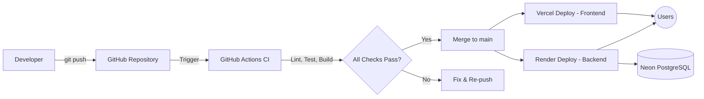

<div align="center">

# ☁️ Deployment Guide

### How Unwind ships from a laptop to production

[](https://project-unwind-mu.vercel.app/)
[](https://project-unwind.onrender.com/)
[](https://neon.tech/)
[](https://github.com/features/actions)

</div>

<br/>

This document describes Unwind's deployment architecture, the release pipeline, environment configuration, and the rollback process.

<br/>

## 📚 Table of Contents

- [Environments](#-environments)
- [Deployment Architecture](#-deployment-architecture)
- [Pre-Deployment Checklist](#-pre-deployment-checklist)
- [CI/CD Pipeline](#-cicd-pipeline)
- [Frontend Deployment (Vercel)](#-frontend-deployment-vercel)
- [Backend Deployment (Render)](#-backend-deployment-render)
- [Database Migrations (Neon)](#-database-migrations-neon)
- [Environment Variables](#-environment-variables)
- [Post-Deployment Verification](#-post-deployment-verification)
- [Rollback Procedure](#-rollback-procedure)
- [Hotfix Process](#-hotfix-process)

<br/>

## 🌍 Environments

<div align="center">

| Environment | Purpose | Frontend | Backend | Database |
|---|---|---|---|---|
| **Local** | Development | `localhost:5173` | `localhost:<PORT>` | Local/Neon dev branch |
| **Preview** | Per-PR review builds | Vercel preview URL | Render preview (if configured) | Neon dev branch |
| **Production** | Live application | Vercel production | Render production | Neon production branch |

</div>

<br/>

## 🏗️ Deployment Architecture



<br/>

## ✅ Pre-Deployment Checklist

Before merging to `main`:

- [ ] All CI checks (lint, tests, build) pass
- [ ] `.env.example` files updated if new environment variables were introduced
- [ ] Database migrations reviewed and tested locally
- [ ] No secrets, tokens, or real user data present in the diff
- [ ] Breaking API changes communicated and versioned appropriately
- [ ] Critical flows manually verified: login, assessment, journal, community, messaging
- [ ] Rollback plan identified for high-risk changes

<br/>

## 🔁 CI/CD Pipeline

GitHub Actions runs automatically on pushes and pull requests targeting `main`:

| Stage | Description |
|---|---|
| **Install** | Install backend and frontend dependencies |
| **Lint** | Run ESLint on frontend and backend code |
| **Test** | Run backend automated test suite |
| **Build** | Verify the production frontend build succeeds |
| **Security scan** | Dependabot, Gitleaks secret scanning, and header/Nuclei checks |

A merge to `main` that passes all checks automatically triggers deployment via Vercel and Render's Git integrations.

<br/>

## 🚀 Frontend Deployment (Vercel)

1. Vercel is connected to the `main` branch via Git integration.
2. Every push to `main` triggers an automatic production build.
3. Every pull request automatically receives a **preview deployment** with a unique URL for review.
4. Build command: `npm run build` · Output directory: `dist`
5. Environment variables are configured in the Vercel project dashboard under **Settings → Environment Variables**, mirroring `client/.env.example`.

**Manual redeploy (if needed):**

```bash
vercel --prod
```

<br/>

## 🖥️ Backend Deployment (Render)

1. Render is connected to the `main` branch via Git integration.
2. Every push to `main` triggers an automatic build and deploy of the backend service.
3. Start command: `npm start` · Build command: `npm ci`
4. Environment variables are configured in the Render dashboard under the service's **Environment** tab, mirroring `backend/.env.example`.
5. Render health checks poll a designated health endpoint to confirm the service is live before routing traffic.

<br/>

## 🗄️ Database Migrations (Neon)

1. Schema changes are written as migration scripts and tested against a Neon development branch first.
2. Neon's branching feature is used to create an isolated copy of production data/schema for safe testing.
3. Once verified, migrations are applied to the production branch during a deployment window with minimal active traffic.
4. Always take note of the current schema state before running a migration, in case a rollback is required.

> Never run untested migrations directly against the production database.

<br/>

## 🔑 Environment Variables

Refer to the [README's Environment Variables section](./README.md#-environment-variables) for the full list of required backend and frontend variables. Keep the following in sync across environments:

- `DATABASE_URL`, `JWT_ACCESS_SECRET`, `JWT_REFRESH_SECRET`
- `BREVO_API_KEY`, `BREVO_SENDER_EMAIL`
- `CLOUDINARY_CLOUD_NAME`, `CLOUDINARY_API_KEY`, `CLOUDINARY_API_SECRET`
- `VITE_API_URL`, `VITE_POSTHOG_KEY`, `VITE_POSTHOG_HOST`

> Rotate any credential immediately if it may have been exposed in logs, screenshots, or version control.

<br/>

## 🔎 Post-Deployment Verification

After every production deployment, verify:

- [ ] The frontend loads and the homepage renders correctly
- [ ] Login, registration, and OTP verification work end-to-end
- [ ] The DASS-21 assessment can be completed and scored
- [ ] Journal entries can be created and unlocked with a PIN
- [ ] Real-time messaging (Socket.IO) connects successfully
- [ ] Admin dashboard loads for an authorized account
- [ ] No new errors appear in monitoring/logging (see [MONITORING.md](./MONITORING.md))

<br/>

## ⏪ Rollback Procedure

If a deployment introduces a critical issue:

1. **Frontend:** In the Vercel dashboard, select the last known-good deployment and choose **Promote to Production** (instant rollback, no rebuild required).
2. **Backend:** In the Render dashboard, redeploy the last successful build from the **Deploys** tab, or revert the merge commit on `main` and push.
3. **Database:** If a migration caused the issue, apply the corresponding down-migration or restore from the most recent Neon backup/branch snapshot (see [DISASTER_RECOVERY.md](./DISASTER_RECOVERY.md)).
4. Confirm the rollback resolved the issue using the post-deployment verification checklist above.
5. Document the incident and root cause before re-attempting the fix.

<br/>

## 🩹 Hotfix Process

For urgent production issues that cannot wait for the normal PR cycle:

1. Branch from `main` using `fix/hotfix-<short-description>`.
2. Keep the change as small and targeted as possible.
3. Request expedited review from a maintainer.
4. Merge and monitor the deployment closely using the verification checklist.
5. Backport the fix into any active feature branches if relevant.

<br/>

---

<div align="center">

### 🌿 Ship calmly, ship safely.

For monitoring after deployment, see [MONITORING.md](./MONITORING.md). For recovery from major incidents, see [DISASTER_RECOVERY.md](./DISASTER_RECOVERY.md).

</div>
