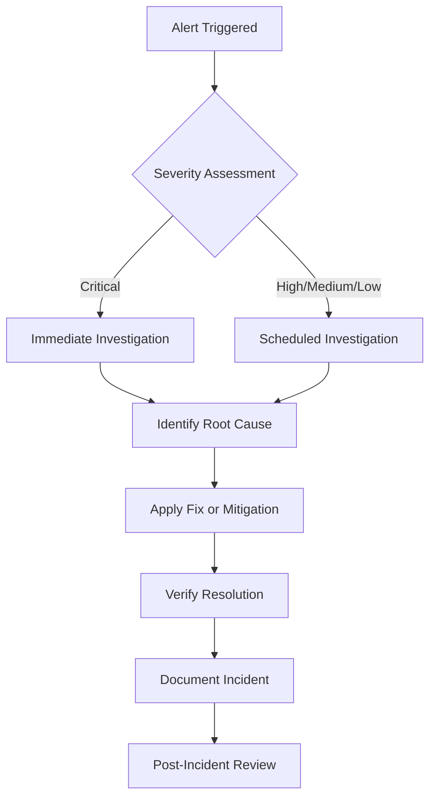

# 📊 Monitoring & Observability

### Keeping Unwind healthy, fast, and trustworthy in production

 

This document describes how Unwind observes the health of its systems, tracks errors, monitors performance, and gets alerted when something needs attention.

 

## 📚 Table of Contents

- [Monitoring Philosophy](#-monitoring-philosophy)
- [System Health Checks](#-system-health-checks)
- [Uptime Monitoring](#-uptime-monitoring)
- [Error Tracking](#-error-tracking)
- [Logging](#-logging)
- [Product Analytics](#-product-analytics)
- [Performance Monitoring](#-performance-monitoring)
- [Alerting](#-alerting)
- [Dashboards](#-dashboards)
- [Privacy in Monitoring](#-privacy-in-monitoring)
- [Incident Response Workflow](#-incident-response-workflow)

 

## 🎯 Monitoring Philosophy

Unwind handles emotionally sensitive data, so monitoring is built around two equally important goals:

1. **Reliability** — knowing quickly when something breaks, before users notice.
2. **Privacy** — observing system behavior without exposing personal or wellness-related content.

Monitoring tools are configured to capture **metadata and technical signals**, not the content of journal entries, assessment answers, or private messages.

 

## 🩺 System Health Checks

| Component | Check | Frequency |
|---|---|---|
| Backend API | Health endpoint returns `200 OK` | Every 1–5 minutes |
| Frontend (Vercel) | Homepage and key routes load successfully | Continuous, on deploy |
| Database (Neon) | Connection pool and query latency | Continuous |
| Socket.IO | WebSocket handshake success rate | Continuous |
| Email service (Brevo) | Delivery success rate for OTP/reset emails | Daily review |
| Media storage (Cloudinary) | Upload success rate | Daily review |

 

## ⏱️ Uptime Monitoring

- An external uptime monitor periodically pings the backend health endpoint and the frontend homepage.
- Downtime beyond a short threshold triggers an alert to the maintainer team.
- Uptime history is reviewed periodically to identify recurring patterns (e.g., cold-start delays on the free tier of a hosting provider).

 

## 🐞 Error Tracking

- Backend exceptions are logged with a stack trace, request path, and a sanitized context object (no request bodies containing sensitive fields).
- Frontend runtime errors are captured via a global error boundary and logged with the route, browser, and a de-identified session reference.
- Errors are grouped by type and frequency to prioritize fixes — a spike in a single error type is treated as a signal worth investigating immediately, even if severity seems low.

**Fields intentionally excluded from error logs:**

- Journal entry content
- DASS-21 answers or written reflections
- Private/direct message content
- Passwords, tokens, OTPs, and PINs (even hashed forms, unless required for a specific security investigation)

 

## 📝 Logging

| Log type | Contents | Retention |
|---|---|---|
| **Access logs** | Request method, route, status code, response time | Short-to-medium term |
| **Application logs** | Service-level events (startup, job runs, integration calls) | Medium term |
| **Security/audit logs** | Admin actions, permission changes, moderation decisions | Extended retention |
| **Error logs** | Exceptions, stack traces, sanitized context | Medium term |

Logs are treated as sensitive infrastructure data: access is restricted to maintainers, and logs are never used as a substitute for the consent-based analytics described below.

 

## 📈 Product Analytics

Unwind uses **PostHog** for privacy-conscious product analytics, focused on understanding feature usage rather than individual behavior.

- Events are limited to interaction-level signals (e.g., "assessment started," "journal entry created") rather than content.
- Personally identifiable fields are masked or excluded from analytics payloads where feasible.
- Analytics configuration favors aggregate, cohort-level insight over granular individual tracking.
- Analytics data informs product decisions — e.g., which features are underused or where users drop off — not moderation or clinical judgments about any individual.

 

## ⚡ Performance Monitoring

- Frontend build size and chunk sizes are checked as part of the CI build step to catch regressions early.
- Key user flows (login, assessment submission, journal save, message send) are periodically tested for response-time regressions.
- Database query performance is reviewed for slow queries, particularly on frequently accessed endpoints like the dashboard and community feed.
- Socket.IO connection stability is monitored to catch reconnect storms or degraded real-time performance.

 

## 🔔 Alerting

| Severity | Example Trigger | Response |
|---|---|---|
| 🔴 **Critical** | API fully down, database unreachable, auth failures spike | Immediate investigation |
| 🟠 **High** | Elevated error rate, degraded real-time messaging | Investigate within hours |
| 🟡 **Medium** | Slow queries, rising latency trend | Investigate within days |
| 🟢 **Low** | Minor UI errors, non-blocking warnings | Scheduled into regular work |

Alerts are routed to the maintainer team through the configured notification channel (e.g., email or chat integration tied to the hosting/monitoring provider).

 

## 📺 Dashboards

- **Infrastructure dashboard** — uptime, response times, error rates, deployment history (Vercel/Render dashboards)
- **Database dashboard** — connection counts, query performance, storage usage (Neon dashboard)
- **Product dashboard** — feature adoption, engagement trends, funnel drop-off (PostHog)

 

## 🔐 Privacy in Monitoring

- Monitoring and analytics tooling is configured to align with the principles in [PRIVACY.md](./PRIVACY.md) and the [Security Policy](./SECURITY.md).
- No monitoring tool is granted access to raw journal, assessment, or message content.
- Any new monitoring integration is reviewed for data-handling implications before being enabled in production.

 

## 🚑 Incident Response Workflow

For major incidents involving data loss, extended downtime, or a security breach, follow the escalation and recovery steps in [DISASTER_RECOVERY.md](./DISASTER_RECOVERY.md).

 

---

### 🌿 Calm systems, calm users.

Questions about monitoring setup? Open a discussion in the [Project Unwind organization](https://github.com/Project-Unwind).

