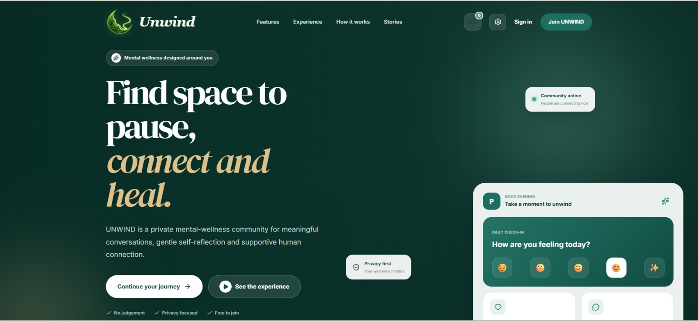
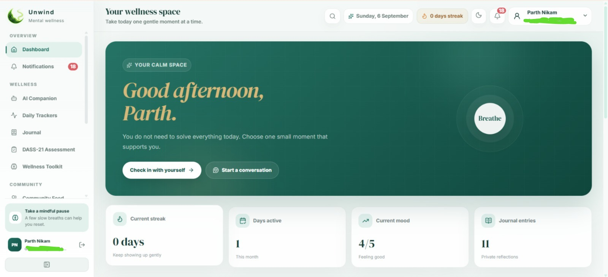
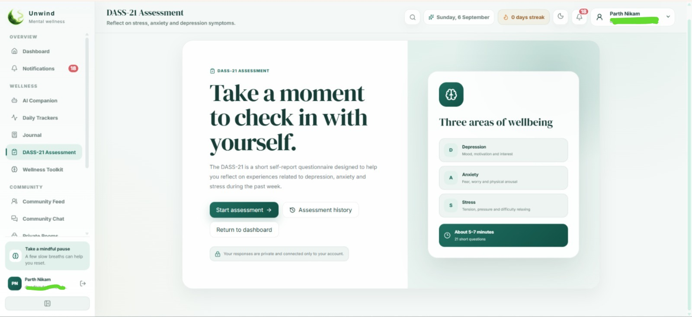
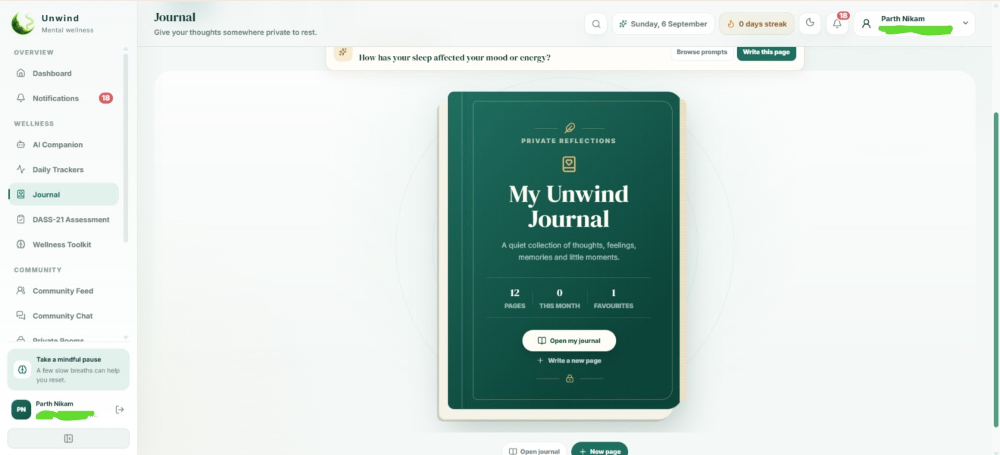
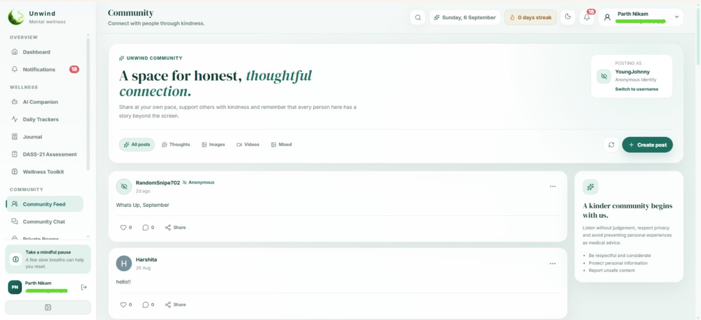
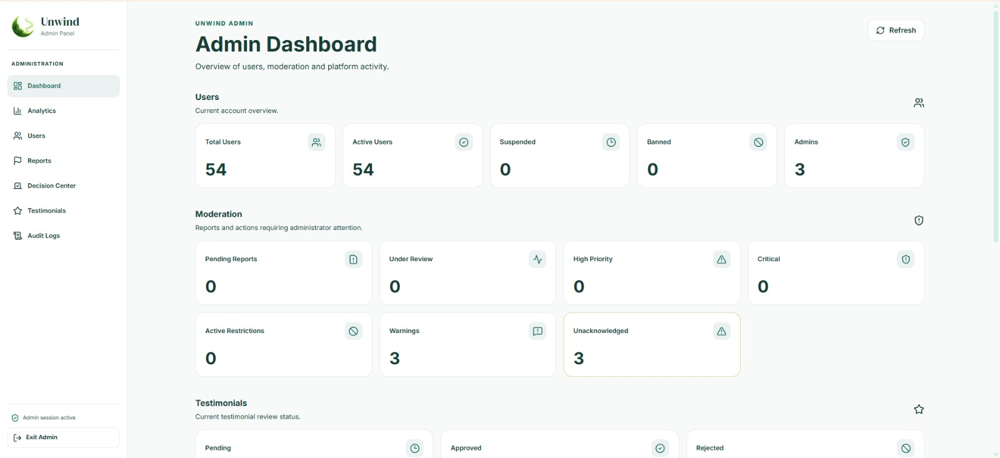
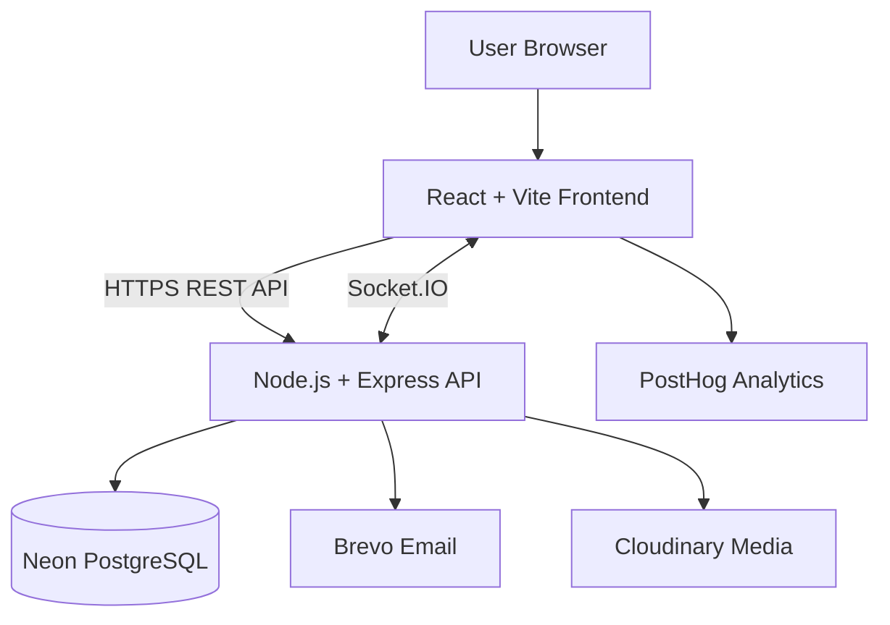

<div align="center">

# 🌿 Unwind

### *A privacy-first mental wellness and self-care platform*

Assessments, private journaling, habit tracking, and community support — in one calm, secure space.

<br/>

[](https://react.dev/)
[](https://nodejs.org/)
[](https://www.postgresql.org/)
[](https://project-unwind-mu.vercel.app/)
[](./LICENSE.md)

<br/>

**[🚀 Live App](https://project-unwind-mu.vercel.app/) &nbsp;·&nbsp; [🔌 Backend API](https://project-unwind.onrender.com/) &nbsp;·&nbsp; [🏢 Organization](https://github.com/Project-Unwind)**

</div>

<br/>

> Unwind is a calm, secure, and inclusive digital space that helps people understand their emotions, build healthier habits, journal privately, connect with a supportive community, and access structured mental-wellness tools.

<br/>

## 📚 Table of Contents

<details>
<summary>Click to expand</summary>

<br/>

| | | |
|---|---|---|
| [About Unwind](#-about-unwind) | [Why Unwind?](#-why-unwind) | [Screenshots](#-screenshots) |
| [Core Features](#-core-features) | [Technology Stack](#-technology-stack) | [System Architecture](#-system-architecture) |
| [Project Structure](#-project-structure) | [Getting Started](#-getting-started) | [Environment Variables](#-environment-variables) |
| [Available Scripts](#-available-scripts) | [Security & Privacy](#-security--privacy) | [Testing & QA](#-testing--quality-assurance) |
| [Deployment](#-deployment) | [API Overview](#-api-overview) | [Accessibility](#-accessibility--performance) |
| [Roadmap](#-roadmap) | [Contributing](#-contributing) | [Documentation](#-documentation) |
| [Disclaimer](#️-important-disclaimer) | [Team](#-team--acknowledgements) | [License](#-license) |

</details>

<br/>

## 🌱 About Unwind

Mental-health tools are often fragmented across separate apps for assessments, journaling, habit tracking, and peer support — and some platforms ask users to trade privacy for access.

**Unwind brings these experiences together in one thoughtfully designed platform**, built around privacy, emotional awareness, consistency, and supportive community interaction — while keeping one clear boundary:

> Unwind supports well-being but does **not** diagnose or replace professional mental-health care.

The interface uses a calm, nature-inspired visual language — deep forest green, sage, mint, cream, and warm off-white tones — with a dashboard that puts mental health at the center of a personal wellness system, rather than competing for attention.

<br/>

## ✨ Why Unwind?

| | |
|---|---|
| 🔒 **Privacy first** | Sensitive journal and account experiences are protected with layered access controls. |
| 🧩 **One connected platform** | Assessments, journals, wellness tracking, community, and insights work together. |
| 🕊️ **Non-clinical experience** | The interface feels calm and approachable rather than institutional. |
| 📊 **Structured self-reflection** | Users can observe patterns instead of relying only on memory. |
| 🤝 **Inclusive community** | Public rooms, private rooms, direct messages, and identity controls support different comfort levels. |
| ✅ **Responsible positioning** | Results and recommendations are informative, not medical diagnoses. |

<br/>

## 🖼️ Screenshots

<div align="center">

**Landing Page**


**Wellness Dashboard**


**DASS-21 Assessment**


**Private Journal**


**Community**


**Admin & Analytics**


</div>

## 🧩 Core Features

<details open>
<summary><h3 style="display:inline">🔐 Authentication & Account Security</h3></summary>

- Account registration with email verification via OTP
- Secure login/logout with short-lived access tokens and refresh-token sessions
- HTTP-only cookie support for sensitive session credentials
- Remember Me, forgot-password, and reset-password flows
- Change-password support and logout from one or all devices
- Profile creation, editing, account settings, and onboarding

</details>

<details>
<summary><h3 style="display:inline">🧠 DASS-21 Self-Assessment</h3></summary>

- Complete 21-question DASS-21 assessment flow
- Separate scoring for depression, anxiety, and stress
- Severity-level interpretation for each dimension
- Assessment history, progress statistics, and risk-aware recommendations
- Downloadable multi-page PDF assessment report
- Clear non-diagnostic notices throughout the experience

> DASS-21 is used as a self-assessment and reflection aid. Results are **not** a medical diagnosis.

</details>

<details>
<summary><h3 style="display:inline">📔 Private Journal</h3></summary>

- Dedicated journal PIN for an additional privacy layer, with recovery via OTP
- Temporary unlocked journal sessions
- Draft and completed entries with custom and system-provided writing prompts
- Emotion, activity, and tag organization
- Favourite entries, optional preview hiding, attachment support
- Archive/restore workflows and soft deletion with optional permanent deletion

</details>

<details>
<summary><h3 style="display:inline">💬 Community & Real-Time Communication</h3></summary>

- Posts with text, images, or videos — likes, shares, comments, and comment likes
- Public discussion rooms and invite-based private rooms
- One-to-one direct messaging with real-time chat powered by Socket.IO
- Typing indicators, online presence, unread counts, and read receipts
- Message replies and editing
- User-selectable identity visibility, plus reporting and moderation workflows

</details>

<details>
<summary><h3 style="display:inline">🌤️ Wellness & Self-Care</h3></summary>

- Personal wellness activities, tasks, and habit-oriented progress tracking
- Sleep, hydration, and other self-care records
- Dashboard summaries, recent activity, and engagement streaks
- Personalized recommendations based on available user activity

</details>

<details>
<summary><h3 style="display:inline">🔔 Notifications</h3></summary>

- Central notification center with read/unread states
- Filters and bulk actions
- Updates for relevant community and account activity

</details>

<details>
<summary><h3 style="display:inline">🛡️ Administrative & Moderation Tools</h3></summary>

- Separate, protected administrator-access flow and dashboard analytics
- User directory, detailed user views, and reports review
- Moderation decision center with warning and restriction management
- Testimonial review and approval
- Administrator-access session controls and audit trail for sensitive actions

</details>

<details>
<summary><h3 style="display:inline">🎨 User Experience</h3></summary>

- Responsive desktop, tablet, and mobile layouts
- Light and dark themes with reduced-motion support
- Global loading, empty, success, and error states with skeleton loaders
- Motion-enhanced dashboard interactions and custom 404/fallback experiences

</details>

<br/>

## 🛠️ Technology Stack

| Layer | Technologies |
|---|---|
| **Frontend** | React, Vite, JavaScript, CSS, React Router |
| **UI & Motion** | Lucide React, Framer Motion, responsive custom UI |
| **Backend** | Node.js, Express.js, ES Modules |
| **Database** | PostgreSQL hosted on Neon |
| **Real-Time** | Socket.IO |
| **Authentication** | JWT access tokens, refresh tokens, HTTP-only cookies, OTP verification |
| **Email** | Brevo transactional email |
| **Media** | Cloudinary |
| **Analytics** | PostHog with privacy-conscious configuration |
| **PDF Generation** | Application-generated DASS-21 reports |
| **Hosting** | Vercel (frontend) · Render (backend) |
| **CI/CD** | GitHub Actions |
| **Quality & Security** | ESLint, automated tests, Dependabot, Gitleaks, Nuclei |

<br/>

## 🏗️ System Architecture



**Request flow:**

1. The React application sends HTTPS requests to the Express API.
2. Protected routes validate the user's access token and authorization level.
3. Refresh-token sessions maintain secure long-term authentication.
4. The backend validates input and performs parameterized database operations.
5. Socket.IO manages real-time community messages, presence, and typing events.
6. External services handle transactional email, media storage, and privacy-conscious analytics.

<br/>

## 📁 Project Structure

```text
Project-Unwind/
├── backend/
│   ├── src/
│   │   ├── config/          # Database and service configuration
│   │   ├── controllers/     # Request handlers
│   │   ├── middleware/      # Authentication, authorization, validation
│   │   ├── routes/          # REST API routes
│   │   ├── services/        # Reusable business logic
│   │   ├── socket/          # Real-time communication logic
│   │   └── server.js        # Backend entry point
│   ├── test/                # Backend tests
│   ├── package.json
│   └── .env.example
├── client/
│   ├── public/               # Static assets
│   ├── src/
│   │   ├── assets/          # Images, icons, and media
│   │   ├── components/      # Shared UI components
│   │   ├── context/         # Global application state
│   │   ├── hooks/           # Reusable React hooks
│   │   ├── pages/           # Route-level pages
│   │   ├── services/        # API client functions
│   │   └── main.jsx         # Frontend entry point
│   ├── package.json
│   └── .env.example
├── docs/
│   └── screenshots/          # README screenshots
├── .github/
│   └── workflows/            # CI workflows
├── README.md
├── SECURITY.md
├── CONTRIBUTING.md
└── LICENSE.md
```

> The exact internal folder names may evolve as the project grows. Refer to the repository for the latest structure.

<br/>

## 🚀 Getting Started

### Prerequisites

- [Node.js](https://nodejs.org/) 22.x
- npm
- PostgreSQL or a Neon PostgreSQL database
- Git
- Accounts or test credentials for the external services used by your configuration

### 1 · Clone the repository

```bash
git clone https://github.com/Project-Unwind/Project-Unwind.git
cd Project-Unwind
```

### 2 · Install backend dependencies

```bash
cd backend
npm ci
```

### 3 · Install frontend dependencies

```bash
cd ../client
npm ci
```

### 4 · Configure environment variables

```bash
cp backend/.env.example backend/.env
cp client/.env.example client/.env
```

Fill in the required development values. **Never commit a populated `.env` file.**

### 5 · Prepare the database

Create a PostgreSQL database and run the schema or migration commands included in the repository. Confirm that the configured database user has only the permissions required by the application.

### 6 · Start the backend

```bash
cd backend
npm run dev
```

### 7 · Start the frontend

Open a second terminal:

```bash
cd client
npm run dev
```

Open the local URL printed by Vite — commonly `http://localhost:5173`.

<br/>

## 🔑 Environment Variables

Exact names must match the `.env.example` files in the repository.

<details>
<summary><strong>Backend</strong></summary>

<br/>

| Variable | Purpose |
|---|---|
| `NODE_ENV` | Application environment |
| `PORT` | Backend server port |
| `DATABASE_URL` | PostgreSQL connection string |
| `CLIENT_URL` | Allowed frontend origin |
| `JWT_ACCESS_SECRET` | Access-token signing secret |
| `JWT_REFRESH_SECRET` | Refresh-token signing secret |
| `BREVO_API_KEY` | Transactional-email authentication |
| `BREVO_SENDER_EMAIL` | Verified sender address |
| `CLOUDINARY_CLOUD_NAME` | Media-storage account name |
| `CLOUDINARY_API_KEY` | Media-storage API key |
| `CLOUDINARY_API_SECRET` | Media-storage API secret |
| `POSTHOG_API_KEY` | Server-side analytics key, when used |

</details>

<details>
<summary><strong>Frontend</strong></summary>

<br/>

| Variable | Purpose |
|---|---|
| `VITE_API_URL` | Backend API base URL |
| `VITE_POSTHOG_KEY` | Frontend analytics project key |
| `VITE_POSTHOG_HOST` | Analytics host |

</details>

> ⚠️ Do not paste production secrets into documentation, issues, screenshots, client code, or Git commits. Rotate any credential that may have been exposed.

<br/>

## 📜 Available Scripts

Run scripts from their corresponding `backend` or `client` directory. Refer to each `package.json` for the authoritative list.

**Backend**

```bash
npm run dev       # Start the development server
npm start         # Start the production server
npm test          # Run the test suite
npm run test:ci   # Run tests in CI mode
```

**Frontend**

```bash
npm run dev       # Start the Vite development server
npm run build     # Create a production build
npm run preview   # Preview the production build locally
npm run lint      # Run ESLint
```

<br/>

## 🔐 Security & Privacy

Unwind handles emotionally sensitive information, so privacy and defensive engineering are core requirements rather than optional additions.

**Implemented protections**

- Short-lived JWT access tokens and refresh-token session management
- HTTP-only cookies for sensitive authentication credentials
- Email OTP verification and recovery flows
- Password hashing before database storage
- Role-based access control and separate administrator-access verification
- Journal PIN protection with temporary unlock sessions
- Rate limits for authentication and OTP endpoints
- Input validation and safe, parameterized database queries
- Controlled CORS configuration and media-type/upload restrictions
- Audit logs for administrator actions
- Masked analytics/session data where analytics is enabled
- Automated dependency and secret scanning

**Responsible disclosure:** If you discover a vulnerability, do not create a public issue containing exploit details or user data. Follow the private disclosure process in [SECURITY.md](./SECURITY.md).

<br/>

## ✅ Testing & Quality Assurance

Unwind combines automated checks with structured human testing:

- Backend syntax validation, automated test suite, and frontend ESLint checks
- Production frontend build verification
- CI checks on pushes and pull requests targeting `main`
- Dependabot alerts, Gitleaks secret scanning, Nuclei and security-header checks
- Manual responsive testing across common screen sizes
- Light-mode/dark-mode verification and critical-flow regression testing

<div align="center">

| 🧪 Testers | 🧑‍💻 Technical | 🙋 Non-technical | ⭐ Rated 4–5 / 5 |
|:---:|:---:|:---:|:---:|
| **59** | 14 | 45 | **~90–95%** |

</div>

> These figures describe the reported test cycle and are not clinical outcome claims.

<br/>

## ☁️ Deployment

| Component | Platform | Address |
|---|---|---|
| Frontend | Vercel | [Open application](https://project-unwind-mu.vercel.app/) |
| Backend | Render | [Open API host](https://project-unwind.onrender.com/) |
| Database | Neon | Managed PostgreSQL |
| Media | Cloudinary | Managed media storage |

**Production pipeline**

1. Changes are developed and tested on a feature branch.
2. GitHub Actions validates backend syntax, tests, linting, and the frontend build.
3. Reviewed changes are merged into `main`.
4. Vercel builds and deploys the frontend; Render deploys the backend service.
5. Production health and critical user flows are verified after deployment.

<br/>

## 🔌 API Overview

| Area | Capabilities |
|---|---|
| Authentication | Register, verify OTP, login, refresh, logout, recover password |
| User | Profile, preferences, onboarding, account settings, sessions |
| DASS-21 | Submit assessment, calculate results, view history and statistics |
| Journal | PIN security, entries, prompts, tags, attachments, archive, recovery |
| Wellness | Track activities and retrieve progress summaries |
| Community | Posts, reactions, comments, rooms, members, messages, reports |
| Notifications | List, filter, mark as read, and manage notifications |
| Testimonials | Submit testimonials and retrieve approved entries |
| Admin | Analytics, users, reports, moderation, access, audit logs |

Real-time community capabilities are delivered through Socket.IO events alongside the REST API.

<br/>

## ♿ Accessibility & Performance

- Responsive layouts support mobile, tablet, and desktop screens
- Semantic controls and visible labels improve keyboard and assistive-technology use
- Colour choices reviewed in both light and dark themes
- `prefers-reduced-motion` is respected for motion-sensitive users
- Loading indicators, skeletons, and clear empty/success/error states
- Caching and optimized data fetching reduce repeated community requests
- Production builds are checked for bundle and chunk-size regressions

<br/>

## 🗺️ Roadmap

- [x] Secure account and session management
- [x] Email OTP verification and password recovery
- [x] DASS-21 assessment, history, and PDF reports
- [x] PIN-protected private journal
- [x] Real-time community rooms and direct messages
- [x] Admin moderation and analytics tools
- [x] Responsive light and dark themes
- [x] Production deployment and initial user testing
- [ ] Expand automated unit, integration, and end-to-end coverage
- [ ] Improve performance through route-level code splitting
- [ ] Strengthen accessibility through a formal WCAG audit
- [ ] Publish complete API and database documentation
- [ ] Conduct longer-term, consent-based user-experience research
- [ ] Expand curated wellness resources with expert review

📄 See [ROADMAP.md](./ROADMAP.md) for the detailed product roadmap.

<br/>

## 🤝 Contributing

Contributions that improve accessibility, privacy, performance, documentation, testing, and responsible wellness support are welcome.

1. Fork the repository
2. Create a feature branch
   ```bash
   git checkout -b feature/your-feature-name
   ```
3. Make focused changes and add or update tests
4. Run the relevant lint, test, and build commands
5. Commit using a clear message
   ```bash
   git commit -m "feat: add a concise feature description"
   ```
6. Push the branch and open a pull request

Read [CONTRIBUTING.md](./CONTRIBUTING.md) before submitting a contribution. By participating, you agree to follow the project's [Code of Conduct](./CODE_OF_CONDUCT.md), when available.

<br/>

## 📖 Documentation

| Document | Purpose |
|---|---|
| [SECURITY.md](./SECURITY.md) | Security policy and responsible disclosure |
| [LICENSE.md](./LICENSE.md) | Project license |

<br/>

## ⚠️ Important Disclaimer

Unwind is a wellness and self-reflection platform. It is **not a medical device**, does **not provide a diagnosis**, and is **not a replacement for a qualified mental-health professional, emergency service, or crisis-support provider**.

**If you or someone else may be in immediate danger, contact local emergency services.** If you are experiencing a mental-health crisis, contact an appropriate crisis helpline or qualified professional in your region.

<br/>

## 👥 Team & Acknowledgements

Unwind is built and maintained by the **Project Unwind** team, with contributions spanning full-stack engineering, frontend experience, assessment logic, testing, content review, and community feedback.

**Special thanks to:**

- Every technical and non-technical tester who shared honest feedback
- Contributors who helped improve accessibility, security, and usability
- The NGO/content consultant who supported responsible wellness communication
- Open-source maintainers whose work makes Unwind possible

### Project Lead

**Atharva Padwal** — IT Engineering student and full-stack developer
[](https://github.com/AtharvaPadwal2)
[](https://github.com/Project-Unwind)

**Parth Nikam** — IT Engineering student and full-stack developer
[](https://github.com/Parth170606)
[](https://github.com/Project-Unwind)

<br/>

## 📄 License

This project is distributed under the terms described in [LICENSE.md](./LICENSE.md). Review that file before using, modifying, or distributing the source code.

<br/>

---

<div align="center">

### 🌿 Built with empathy, privacy, and purpose.

If Unwind helps or inspires you, consider **starring the repository** ⭐ and sharing thoughtful feedback.

</div>
