# Unwind System Design

## Document control

| Field                      | Value                            |
| -------------------------- | -------------------------------- |
| Project                    | Unwind                           |
| Document owner             | Atharva Padwal                   |
| Backend and data owner     | Atharva Padwal                   |
| Frontend integration owner | Parth Nikam                      |
| Created                    | 12 September 2026                |
| Last updated               | 12 September 2026                |
| Status                     | Active                           |
| Classification             | Internal technical documentation |

## 1. Purpose and scope

This document describes how Unwind is designed at implementation level: component responsibilities, request processing, state, authentication, feature workflows, database interaction, real-time events, external services, failure behaviour, security controls, performance, and scaling.

`ARCHITECTURE.md` describes the high-level system shape. This file explains how that shape operates. Exact route names, payloads, and source paths belong in API documentation and must not be invented when they have not been verified from code.

Related documentation:

* [`ARCHITECTURE.md`](./ARCHITECTURE.md)
* [`DECISIONS.md`](./DECISIONS.md)
* [`DATABASE.md`](./DATABASE.md)
* [`SECURITY.md`](./SECURITY.md)
* [`PRIVACY.md`](./PRIVACY.md)
* API and testing documentation

## 2. Goals and constraints

### Functional goals

* authenticated and recoverable user accounts;
* DASS-21 self-assessment and progress history;
* private PIN-protected journaling;
* mood, energy, sleep, water, habit, and wellness tracking;
* safety-aware AI support;
* posts, comments, reactions, rooms, and direct messages;
* notifications, reporting, moderation, and administration;
* responsive, accessible, theme-aware user experience.

### Non-functional goals

| Quality         | Design requirement                                                                      |
| --------------- | --------------------------------------------------------------------------------------- |
| Privacy         | Minimize exposure of wellness data and enforce ownership server-side                    |
| Security        | Layer authentication, authorization, validation, rate limits, hashing, and auditability |
| Reliability     | Fail safely and give users clear recoverable states                                     |
| Performance     | Measure critical paths and avoid unnecessary sequential work                            |
| Maintainability | Keep routes, validation, controllers, services, and SQL responsibilities clear          |
| Auditability    | Record consequential decisions, migrations, moderation, and document changes            |
| Accessibility   | Support keyboard use, contrast, responsive layouts, and reduced motion                  |
| Cost            | Operate within managed student-project hosting constraints                              |

### Known constraints

* Render cold starts can increase initial latency.
* Vercel, Render, Neon, Brevo, Cloudinary, and PostHog are independent failure domains.
* The React application has reported a large main bundle.
* Raw SQL gives control but requires disciplined ownership checks, parameters, migrations, and tests.
* Mental-wellness data raises the impact of privacy, safety, and moderation failures.
* Unwind supports well-being but is not a diagnostic or clinical system.

## 3. System overview

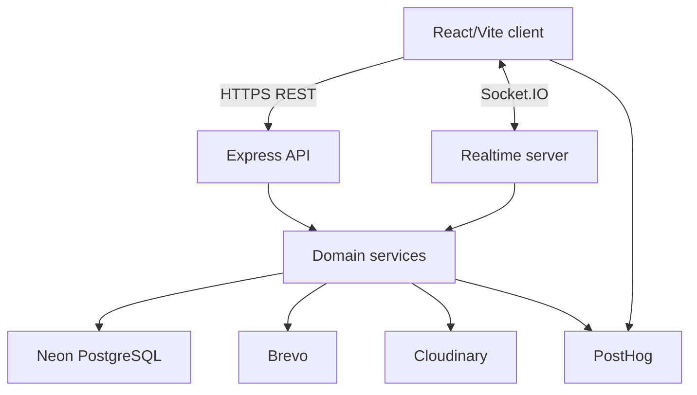

### Primary components

| Component         | State                                                  | Responsibility                                              | Owner          |
| ----------------- | ------------------------------------------------------ | ----------------------------------------------------------- | -------------- |
| React client      | Browser state                                          | UI, navigation, forms, feedback, API and socket integration | Parth Nikam    |
| Express API       | Stateless request handling plus external session state | Validation, authentication, authorization, orchestration    | Atharva Padwal |
| Socket.IO server  | Connection and room state                              | Authenticated real-time delivery and presence               | Atharva Padwal |
| Domain services   | Request-scoped logic                                   | Business rules, transactions, SQL, providers                | Atharva Padwal |
| PostgreSQL        | Durable state                                          | Relational integrity and application records                | Atharva Padwal |
| Managed providers | Provider-owned state                                   | Email, media, analytics, and OAuth                          | Atharva Padwal |

## 4. Frontend design

### Client structure

The client uses React with Vite, React Router, Axios, React Context for authentication, and plain CSS. Shared components provide reusable controls, loaders, states, and layout behaviour.

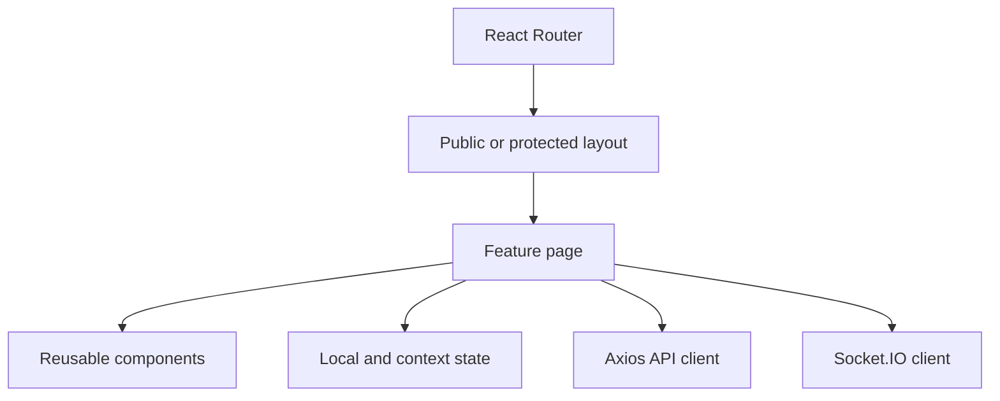

### Client state categories

| State                               | Recommended owner                  | Persistence                                   |
| ----------------------------------- | ---------------------------------- | --------------------------------------------- |
| Authenticated user and access state | Authentication context             | Memory; refresh through server cookie         |
| Form input                          | Page or form component             | Memory until submitted or explicitly drafted  |
| Server resource state               | Feature page or reusable data hook | Memory/cache with controlled invalidation     |
| Theme and allowed preferences       | Settings layer                     | Server and permitted local preference storage |
| Socket connection and presence      | Realtime client                    | Connection lifetime                           |
| Sensitive journal unlock state      | Server-issued unlock session       | Never represented by a plaintext PIN          |

### Page request state

Every server-dependent view should distinguish:

1. initial loading;
2. loaded with data;
3. loaded with no data;
4. recoverable error;
5. permission or authentication failure;
6. submission in progress;
7. submission success or failure.

The client must not show permanent success before the backend confirms sensitive writes. Optimistic updates may be used for low-risk interactions only when rollback and reconciliation are defined.

### API client behaviour

* use one configured API client for base URL and credential settings;
* attach access credentials consistently;
* attempt refresh only for eligible authentication failures;
* prevent uncontrolled refresh loops;
* retry only idempotent or explicitly retry-safe operations;
* normalize safe user-facing errors without discarding diagnostic identifiers;
* cancel or ignore stale requests when pages unmount or inputs change;
* never expose provider credentials in the client bundle.

## 5. Backend layered design

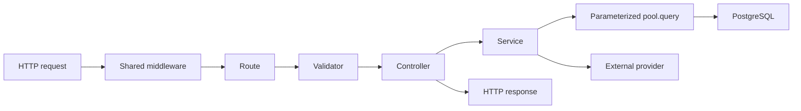

### Layer contract

| Layer            | Does                                                                           | Does not                                               |
| ---------------- | ------------------------------------------------------------------------------ | ------------------------------------------------------ |
| Middleware       | Parse, authenticate, rate-limit, authorize broad roles, attach trusted context | Implement feature business workflows                   |
| Route            | Bind method, path, middleware, validator, and controller                       | Query the database directly                            |
| Validator        | Check shape, type, bounds, enums, and required fields                          | Decide authorization from client claims                |
| Controller       | Extract validated input, call service, choose response status and shape        | Contain complex SQL or duplicate business rules        |
| Service          | Enforce ownership and business rules, coordinate SQL/providers/transactions    | Trust raw request identity fields                      |
| SQL access       | Execute parameterized statements and return controlled results                 | Concatenate user input into queries                    |
| Error middleware | Normalize safe errors and preserve operational logging                         | Leak stacks, queries, credentials, or sensitive values |

Unwind currently uses raw PostgreSQL `pool.query`; no ORM or separate repository layer is assumed. Services therefore require consistent query construction, transaction boundaries, row ownership, and mapping of database errors to safe application errors.

## 6. HTTP request lifecycle

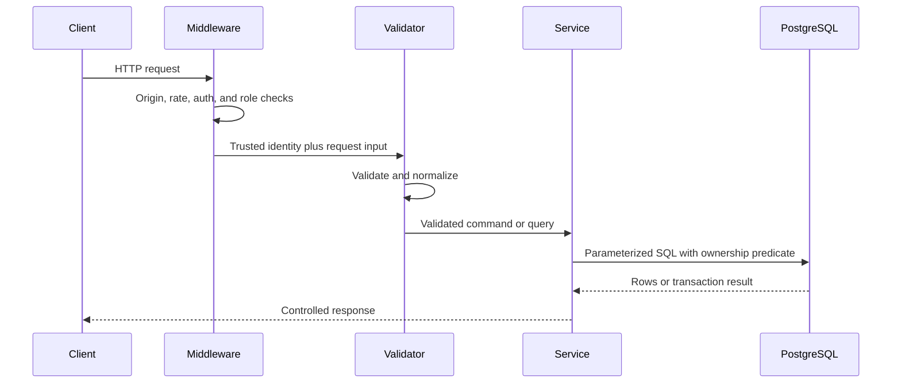

### Response design

* use consistent JSON envelopes or a consistently documented alternative;
* return stable HTTP status codes;
* avoid exposing database implementation details;
* use request or correlation identifiers for operational investigation;
* distinguish validation, authentication, authorization, not-found, conflict, rate-limit, and server failures;
* return only fields required by the client.

## 7. Authentication design

### Registration and verification

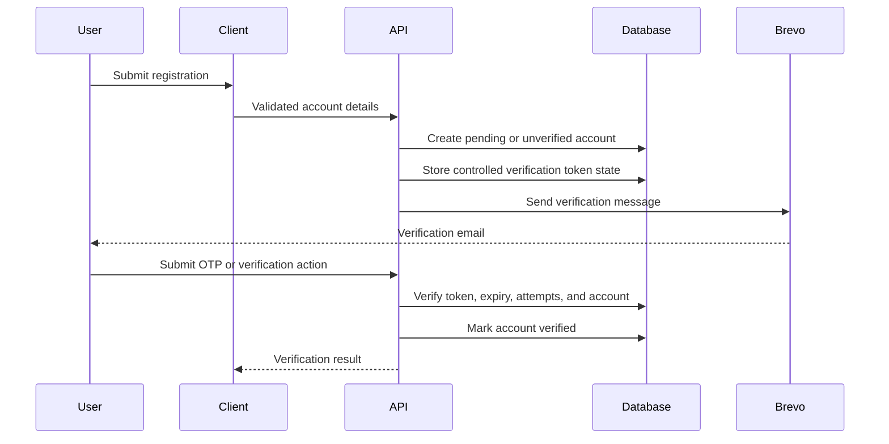

Design requirements:

* hash passwords with an approved adaptive password hash;
* normalize email safely before uniqueness checks;
* prevent account enumeration in recovery flows;
* expire and limit verification attempts;
* make token consumption single-use;
* rate-limit registration, verification, login, and recovery;
* avoid logging passwords, OTPs, tokens, or message bodies.

### Login and refresh

Access tokens are short-lived, approximately 15 minutes. Refresh tokens are longer-lived, approximately 30 days, delivered through HTTP-only cookies, rotated, and linked to revocable sessions.

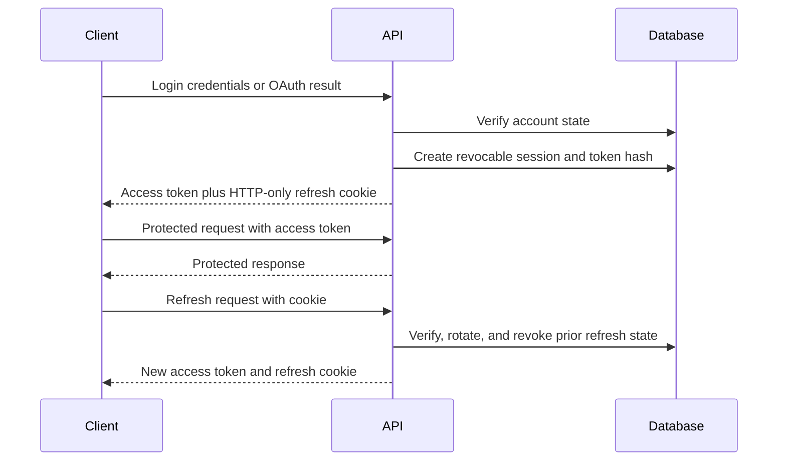

OAuth-only accounts may not have a password hash. Password login must return a controlled response for that state rather than throwing an internal error.

### Logout

* single-session logout revokes the active refresh session and clears its cookie;
* logout-all-devices revokes every eligible user session;
* expired or revoked refresh tokens cannot create new access tokens;
* access tokens remain bounded by their short lifetime unless a stronger deny-list mechanism is adopted.

## 8. Authorization design

Authorization has several levels:

| Level             | Example decision                                                                  |
| ----------------- | --------------------------------------------------------------------------------- |
| Authentication    | Is the requester a valid signed-in user?                                          |
| Role              | Is the requester a user, moderator, or administrator?                             |
| Ownership         | Does the requested journal, tracker, message, or profile belong to the requester? |
| Membership        | Does the requester belong to the room or direct conversation?                     |
| Restriction       | Is the requester blocked, warned, muted, or restricted from this action?          |
| Step-up authority | Has an administrator completed valid additional verification?                     |
| Object state      | Is this record active, archived, deleted, approved, or locked?                    |

Ownership must appear in the SQL predicate or an equivalent server-side authorization step. Checking that a row exists and then trusting a client-provided user ID creates an IDOR risk.

## 9. Admin step-up design

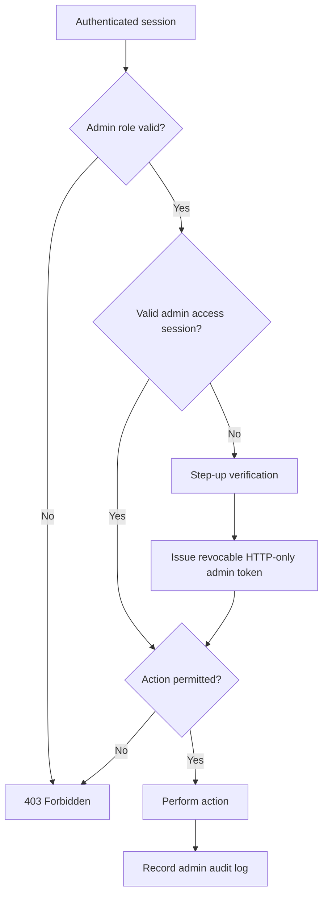

The current shared verification secret is a known weakness. The target design uses per-administrator credentials or stronger step-up authentication, short expiry, revocation, and individual attribution.

## 10. Journal design

### Journal access state

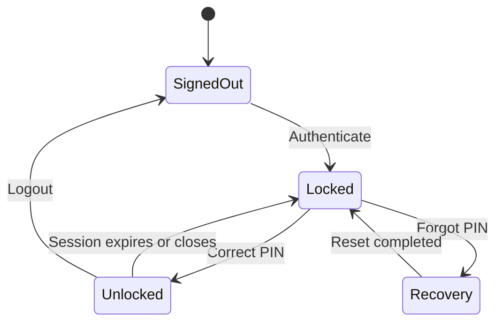

### Journal write flow

1. authenticate the account;
2. verify an active journal unlock session;
3. validate the entry and attachment metadata;
4. derive ownership from authenticated context;
5. perform the write in PostgreSQL;
6. coordinate Cloudinary state for attachments where applicable;
7. return only authorized entry data;
8. record safety events separately when the approved policy requires it.

PINs are strings so leading zeroes remain intact. PIN hashes, reset tokens, unlock tokens, private entry text, voice transcripts, and attachment identifiers require restricted logging and access.

### Journal state model

| State               | Meaning                                    | Allowed examples                           |
| ------------------- | ------------------------------------------ | ------------------------------------------ |
| Draft               | Work not finalized by user                 | Edit, save, complete, delete               |
| Completed           | User marked entry complete                 | Read, edit if allowed, favourite, archive  |
| Archived            | Hidden from the active collection          | Read, restore, delete                      |
| Soft deleted        | Retained temporarily under deletion policy | Restore or permanently delete if supported |
| Permanently deleted | Removed according to approved lifecycle    | No normal recovery                         |

Exact retention periods remain unresolved and must align with privacy documentation and provider-side media deletion.

## 11. DASS-21 design

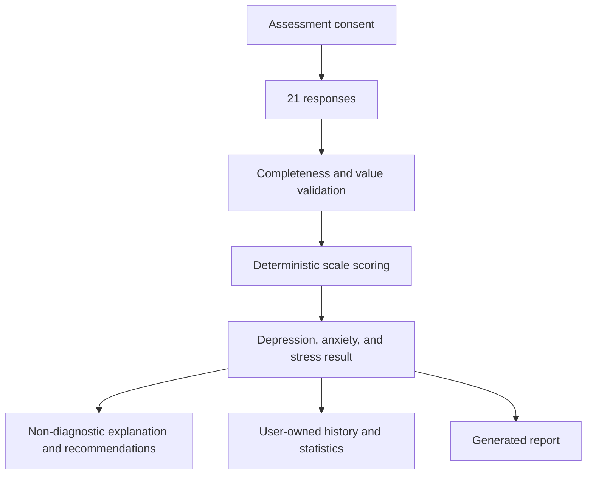

Design rules:

* use one authoritative scoring implementation;
* validate exactly the expected questions and response ranges;
* store consent and assessment ownership;
* make repeated submissions idempotent or safely conflict-aware;
* preserve the non-diagnostic boundary in UI, API, and reports;
* keep high-risk guidance separate from ordinary recommendations;
* test score boundaries and scale classification.

## 12. Wellness tracker design

Mood, energy, sleep, water, habits, activities, emotions, reminders, and settings use user-owned time-series records.

Common design pattern:

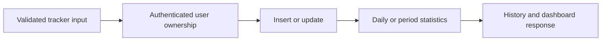

Requirements:

* store timestamps with an explicit timezone strategy;
* define daily boundaries for the user’s timezone;
* prevent duplicate records where only one record per period is allowed;
* use transactions for entry-plus-tag or entry-plus-factor operations;
* calculate streaks from an explicitly documented event source;
* paginate history and index common user/date filters;
* distinguish missing data from a recorded zero.

## 13. AI-support design

The AI-support module includes conversations, messages, settings, daily usage, and safety events.

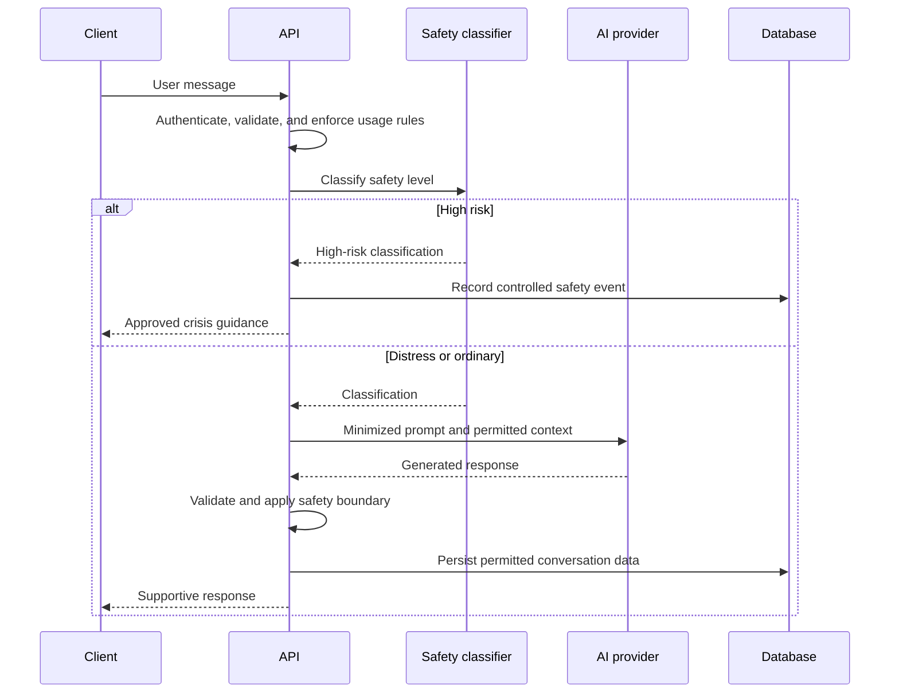

The production provider and fallback chain remain unverified. The system design requires timeouts, controlled retries, usage limits, provider-safe error messages, minimal context, and a non-generative high-risk fallback when provider output cannot be trusted.

## 14. Community content design

### Post lifecycle

1. validate authenticated profile and restriction state;
2. validate text and media metadata;
3. upload or associate permitted media;
4. create the post under server-derived ownership;
5. expose identity according to approved visibility rules;
6. allow authorized comments, likes, shares, edits, and reports;
7. retain stable internal identity for moderation and auditability.

### Content interaction rules

* unique constraints or idempotent operations prevent duplicate likes;
* comments and replies require parent-resource authorization;
* edits preserve ownership and permitted edit windows if adopted;
* deletion and moderation states remain distinguishable;
* counters must be transactionally correct or safely derived;
* media cleanup must reconcile database and Cloudinary state.

## 15. Realtime room and direct-message design

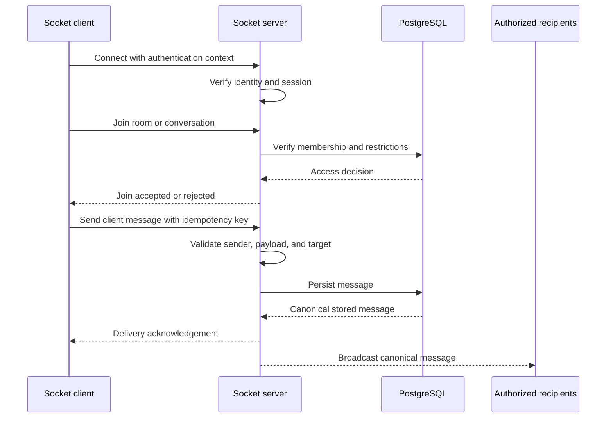

### Event categories

| Category      | Persistence           | Authorization requirement                           |
| ------------- | --------------------- | --------------------------------------------------- |
| Message       | Durable               | Membership, restriction, payload, and target checks |
| Edit or reply | Durable               | Sender ownership plus target membership             |
| Read receipt  | Durable or summarized | Recipient membership                                |
| Unread count  | Derived or persisted  | User ownership                                      |
| Typing        | Ephemeral             | Active membership                                   |
| Presence      | Ephemeral             | Authenticated and privacy-aware visibility          |

Reconnect logic must prevent duplicate sends, stale presence, unauthorized room restoration, and incorrect unread counts. A client-generated idempotency key or equivalent deduplication design should be formally verified.

## 16. Notifications design

Notification definitions describe an event; `user_notifications` stores recipient-specific state.

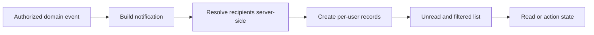

Requirements include deduplication, safe actor/resource summaries, per-user authorization, pagination, read-state updates, retention, and deletion when the referenced resource becomes unavailable.

## 17. Moderation workflow design

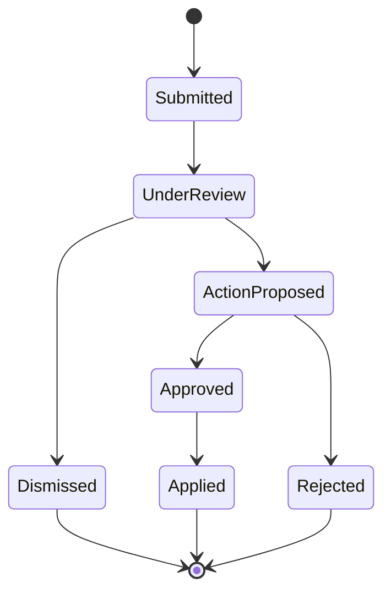

A report should preserve reporter, target, category, controlled evidence, status, timestamps, and reviewer actions. Warnings and restrictions must be attributable, proportionate, time-bounded where appropriate, and reflected consistently in HTTP and Socket.IO authorization.

Sensitive administrative changes write audit records containing the actor, action, target, outcome, and time without copying unnecessary private content into the audit log.

## 18. File and media design

Cloudinary stores uploaded media while PostgreSQL stores application ownership and metadata.

Upload flow:

1. authenticate and authorize the feature action;
2. validate type, size, count, and metadata;
3. perform the approved upload strategy;
4. store provider identifier and owner-bound metadata;
5. return a controlled representation;
6. compensate or schedule cleanup if database persistence fails;
7. remove both database and provider state during permanent deletion.

Open verification areas include malware scanning, content-type inspection beyond file extension, media transformation rules, signed access requirements, orphan cleanup, and provider deletion evidence.

## 19. Email design

Brevo delivers verification, recovery, and other approved transactional email.

Design requirements:

* templates receive only required variables;
* addresses and delivery results have documented retention;
* retry does not generate uncontrolled duplicate OTPs or tokens;
* failed email delivery produces a safe recoverable response;
* email logs exclude secrets and complete sensitive payloads;
* sender identity and production-domain configuration are verified operationally.

## 20. Analytics design

PostHog is configured with autocapture disabled, identified-only behaviour, and masked session recording.

An event allowlist should define:

| Field              | Requirement                                                                                      |
| ------------------ | ------------------------------------------------------------------------------------------------ |
| Event name         | Stable, documented, non-sensitive                                                                |
| Trigger            | Exact user or system action                                                                      |
| Properties         | Minimum fields required for analysis                                                             |
| Prohibited content | Journals, assessment answers, messages, secrets, form values, direct identifiers unless approved |
| Retention          | Approved duration                                                                                |
| Owner              | Atharva Padwal                                                                                   |

Analytics failure must never block authentication, journaling, assessments, community, or safety guidance.

## 21. Database design summary

The Neon production schema contains 79 tables, 914 columns, 79 primary-key constraints, 127 foreign-key constraints, 38 unique constraints, and 366 indexes. All tables have a primary key and at least one index.

### Database design rules

* use UUID or existing schema identifiers consistently;
* preserve created and updated timestamps where required;
* define soft-delete state explicitly rather than interpreting absence;
* use foreign keys for relational integrity;
* index measured ownership, status, and time-based access paths;
* use unique constraints for invariants such as one membership or one reaction;
* use transactions for multi-table invariants;
* version every schema change;
* verify foreign-key update and delete actions before documenting them;
* do not treat TLS or journal PIN gating as field-level encryption.

Detailed schema evidence is maintained in `DATABASE.md`.

## 22. Caching design

Community caching was introduced to improve perceived and actual speed. Cache ownership and invalidation must be explicit.

| Resource                    | Possible cache location        | Invalidation event                        |
| --------------------------- | ------------------------------ | ----------------------------------------- |
| Community feed              | Client memory                  | Create, edit, delete, moderation, refresh |
| Profiles                    | Client memory                  | Profile update, identity-mode change      |
| Rooms and membership        | Client memory and socket state | Join, leave, invitation, restriction      |
| Notifications               | Client memory                  | New notification, read, delete, action    |
| Static questions or prompts | Client or server memory        | Administrative content version change     |

Sensitive resources must not be stored in shared public caches. Cache keys must include authenticated scope where required. Stale data must never grant authority; the backend always makes the final authorization decision.

## 23. Error handling and resilience

### Error classes

| Category           | Expected response                                    |
| ------------------ | ---------------------------------------------------- |
| Validation         | 4xx response with field-safe details                 |
| Authentication     | Controlled 401 and eligible refresh behaviour        |
| Authorization      | Controlled 403 without resource leakage              |
| Not found          | 404 that does not reveal unauthorized existence      |
| Conflict           | 409 for duplicate or state conflict where applicable |
| Rate limit         | 429 with safe retry guidance                         |
| Provider failure   | Safe dependency error or degraded feature behaviour  |
| Database failure   | Safe server error, rollback, operational correlation |
| Unexpected failure | Generic user response plus redacted server logging   |

### Retry policy

* retry safe reads only when the failure is transient;
* do not automatically repeat non-idempotent writes without an idempotency mechanism;
* use bounded retries and timeouts for providers;
* avoid synchronized retry storms after Render or database recovery;
* show users whether an operation definitely failed or has an unknown outcome.

## 24. Performance design

Known evidence includes earlier two-to-three-second signup/login and chat-send behaviour, Render cold starts, a roughly 3.3 MB minified main bundle, and frontend warnings.

### Critical performance paths

| Path                   | Measurement needed                                   | Primary owner                  |
| ---------------------- | ---------------------------------------------------- | ------------------------------ |
| Registration and login | p50, p95, provider and database time                 | Atharva Padwal                 |
| Token refresh          | p50, p95, error and rotation conflict rate           | Atharva Padwal                 |
| Dashboard              | API fan-out, bundle, render and interaction time     | Atharva Padwal and Parth Nikam |
| Community feed         | Query, transfer, render and cache-hit behaviour      | Atharva Padwal and Parth Nikam |
| Message delivery       | persist, acknowledgement and recipient delivery time | Atharva Padwal                 |
| Journal open           | authentication, unlock, query and render time        | Atharva Padwal and Parth Nikam |
| DASS report            | scoring, query and generation time                   | Atharva Padwal                 |

Optimization order: measure, identify the dominant segment, fix it, verify regression safety, and record the result. Loaders improve clarity but are not a substitute for faster execution.

## 25. Scalability design

The current architecture is appropriate for a student-led production application. Scaling should remain evidence-driven.

### Horizontal concerns

* keep REST handlers stateless outside controlled session and database state;
* ensure Socket.IO state can move beyond one process before multi-instance deployment;
* avoid process-memory state as the only source of room membership, locks, jobs, or rate limits;
* manage PostgreSQL connection counts under multiple backend instances;
* paginate unbounded collections;
* move slow non-interactive work to a controlled job mechanism if measurements justify it;
* introduce shared cache or message infrastructure only when required by real load.

### Growth triggers

| Trigger                      | Design review                                                             |
| ---------------------------- | ------------------------------------------------------------------------- |
| Database connection pressure | Pool sizing, query duration, Neon connection strategy                     |
| Multiple Render instances    | Shared socket adapter, distributed rate limits, shared transient state    |
| Large feeds or histories     | Cursor pagination, covering indexes, archival policy                      |
| Slow reports or exports      | Background jobs, progress state, controlled artifact storage              |
| Higher media volume          | Upload limits, lifecycle cleanup, provider cost and transformation policy |
| Higher moderation volume     | Queues, assignment, escalation, review SLOs                               |

## 26. Security design checklist

| Control                               | Design state                                                        |
| ------------------------------------- | ------------------------------------------------------------------- |
| Server-side authentication            | Confirmed                                                           |
| Role authorization                    | Confirmed                                                           |
| Ownership checks                      | Confirmed for tested paths; complete endpoint audit required        |
| HTTP-only refresh cookie              | Confirmed                                                           |
| Refresh rotation and revocation       | Confirmed                                                           |
| Rate limits on sensitive endpoints    | Confirmed for recorded auth and OTP paths                           |
| Password and journal PIN hashing      | Confirmed                                                           |
| Parameterized SQL                     | Required and evidenced in selected paths; full query audit required |
| Socket membership authorization       | Designed; full event-level test evidence incomplete                 |
| Admin audit logging                   | Confirmed                                                           |
| Dependency and secret scanning        | Confirmed process                                                   |
| Field-level encryption                | Open                                                                |
| Per-administrator step-up credentials | Open                                                                |
| Restore testing                       | Open                                                                |
| Formal CSRF assessment                | Open                                                                |
| Complete upload-security verification | Open                                                                |

## 27. Testing design

The recorded suite includes 18 backend and 2 client tests, with CI syntax, test, lint, and build checks. Current evidence covers selected authentication, authorization, journal, DASS-21, ownership, and AI-risk boundaries.

### Required test layers

| Layer                | Purpose                                               | Current position      |
| -------------------- | ----------------------------------------------------- | --------------------- |
| Unit                 | Deterministic rules, normalization, scoring, tokens   | Partially implemented |
| Service              | Ownership, workflows, failures, transactions          | Partial               |
| Database integration | Real constraints, SQL, rollback, migrations           | Incomplete            |
| API integration      | Middleware-to-database request behaviour              | Incomplete            |
| Realtime integration | Connection, membership, delivery, reconnect           | Incomplete            |
| Client integration   | Routes, context, API states, protected UI             | Limited               |
| End-to-end           | Critical user journeys in production-like environment | Incomplete            |
| Security             | IDOR, CSRF, XSS, upload, token and role abuse         | Partial               |
| Accessibility        | Keyboard, focus, semantics, contrast, motion          | Incomplete            |
| Recovery             | Backup restoration and release rollback               | Incomplete            |

Critical test data must be fictional and isolated from production.

## 28. Deployment and release design

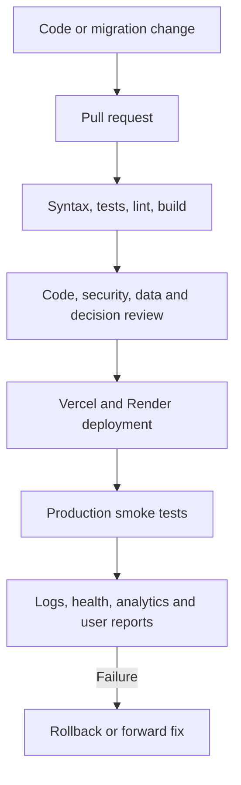

Release requirements:

* all required CI checks pass;
* database changes are backward-compatible or sequenced safely;
* environment variables are present without being logged;
* critical auth, journal, assessment, community, and admin paths receive smoke tests;
* a last known stable version and rollback procedure are identified;
* consequential changes update documentation and decision records;
* production incidents create corrective actions and evidence.

## 29. Ownership matrix

| Design area                                 | Accountable owner              |
| ------------------------------------------- | ------------------------------ |
| Product and system design                   | Atharva Padwal                 |
| Backend layers and services                 | Atharva Padwal                 |
| PostgreSQL schema and queries               | Atharva Padwal                 |
| Authentication and security                 | Atharva Padwal                 |
| Real-time server and delivery               | Atharva Padwal                 |
| Providers and deployment                    | Atharva Padwal                 |
| React structure and components              | Parth Nikam                    |
| Client routes and API integration           | Parth Nikam                    |
| Client accessibility and interaction states | Parth Nikam                    |
| Cross-stack contracts                       | Atharva Padwal and Parth Nikam |
| System-design documentation                 | Atharva Padwal                 |

## 30. Open design decisions

| ID     | Decision or evidence required                                               | Owner                          | Target date       | Status |
| ------ | --------------------------------------------------------------------------- | ------------------------------ | ----------------- | ------ |
| SD-P01 | Verify exact API endpoint and source-module inventory from code             | Atharva Padwal                 | 18 September 2026 | Open   |
| SD-P02 | Define application-level encryption fields and key lifecycle                | Atharva Padwal                 | 20 September 2026 | Open   |
| SD-P03 | Replace shared admin secret with per-admin step-up design                   | Atharva Padwal                 | 21 September 2026 | Open   |
| SD-P04 | Verify every Socket.IO event’s authentication and membership checks         | Atharva Padwal                 | 23 September 2026 | Open   |
| SD-P05 | Define idempotency and delivery guarantees for messages and critical writes | Atharva Padwal                 | 24 September 2026 | Open   |
| SD-P06 | Approve caching rules and invalidation ownership                            | Atharva Padwal and Parth Nikam | 24 September 2026 | Open   |
| SD-P07 | Set bundle-size and route-splitting budgets                                 | Parth Nikam                    | 25 September 2026 | Open   |
| SD-P08 | Approve accessibility target and release checks                             | Parth Nikam                    | 26 September 2026 | Open   |
| SD-P09 | Verify media scanning, orphan cleanup, and permanent deletion               | Atharva Padwal                 | 27 September 2026 | Open   |
| SD-P10 | Define monitoring, alert thresholds, and correlation identifiers            | Atharva Padwal                 | 27 September 2026 | Open   |
| SD-P11 | Verify Neon restore behaviour and run a recovery exercise                   | Atharva Padwal                 | 28 September 2026 | Open   |
| SD-P12 | Approve retention and deletion periods across all data stores               | Atharva Padwal                 | 30 September 2026 | Open   |
| SD-P13 | Verify production AI provider, safety fallback, and data contract           | Atharva Padwal                 | 30 September 2026 | Open   |
| SD-P14 | Establish integration, end-to-end, realtime, and upload test coverage       | Atharva Padwal and Parth Nikam | 30 September 2026 | Open   |

## 31. System-design change process

Update this file when a change affects component responsibilities, request flow, state ownership, authentication, authorization, data access, real-time delivery, provider behaviour, caching, failure handling, scaling, or deployment sequencing.

Each consequential update should include:

1. affected section and component;
2. owner and implementation date;
3. related decision ID;
4. database migration or API contract where applicable;
5. security and privacy impact;
6. test evidence;
7. changelog entry.

## 32. Changelog

| Date              | Change type | Owner                          | Scope            | Description                                                                                                                   |
| ----------------- | ----------- | ------------------------------ | ---------------- | ----------------------------------------------------------------------------------------------------------------------------- |
| 12 September 2026 | Added       | Atharva Padwal                 | Full document    | Created the first implementation-level system design for Unwind.                                                              |
| 12 September 2026 | Added       | Atharva Padwal                 | Backend and data | Documented layered request handling, raw PostgreSQL access, feature workflows, real-time processing, and provider boundaries. |
| 12 September 2026 | Added       | Parth Nikam                    | Frontend         | Documented client structure, state categories, API integration, and interaction states.                                       |
| 12 September 2026 | Added       | Atharva Padwal and Parth Nikam | Governance       | Added ownership, open decisions, target dates, and the system-design change process.                                          |

Add a row whenever a component or flow is introduced, changed, reclassified, deprecated, or superseded. Preserve historical entries and identify both old and replacement references when a design is superseded.

## Appendix A. Evidence and limitations

This design is based on the confirmed Unwind architecture, production Neon schema documentation, decision log, deployment state, testing evidence, and implementation discussions available on 12 September 2026.

Confirmed elements include React/Vite, React Router, Axios, React Context, Node.js 22, Express ES modules, Routes → Validators → Controllers → Services, raw PostgreSQL `pool.query`, Neon, JWT access and refresh tokens, HTTP-only cookies, Google OAuth, journal PIN sessions, DASS-21, wellness trackers, AI safety classification, Socket.IO, community and direct messaging, notifications, moderation, admin audit logs, Brevo, Cloudinary, PostHog, Vercel, Render, and GitHub Actions.

Not fully verified here: exact route names and payloads, exact source tree, complete SQL-query inventory, all transaction boundaries, every socket event, production AI-provider selection, upload-security controls, retention periods, field-level encryption, database privileges, backup restoration, formal service objectives, complete accessibility conformance, and full integration or end-to-end coverage.

Unknown implementation details must remain marked `Open`, `Unknown`, or `Unverified` until code, configuration, tests, migrations, provider settings, or production evidence confirms them.
